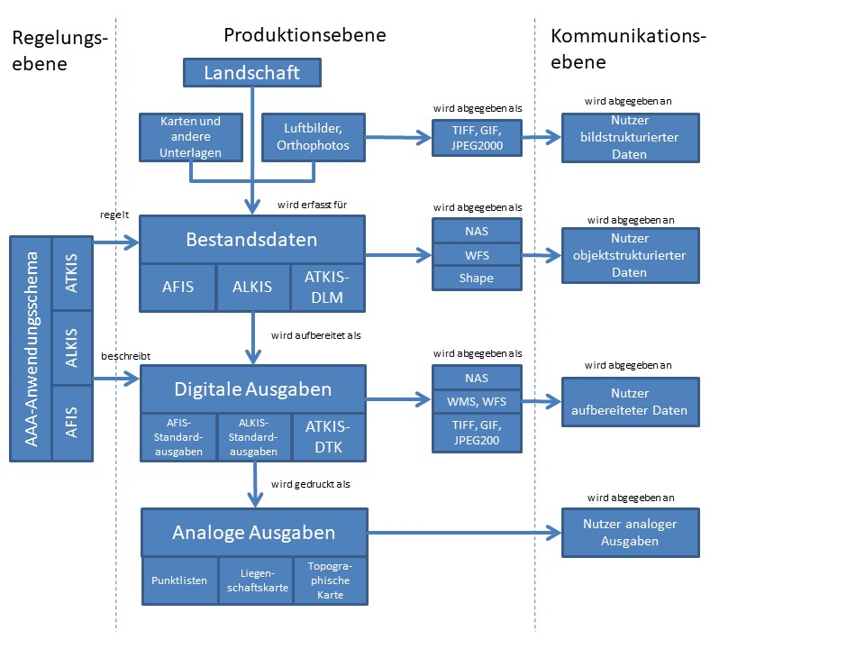

[[aaareferenzmodell]]
== Das AFIS-ALKIS-ATKIS-Referenzmodell

Das AFIS-ALKIS-ATKIS-Referenzmodell hat die Aufgabe, die nach dieser Dokumentation beschriebenen Datenbestände mit ihren Beziehungen im Kontext darzustellen. Ziel dabei ist es,

* Komponenten zu identifizieren,
* die Modularisierung zu erleichtern,
* die Verbindung zu den Normen aufzuzeigen und
* Doppelarbeit innerhalb der Komponenten zu vermeiden.

AFIS ist das Amtliche Festpunktinformationssystem und enthält beschreibende und darstellende Daten zu folgenden Produktgruppen:

* AFIS-Bestandsdaten,
* digitale AFIS-Auszüge sowie
* analoge AFIS-Auszüge.

ALKIS ist das Amtliche Liegenschaftskatasterinformationssystem und enthält liegenschaftsbeschreibende und -darstellende Daten in folgenden Produktgruppen:

* ALKIS-Bestandsdaten (optional auch Erweiterung um 3D-Informationen),
* digitale ALKIS-Auszüge sowie
* analoge ALKIS-Auszüge.

ATKIS ist das Amtliche Topographisch-Kartographische Informationssystem der deutschen Landesvermessung. ATKIS beschreibt die Landschaft mit unterschiedlichen Anwendungszielen in folgenden Produktgruppen:

* digitale Landschaftsmodelle (ATKIS-DLM und Zusatzdaten) einschließlich digitaler Geländemodelle (DGM),
* digitale topographische Karten (DTK),
* analoge Auszüge aus den DTK (Topographische Karten) sowie
* digitale Bildmodelle (DBM) in Form digitaler Orthophotos (DOP).

Die Inhalte, Strukturen und Herstellungsvorschriften der Produkte des Referenzmodells werden auf der *Regelungsebene* durch die Objektartenkataloge (OK) und Signaturenkataloge (SK) definiert. Diese umfassen:

* Vorschriften zur Abbildung der Informationen der Festpunkte, des Liegenschaftskatasters und der Topographie,
* Vorschriften zur Bildung von Präsentations- und Kartengeometrieobjekten (Zusatzdaten),
* Vorschriften zur Darstellung und kartographischen Gestaltung der Objekte,
* Vorschriften zur Ausgestaltung von analogen Auszügen.

Die Erfassungsvorlagen in der *Produktionsebene* sind untergliedert in Landschaft, digitale Bildmodelle (digitale Orthophotos) sowie Karten und andere Unterlagen. Die Landschaft als Quelle der Originalinformation wird insbesondere im Rahmen der Fortführung als Erfassungsquelle herangezogen werden. Durch den digitalen Datenfluss fließen im Felde registrierte Daten ohne den Umweg über analoge Medien direkt oder nach Strukturierung und Klassifizierung in die Bestandsdaten von AFIS, ALKIS und ATKIS ein. Die aufgebauten Geobasisdatenbestände können zugleich wieder als Erfassungsquelle für abgeleitete Datenbestände dienen, z.B. sind Teile der ALKIS-Bestandsdaten, insbesondere die Gebäudedaten, Grundlage zur Ableitung entsprechender Daten für das ATKIS-DLM. Der Erfassungsvorgang umfasst auch die Bildung von Präsentations- und Kartengeometrieobjekten und schließt damit auch den Vorgang der kartographischen Generalisierung ein.

[#img_aaa_referenzmodell,reftext='{figure-caption} {counter:figure-num}']
.Gemeinsames AFIS-ALKIS-ATKIS-Referenzmodell

Die Bestandsdaten unterscheiden sich durch den Abstraktionsgrad, mit dem sie die Erdoberfläche und damit in Beziehung stehende Sachverhalte modellieren. Sie weisen Eigenschaften wie Objektstrukturierung und Geokodierung auf. Sie enthalten neben den *Fachobjekten* mit ihren semantischen und geometrischen Informationen auch die zur Präsentation benötigten Daten:

* nämlich die *Präsentationsobjekte* für Text und Signaturen
* sowie die mit den topographischen Objekten durch eine einseitige Relation verknüpften *Kartengeometrieobjekte* mit der jeweiligen Kartengeometrie für einen bestimmten Kartenmaßstab.

Die Bestandsdaten enthalten damit die vollständige Beschreibung von Fachobjekten einschließlich der Daten zu ihrer kartographischen oder textlichen Darstellung in einem oder mehreren Zielmaßstäben. Damit sind die Bestandsdaten so modelliert, dass sie bei der Präsentation vollständig automatisch, d.h. ohne weiteren interaktiven Eingriff, in der vorgesehenen Ausgabeform dargestellt werden können.

An den Nutzer werden auf der *Kommunikationsebene* objekt- oder bildstrukturierte Daten, aufbereitete Informationen oder analoge Auszüge abgegeben, die den kompletten Dateninhalt, beliebige Auszüge nach Inhalt und Gebiet sowie Fortführungsdaten beliebiger Zeiträume umfassen können.