[[basisschema]]
== Das konzeptuelle Modell des AAA-Basisschemas

[[basisschema_modellierung]]
=== Grundsätze der Modellierung

[[basisschema_modellierung_normen]]
====  Normen und Standards

Internationale Normungs- bzw. Standardisierungsaktivitäten im Bereich von Geoinformationen erfolgen zurzeit in folgenden Gremien:

* ISO/TC 211 Geographic Information/Geomatics
* Open Geospatial Consortium (OGC)

Ziel ist die Schaffung von Grundlagen für die gemeinsame, ganzheitliche und fachübergreifende Nutzung von Geodaten an verschiedenen Orten durch Personen, Anwendungen und Systeme auf der Grundlage einer einheitlichen Beschreibung der Inhalte vorhandener oder geplanter Datenbestände, der Funktionalitäten der Datenbearbeitung und der Kommunikation. Der Modellierung liegen die Ergebnisse des ISO/TC 211 in Form der Normfamilie 19100 im aktuellen Bearbeitungsstand zu Grunde. Im Bereich der Datenaustauschschnittstelle werden darüber hinaus auch Teile der Spezifikationen des OGC verwendet. Für die Integration von 3D-Informationen bildet CityGML (OGC Best Practices Document in der Version 0.4.0) die Grundlage.

[[basisschema_modellierung_sprache]]
====  Modellierungs- und Beschreibungssprache

Zur Beschreibung des Anwendungsschemas und der Objektartenkataloge hat sich die AdV entschieden, die Datenmodellierungssprache _Unified Modeling Language (UML)_ zu verwenden. Sie wird auch von ISO/TC 211 im Bereich der Normung von Geoinformationen eingesetzt.

UML wurde von der _Object Management Group_ (OMG) zur Beschreibung von Anwendungsschemata entwickelt. Semantik und Notation von UML sind im _UML Notation Guide_ beschrieben. Um eine einheitliche Nutzung von UML im Bereich der Normfamilie 19100 zu gewährleisten, ist deren Anwendung in der ISO-Spezifikation 19103 _Conceptual schema language_ festgelegt. Der Zweck liegt in der vollständigen und unzweifelhaft interpretierbaren, formalen Beschreibung von Inhalt und Struktur von Datenbeständen. Die Beschreibung ist unabhängig von der Art der Implementierung und der verwendeten Programmiersprache. Mit formalen Sprachen ist eine einheitliche Beschreibung aller Geodaten erreichbar. Die so beschriebenen Anwendungsschemata können von geeigneten Programmen automatisch interpretiert und in interne Datenstrukturen bzw. Datenbankstrukturen übersetzt werden.

Ein universelles und systemunabhängiges Datenaustausch- bzw. Dateiformat ergibt sich daraus automatisch in Verbindung mit sogenannten Kodierungsregeln. Diese Kodierungsregeln werden entsprechend der ISO-Normen 19118 _Encoding_ und 19136 _Geography Markup Language (GML)_ erstellt. Als Format wird die Auszeichnungssprache XML (Extensible Markup Language) des World-Wide-Web Consortiums (W3C) verwendet.

[[basisschema_aufgabeundstruktur]]
=== Aufgabe und Struktur

Ein Anwendungsschema liefert die formale Beschreibung für Datenstrukturen und Dateninhalte in einer oder mehreren Anwendungen. Es enthält die vollständige Beschreibung eines Datenbestandes und kann neben den geographischen auch weitere dazugehörige Daten enthalten. Ein grundsätzliches Konzept, die reale Welt zu abstrahieren, ist die Einführung des Fachobjekts und von Regeln, wie es erfasst und fortgeführt wird. Die Klassifizierung der Fachobjekte erfolgt nach Typen. Auf der Typenebene beschreibt das Anwendungsschema die Objektarten der realen Welt. Daten selbst existieren auf der Instanzenebene. Sie stellen einzelne Exemplare einer Objektart in der realen Welt dar und können durch das Anwendungsschema interpretiert werden, siehe hierzu auch ISO 19101 _Reference model_ und 19109 _Rules for application schema_.

Der Zweck eines Anwendungsschemas ist es, ein gemeinsames und einheitliches Verständnis der Daten zu erreichen und die Dateninhalte für eine bestimmte Anwendungsumgebung so zu dokumentieren, dass eindeutige Informationen über die Daten erhalten werden.

[#img_Rolle_des_Anwendungsschemas,reftext='{figure-caption} {counter:figure-num}']
.Die Rolle des Anwendungsschemas
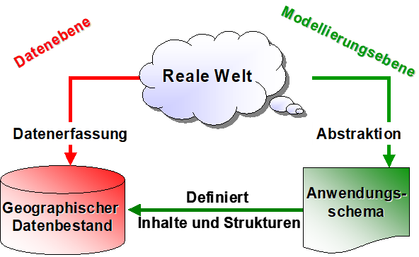

Das gemeinsame AFIS-ALKIS-ATKIS-Anwendungsschema bietet einen einheitlichen und objektorientierten Modellansatz für AFIS, ALKIS und ATKIS, der möglichst mit den marktüblichen und dem Stand der Technik entsprechenden GIS-Programmen abgebildet und geführt werden soll.

Ein Anwendungsschema kann Festlegungen aus verschiedenen Subschemata verwenden. Im Fall des AFIS-ALKIS-ATKIS-Anwendungsschemas werden hauptsächlich Subschemata aus der Normfamilie ISO 19100 verwendet. In Bereichen, in denen ISO bisher keine Festlegungen getroffen hat, werden zusätzlich Schemata des Open Geospatial Consortiums verwendet.

[#img_10,reftext='{figure-caption} {counter:figure-num}']
.Abhängigkeit des AFIS-ALKIS-ATKIS-Anwendungsschemas von den genormten Strukturen aus OGC
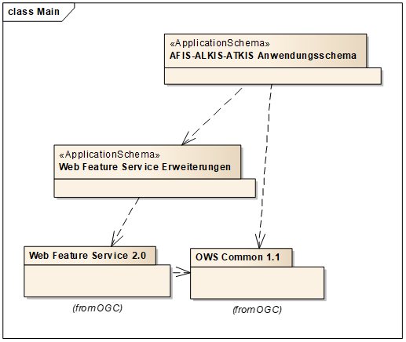

[#img_11,reftext='{figure-caption} {counter:figure-num}']
.Verwendete Teile aus der Normfamilie ISO 19100 (Auszug aus dem UML-Datenmodell)
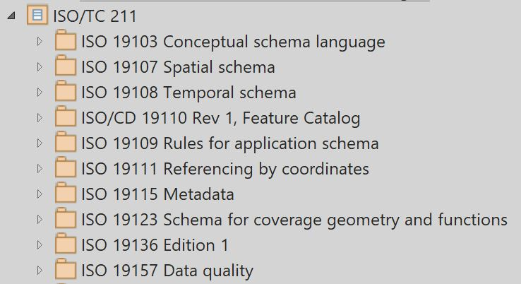

Das AFIS-ALKIS-ATKIS-Anwendungsschema gliedert sich in das

* AAA-Basisschema,
* ALKIS-ATKIS-AFIS-Fachschema,
* AAA-Versionierungsschema sowie
* NAS-Operationen.

Das Basisschema ist die Grundlage für die Modellierung der Fachobjekte in den Fachschemata. Das Versionierungsschema zeigt das Konzept zur Historisierung von Fachobjekten auf. Ein internes Schema (Implementierungsmodell) ist nicht Bestandteil der gemeinsamen Modellierung; es entsteht durch Abbildung des konzeptuellen Anwendungsschemas in spezifische GIS-Systeme im Zuge der Implementierung. Auf Basis des Anwendungsschemas sind schließlich Operationen für den Datenaustausch und fachliche Festlegungen für Datenausgaben definiert.

[#img_12,reftext='{figure-caption} {counter:figure-num}']
.Die Bestandteile des AFIS-ALKIS-ATKIS-Anwendungsschemas
image::media/image12.png[media/image12,width=680,height=373]

Externe Anwendungsschemata (z.B. GV_Geometrische Verbesserungen) können unabhängig vom AAA-Anwendungsschema fortgeführt, bzw. versioniert werden. Daher wurden dies Anwendungsschemata auch außerhalb des AAA-Anwendungschemas modelliert. Es ist jedoch stets eine Referenz auf die Version des AAA-Anwendungsschemas anzugeben, auf die sich das jeweilige Applikationsschema bezieht (Tagged Value AAA:AAAVersion). Die Metamodelle zum Objektartenkatalog (AAA_Objektartenkatalog) und Signaturenkatalog (AAA_Signaturenkatalog) werden ebenfalls unabhängig vom AAA_Anwendungsschema modelliert und fortgeführt, da sie keinerlei Beziehung zum Basischema haben. Hier ist selbst die Referenz zum dazugehörigen AAA-Anwendungsschema nicht erfoderlich und kann unabhängig davon versioniert und fortgeführt werden.

Das Datum einer Version (Releasedatum) ist für eine eindeutige Referenz zwischen den Anwendungsschemata nicht erforderlich und in diesem Zusammenhang eine zur Versionsnummer redundante Information. Das Datum erscheint jedoch als zeitlicher Anhaltspunkt der Veröffentlichung in den Anwendungsschemata und den daraus abgeleiteten Dokumenten.

[[basisschema_aaa]]
=== Das AFIS-ALKIS-ATKIS-Basisschema

Das AFIS-ALKIS-ATKIS-Basisschema (AAA-Basisschema) bildet die Grundlage der fachlichen Modellierung der AFIS-, ALKIS- und ATKIS-Objekte und für den Datenaustausch. Auf seiner Basis werden die Fachschemata erstellt. Seine Anwendung ist nicht auf AFIS, ALKIS und ATKIS beschränkt. Andere Fachinformationssysteme können die im Basisschema definierten Klassen zur Modellierung ihres Fachschemas ebenfalls nutzen.

Da bislang im Basisschema keine Geometrietypen zur Beschreibung von volumenförmigen Objekten enthalten waren, wurde die Ergänzung der AAA-Basisschemaklassen zur Aufstellung eines 3D-Fachschemas erforderlich.

[#img_13,reftext='{figure-caption} {counter:figure-num}']
.Das Basisschema als Grundlage für anwendungsspezifische Fachschemata (z.B. AFIS, ALKIS und ATKIS) 
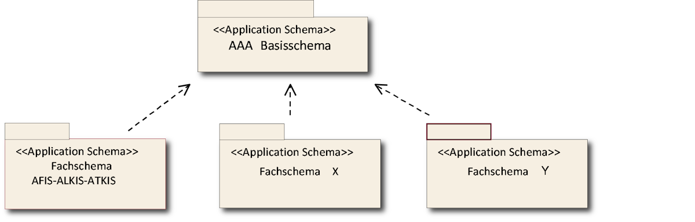

Das Basisschema gliedert sich in die Pakete "AAA_Basisklassen", "AAA_SpatialSchema", "AAA_GemeinsameGeometrie", "AAA_UnabhaengigeGeometrie", "Codelisten", "AAA_Praesentationsobjekte", AAA_Punktmengenobjekte, AAA_Projektsteuerung, AAA_Nutzerprofile, AAA_Operationen, AAA_Praesentationsobjekte_3D, und AAA_Unabhaengige Geometrie_3D.

Die Pakete AAA_Nutzerprofile und AAA_Operationen dienen lediglich der Verankerung einer Nutzerverwaltung bzw. einer Operationsmodellierung im Basisschema. Sie enthalten nur leere, abstrakte Klassen, die von den jeweiligen Fachschemata weiter ausgefüllt werden müssen. Sie werden im Folgenden deshalb nicht weiter erläutert.

Zur eindeutigen Benennung der definierten Klassen wird von folgender Systematik ausgegangen:

. Genormte Klassen behalten das jeweilige genormte Präfix im Klassennamen (z.B. FC für "Feature Catalogue", MD für "Metadata")
. Klassen als AFIS-ALKIS-ATKIS-spezifische Ergänzungen am genormten _Feature Catalogue_ erhalten das Präfix AC
. Klassen mit grundsätzlicher Bedeutung für AFIS, ALKIS und ATKIS erhalten das Präfix AA
. Klassen, die aus den ISO TS_*Component-Klassen ("simple topology") abgeleitet wurden, erhalten das Präfix TA; ebenso die sinngemäß gebildete Klasse für topologische Flächen mit multipler räumlich getrennter Geometrie (TA_MultiSurfaceComponent)
. Klassen mit gemeinsam genutzter Geometrie erhalten das Präfix AG
. Klassen der unabhängigen Geometrie erhalten das Präfix AU
. Klassen der Präsentationsobjekte erhalten das Präfix AP
. Klassen für die Modellierung von Punktmengenobjekten erhalten das Präfix AD

[#img_14,reftext='{figure-caption} {counter:figure-num}']
.Bestandteile des AAA-Basisschemas 
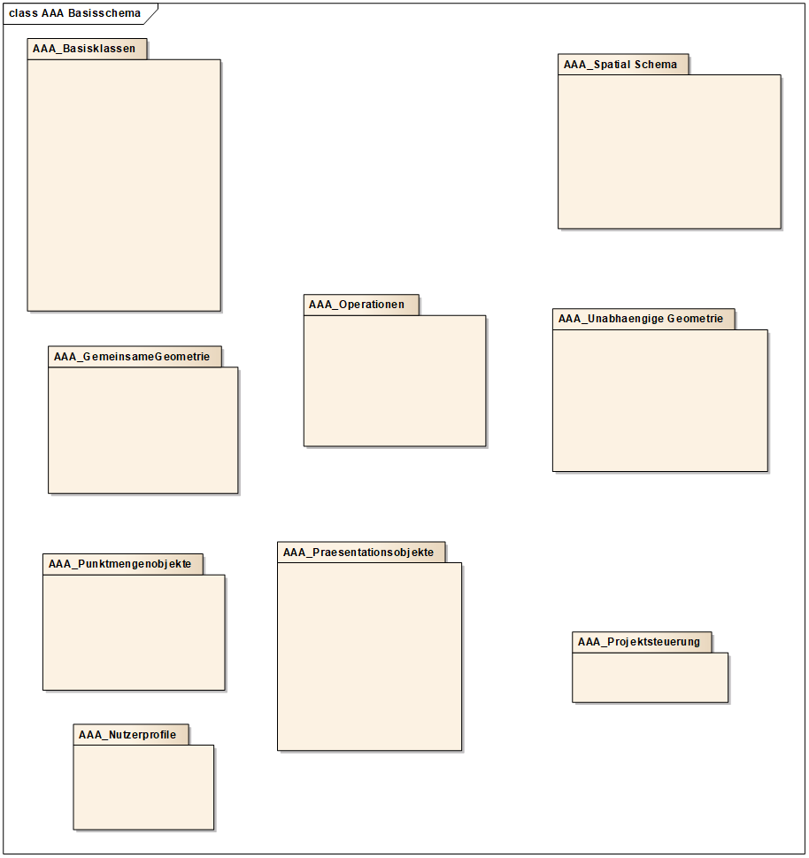

[[basisschema_aaa_objektbildungsgrundsaetze]]
====  Objektbildungsgrundsätze

Die Regeln zur Erstellung von Anwendungsschemata werden durch die Norm 19109 _"Rules for Application Schema"_ des ISO/TC 211 vorgegeben. In dieser Norm ist auch das allgemeine Modell zu Beschreibung und Bildung von Fachobjekten _(General Feature Model)_ enthalten. Das gemeinsame Basisschema wird an das _General Feature Model_ von ISO 19100 angeschlossen und dieses um die Metaklasse "AA_ObjektOhneRaumbezug" erweitert, um Objektklassen bilden zu können, für die kein Raumbezug zulässig ist.

Die Bildung eigenständiger Objekte ergibt sich aus der fachlichen Objektsicht. *Objekte* *mit geometrischer Ausprägung* können punkt-, linien-, flächen- und volumenförmige Beschreibungen führen oder vom Typ Punktmengenobjekt sein. *Objekte ohne Raumbezug* (z. B. Personen) tragen keine Geometrie und lassen sich nicht auf einen bestimmten Ort festlegen. Sie können aber mit anderen raumbezogenen und nicht-raumbezogenen Objekten in Beziehung stehen, z. B. mit Flurstücken, Gebäuden oder Adressen.

Zur Systematisierung und zur Unterstützung bei der Erstellung der Fachschemata werden im gemeinsamen AAA-Basisschema folgende Arten von Objektausprägungen vordefiniert:

* Raumbezogene Elementarobjekte (AA_REO)
+
Raumbezogene Elementarobjekte sind zu bilden, wenn zusätzlich zu fachlichen Eigenschaften auch geometrische oder topologische Eigenschaften nachgewiesen werden sollen.

* Nicht raumbezogene Elementarobjekte (AA_NREO)
+
Nicht raumbezogene Elementarobjekte sind zu bilden, wenn nur fachliche, aber keine geometrischen oder topologischen Eigenschaften nachgewiesen werden sollen.

* Zusammengesetzte Objekte (AA_ZUSO)
+
Zusammengesetzte Objekte werden gebildet, um den Zusammenhang einer beliebigen Zahl und Mischung semantisch zusammengehörender raumbezogener Elementarobjekte, nicht raumbezogener Elementarobjekte oder zusammengesetzter Objekte herzustellen. Ein zusammengesetztes Objekt muss aber mindestens ein Objekt als Bestandteil besitzen.

* Punktmengenobjekte (AA_PMO)
+
Für bestimmte Fachobjekttypen, die aus einer großen Anzahl geometrischer Orte mit jeweils gleichen Attributarten bestehen (z.B. Digitale Geländemodelle, Temperatur- und Luftdruckverteilungen), ist es günstiger, statt einzelner REOs ein alle Angaben klammerndes Objekt -ein sogenanntes Punktmengenobjekt- zu nutzen. Ein Punktmengenobjekt ist eine Abbildung einer Menge von Geometrien auf die zugehörigen Attributwerte.

Elementarobjekte sind die kleinste mögliche fachliche Einheit. Die Bildung von Objektteilen oder von Linien als Objektbestandteile mit fachlicher Information wie in den bisherigen Systemen ALK und ATKIS entfällt.

Die Führung der *Historie von Objekten* wird unterstützt. Ebenso werden *Integrations- und Verknüpfungsmöglichkeiten der Fachobjekte mit den Fachdaten* anderer Fachbereiche unterstützt.

Alle instanziierbaren fachlichen Objektklassen sind in den anwendungsbezogenen Subschemata aus den folgenden Objektklassen des Basisschemas durch Vererbung abzuleiten:

* AA_ZUSO
* AA_NREO
* AA_PMO
* TA_PointComponent
* TA_CurveComponent
* TA_SurfaceComponent
* TA_MultiSurfaceComponent
* AG_Objekt
* AG_Punktobjekt
* AG_Linienobjekt
* AG_Flaechenobjekt
* AU_Objekt
* AU_Punktobjekt
* AU_Punkthaufenobjekt
* AU_Linienobjekt
* AU_KontinuierlichesLinienobjekt
* AU_Flaechenobjekt
* AU_Punktobjekt_3D
* AU_Umringobjekt_3D
* AU_Punkthaufenobjekt_3D
* AU_Mehrfachflaechenobjekt_3D
* AU_MehrfachlinienObjekt_3D
* AU_Geometrieobjekt_3D
* AU_KoerperObjekt_3D
* AU_TrianguliertesOberflaechenObjekt_3D
* AD_PunktCoverage
* AD_GitterCoverage

Für Präsentationsobjekte können folgende Objektklassen des Basisschemas direkt verwendet bzw. instanziiert werden:

* AP_PPO
* AP_PTO
* AP_LTO
* AP_LPO
* AP_FPO
* AP_Darstellung
* AP_KPO_3D

Alternativ ist zugelassen, dass aus diesen Objektklassen des Basisschemas durch Vererbung weitere instanziierbare fachliche Objektklassen abgeleitet werden.

[[basisschema_aaa_attribute]]
====  Attribute

Die in den Fachschemata zu beschreibenden Objekte können selbstbezogene Eigenschaften (Attribute) besitzen. Attribute sind die Träger der statischen Informationen der Objekte. Attribute werden immer über einen Namen und eine Werteart definiert. Wertearten können sowohl Basisdatentypen (Zahlen, Zeichenketten, Datums- und Zeitangaben) als auch komplexe Datentypen wie Geometrien oder Qualitätsmerkmale sein. *Attribute* können grundsätzlich multipel und Zeichenketten beliebig lang sein.

Attribute vom Typ Datums- und/oder Zeitangabe ("DateTime") werden entsprechend den Festlegungen von ISO 8601, Kapitel 5.4.1 in Verbindung mit 5.3.3 modelliert. Hierbei wird die Variante mit Trennzeichen gewählt. Zeitgenauigkeit ist die volle Sekunde, Zeitzone ist immer UTC (Universal Time Coordinated, Greenwich Mean Time, Abkürzung: Z). Beispiel: 2004-02-29T10:15:30Z

[[basisschema_aaa_beziehungen]]
====  Beziehungen

Die in den Fachschemata zu beschreibenden Objekte können fremdbezogene Eigenschaften (Beziehungen bzw. Relationen) besitzen. In den Fachschemata können verschiedene Arten von Beziehungen verwendet werden:

* Nach dem _General Feature Model_ von ISO können Fachobjekte beliebige Beziehungen zueinander eingehen. Diese werden in den fachspezifischen Subschemata definiert.
* Daneben sind im gemeinsamen Basisschema bereits einige Beziehungen zwischen Objekten fest vorgegeben:
** Relation zur Bildung von Zusammengesetzten Objekten (ZUSO) +
Ein ZUSO setzt sich aus mindestens einem Objekt zusammen. Die Klammer um diese Objekte bildet die Assoziation _Zusammensetzung_ zwischen "AA_ZUSO" und "AA_Objekt".
** Unterführungsrelation +
Unterführungsrelationen (_hatDirektUnten_ ) werden verwendet, um eine relative vertikale Lage einzelner Objekte im Verhältnis zu anderen Objekten abzubilden. Die Angabe einer absoluten "Höhenstufe" ist durch Verwendung von Überführungs- bzw. Unterführungsrelationen nicht möglich, da derartige Relationen immer nur die Zweierbeziehung zwischen den beteiligten Objekten beinhalten.
** Kartengeometrie +
Die Relation von Kartengeometrieobjekten (=generalisierte Geometrie, zu den zugehörigen Basisobjekten (_istAbgeleitetAus_) gibt an, aus welchen Objekten die Kartengeometrieobjekte abgeleitet sind.
** Fachdatenverbindung +
Soll ein AFIS-, ALKIS- oder ATKIS-Objekt auf ein Fachdatenobjekt zeigen, das in einem fremden Fachdatensystem geführt wird, so kann dies optional durch das Attribut _zeigtAufExternes_ beschrieben werden. Fachdatenverbindungen werden gemäß xref:basisschema_aaa_fdvregelung[] strukturiert.
+
Der Aufbau der Fachdatenverbindung ist sinnvoll, um bei der Benutzung und Fortführung von ALKIS die Existenz von Fachdatenbeständen zu berücksichtigen.

** Darstellungsrelation +
Präsentationsobjekte dienen der Darstellung von Objekten der Bestandsdaten. Dieser Zusammenhang wird durch den Verweis _dientZurDarstellungVon_ zwischen dem Präsentationsobjekt und anderen Objekten nachgewiesen.

[#img_15,reftext='{figure-caption} {counter:figure-num}']
.Modellierung der AAA-Basisklassen
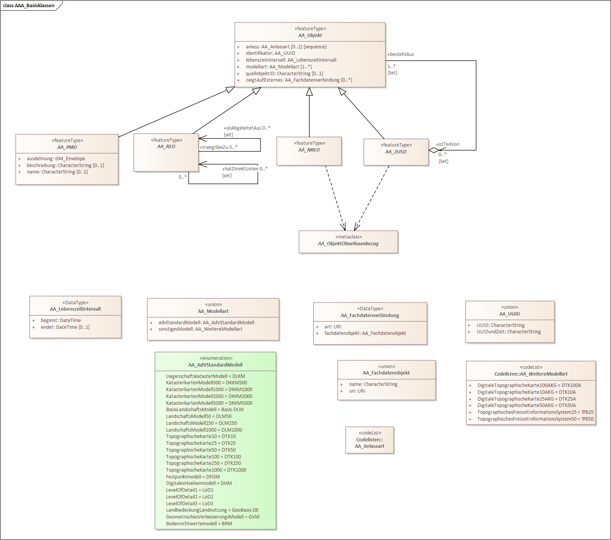

[[basisschema_aaa_raumbezug]]
==== Raumbezug, Geometrie

===== Grundsätze

Die ISO-Norm 19107 _Spatial schema_ stellt Raumbezugsgrundformen für die Verwendung in Anwendungsschemata zur Verfügung; für AFIS, ALKIS und ATKIS werden davon zur Verringerung der Komplexität ausschließlich folgende verwendet:

[width="99%"]
|===
3+|*Geometrische Objekte (GM_Object)* 2+|*Topologische Objekte (TP_Object)*

|*Geometrische Primitive* |*Geometrische Komplexe* |*Geometrische Aggregate* |*Topologische Primitive* |*Topologische Komplexe*

|GM_Point +
GM_Curve +
GM_PolyhedralSurface 
|GM_CompositeCurve +
GM_CompositeSurface
|GM_MultiPoint +
GM_MultiCurve +
GM_MultiSurface 
|TS_PointComponent +
TS_CurveComponent +
TS_SurfaceComponent +
TS_Face 
|TP_Complex

|===

Auch die Repräsentation der 3D-Geometrien basiert auf der ISO 19107. Die bereits im AAA-Basisschema vorhandenen Raumbezugsgrundformen werden um die in der folgenden Tabelle dargestellten erweitert:

[width="99%"]
|===
3+| *Geometrische Objekte (GM_Object)*
| *Geometrische Primitive* | *Geometrische Komplexe* | *Geometrische Aggregate*
|GM_Solid +
GM_SurfaceBoundary +
GM_TriangulatedSurface +
GM_OrientableSurface
|GM_CompositeSolid |
|===

Die geometrischen und topologischen Objekte sind als UML-Klassen beschrieben. Die Norm enthält auch räumliche Operationen, die die geometrischen und topologischen Objekte _(GM_Object_ bzw. _TP_Object)_ als Parameter benutzen (Erstellen, Löschen, Ändern, räumliche Auswertungen ...). Die definierten Klassen finden keine direkte Verwendung, d.h. sie sind nicht instanziierbar. Ihre Nutzung in speziellen Anwendungsschemata wird mittels Vererbung erreicht; soweit die Klassen des _Spatial Schema_ für AFIS, ALKIS und ATKIS nicht um spezielle Eigenschaften ergänzt werden, werden sie jedoch in diesem Anwendungsbereich zur Vereinfachung unmittelbar verwendet.

Die Raumbezugsgrundformen werden in der Regel als selbstbezogene Eigenschaften (Attribute) der Objekte geführt; dies bedeutet jedoch nicht, dass der Nachweis der Geometrie grundsätzlich redundant erfolgt. Das gemeinsame AFIS-ALKIS-ATKIS-Anwendungsschema verfügt hinsichtlich der Anbindung des Raumbezuges über folgende Möglichkeiten:

* Bildung knotenförmiger, kantenförmiger und maschenförmiger Objekte mit "einfacher Topologie". Zusätzlich maschenförmige Objekte mit "einfacher Topologie", die aus zwei oder mehr räumlich getrennt liegenden Maschen bestehen (wird zur Modellierung von Überhakenflurstücken benötigt). +
Es wird das ISO-Schema "Simple Topology" verwendet, das topologische Eigenschaften durch geometrische Eigenschaften ausdrückt, aber topologische Funktionalität bietet.
* Bildung punktförmiger, linienförmiger und flächenförmiger Objekte, die sich gegenseitig Linien und Punkte teilen.
* Bildung punktförmiger, linienförmiger, flächenförmiger und volumenförmiger Objekte mit voneinander "unabhängiger" Geometrie.
* Bildung von topologischen und geometrischen "Themen", die es erlauben, selektiv Objektarten zu sogenannten Komplexen zusammenzufassen, um geometrische Identitäten und/oder topologische Zusammenhänge auszudrücken.
* TriangulatedSurface (Grundlage für 3D-DGM)
* Eine triangulierte Oberfläche ergibt sich durch die Oberflächenaufteilung in Dreiecke, durch Triangulation mittels bestimmter Algorithmen z.B. durch Delaunay-Triangulation.
* Beispielsweise ist die Geometrie eines Tin-Reliefs durch den GML-Geometrietyp gml:TriangulatedSurface definiert. In Fachschemata kann entweder der Geometrietyp gml:TriangulatedSurface verwendet werden oder seine Unterklasse gml:tin.

Jedes raumbezogene AFIS-ALKIS-ATKIS-Fachobjekt (AA_REO) verweist auf maximal eine Geometrie. Besteht die Notwendigkeit, zu einem Realwelt-Objekt mehrere Geometrien vorzuhalten (z.B. Generalisierung, unterschiedliche Koordinatenreferenzsysteme, Punkt- und Flächengeometrie), so ist jeweils ein eigenständiges Fachobjekt (ggf. als Kartengeometrieobjekt) zu bilden.

Die erforderlichen Erweiterungen und Einschränkungen des _Spatial Schema_ von ISO sind in den folgenden Abbildungen zusammenfassend dargestellt:

[#img_16,reftext='{figure-caption} {counter:figure-num}']
.Zusammenfassende Darstellung der für AFIS-ALKIS-ATKIS erforderlichen Ergänzungen am genormten Spatial Schema
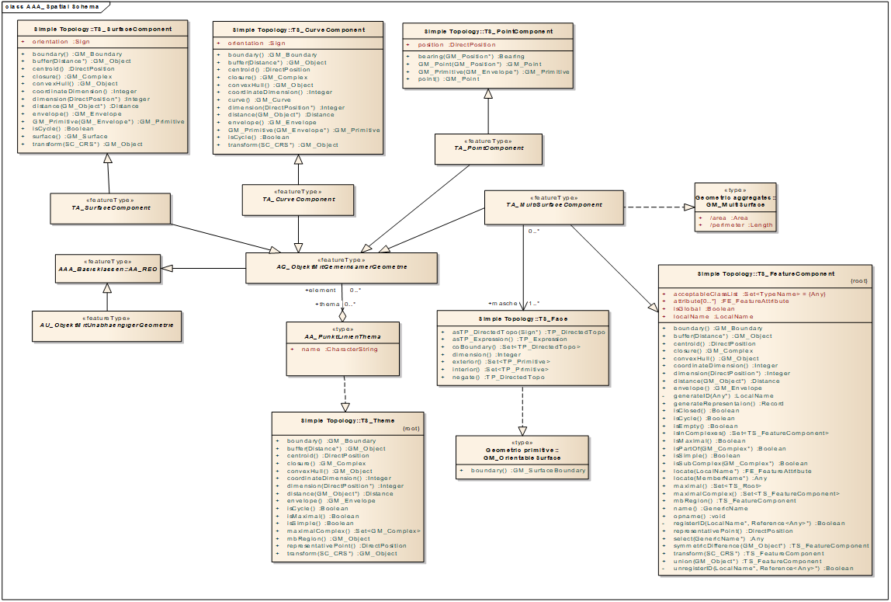

[#img_17,reftext='{figure-caption} {counter:figure-num}']
.Auswahldatentypen zur Bildung unterschiedlicher geometrischer Objektinstanzen
image::media/image17.png[media/image17,width=576,height=243]

Bezüglich der Verwendung von Geometrien bei raumbezogenen Objekten werden folgende Einschränkungen in der Beschreibung der Klassen angegeben:

Der Auswahldatentyp AA_Flaechengeometrie erlaubt die alternative Modellierung flächenförmiger Objekte durch eine Fläche oder eine Menge von Flächen.

GM_MultiSurface ist nur zulässig, wenn die Anzahl der enthaltenen GM_PolyhedralSurface >=2 ist und räumlich getrennte Flächen nachgewiesen werden müssen. Räumlich nicht getrennt liegende Flächen sind immer durch 1 Fläche (GM_PolyhedralSurface) abzubilden, es sei denn, die Erfassung sehr großer Flächen erfordert eine GM_CompositeSurface.

Der Auswahldatentyp AA_Liniengeometrie erlaubt es, linienförmige Objekte wahlweise durch eine einzelne Linie oder durch mehrere aufeinander folgende Linien geometrisch zu modellieren. GM_CompositeCurve ist nur zulässig, wenn die Anzahl der enthaltenen GM_Curve >=2 ist.

Die instanziierbaren Klassen für die raumbezogenen Fachobjekte sind ausschließlich aus den folgenden, im gemeinsamen Basisschema definierten abstrakten Supertypen abzuleiten:

*Objekte mit einfacher Topologie*

* TA_PointComponent,
* TA_CurveComponent
* TA_SurfaceComponent,
* TA_MultiSurfaceComponent

*Objekte mit gemeinsamer Punkt- und/oder Liniengeometrie*

* AG_Objekt
* AG_Punktobjekt
* AG_Linienobjekt
* AG_Flaechenobjekt

*Objekte mit unabhängiger Geometrie*

* AU_Objekt,
* AU_Punktobjekt
* AU_PunkthaufenObjekt
* AU_Linienobjekt
* AU_KontinuierlichesLinienobjekt
* AU_Flaechenobjekt
* AU_TrianguliertesOberflaechenObjekt_3D
* AU_MehrfachLinienObjekt_3D
* AU_MehrfachFlaechenObjekt_3D
* AU_UmringObjekt_3D
* AU_Punktobjekt3D
* AU_PunkthaufenObjekt_3D
* AU_KoerperObjekt_3D
* AU_GeometrieObjekt_3D

Für Präsentationsobjekte sind folgende Typen zu verwenden. Diese Klassen können auch direkt instanziiert werden:

* AP_PPO
* AP_PTO
* AP_KPO_3D
* AP_LTO
* AP_LPO
* AP_FPO

Als Geometrie für Linien bzw. Flächenumringe sind lediglich folgende Arten von Curve-Segmenten (Interpolationsarten) zulässig:

* GM_LineSegment
* GM_LineString
* GM_Arc
* GM_Circle
* GM_CubicSpline.

Bei GM_Arc muss der 2. ControlPoint im mittleren Drittel des Kreisbogens liegen; falls möglich, soll der Scheitelpunkt des Kreisbogens genommen werden. Bei GM_Circle dürfen die jeweiligen Abstände der ControlPoints (1=4,2,3) nicht weniger als ein Sechstel des Kreisumfangs betragen.

===== Objekte mit einfacher Topologie

ISO 19107 _Spatial schema_ bietet als Modul für ein Anwendungsschema unmittelbar das Schema _Simple topology_ an. Auf dieser Basis werden Objekte bereitgestellt, die topologische Eigenschaften durch geometrische Eigenschaften ausdrücken. Als Anwendung dieses Moduls stellt das Basisschema die Klassen TA_*Component zur Verfügung. Diese Klassen bieten zusätzlich zu den entsprechenden Klassen des _Spatial Schema_ die allgemeinen Eigenschaften aller AFIS-ALKIS-ATKIS-Objekte (Identifikator, Lebenszeitintervall, Anlass) sowie die Möglichkeit, verschiedene Objektarten über das Konstrukt des "PunktLinienThemas" topologisch und geometrisch zu verknüpfen. Die TA-Klassen können gleichzeitig einem topologischen Thema und einem oder mehreren PunktLinienThemen angehören. Die Klasse TA_MultiSurfaceComponent wurde abweichend zur Klasse TA_SurfaceComponent definiert, um zu erreichen, dass die referenzierten Maschen _(TS_Face)_ auch Realisierungen getrennt liegender Flächen _(GM_OrientableSurface)_ sein können. Damit ist auch die topologische Modellierung von Exklaven möglich. Exklaven sollen deshalb nicht über Relationen von Fachobjekt zu Fachobjekt (Relation _Composite_ [_composite > component_] zwischen TS_Feature und TS_Feature) modelliert werden.

===== Objekte mit gemeinsam genutzter Geometrie

Das Paket "AAA_GemeinsameGeometrie" stellt Basisklassen für Fachobjekte (Features) zur Verfügung, deren Geometrie aus Punkten, Linien und Flächen bestehen, die sich jeweils ihre Geometrie teilen.

[#img_18,reftext='{figure-caption} {counter:figure-num}']
.Objekte mit gemeinsamer Geometrie
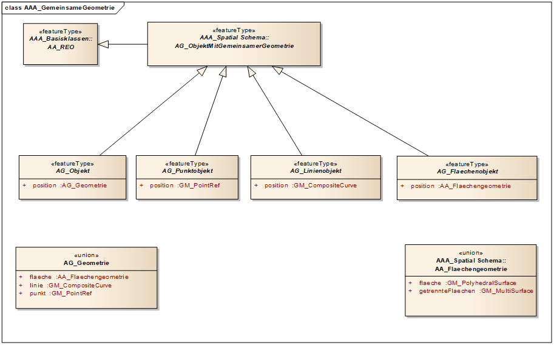

Dazu werden die Eigenschaften des erweiterten "AAA-SpatialSchema" genutzt, das zusätzlich das Konstrukt des "PunktLinienThemas" zur Verfügung stellt. Außerdem wird die Geometrie durch die gemäß ISO 19107 und 19109 für die gemeinsame Nutzung von Geometrie vorgesehenen Raumbezugsgrundformen (GM_PointRef und GM_CompositeCurve) ausgedrückt. Damit sind die geometrietragenden Primitive (GM_Point und GM_Curve) relational mit den Fachobjekten verbunden und können so von mehreren Fachobjekten gemeinsam genutzt werden. Die gemeinsame Nutzung von Geometrie bezieht sich nur auf Punkte und Linien, nicht auf Flächengeometrien. Linien werden vereinigt und einer gemeinsamen Nutzung zugeführt, wenn sie exakt in allen Stützpunkten gleich sind und gleiche Linieninterpolationen aufweisen; Linien, die sich kreuzen, zerschlagen sich nicht. Die Basisklassen "AG_Objekt", "AG_Punktobjekt", "AG_Linienobjekt" und "AG_Flaechenobjekt" sollen für die Definition von raumbezogenen Objektarten mit gemeinsamer Geometrie verwendet werden.

[#img_19,reftext='{figure-caption} {counter:figure-num}']
.Gemeinsam genutzte Grenzfläche bei 3D-Objekten
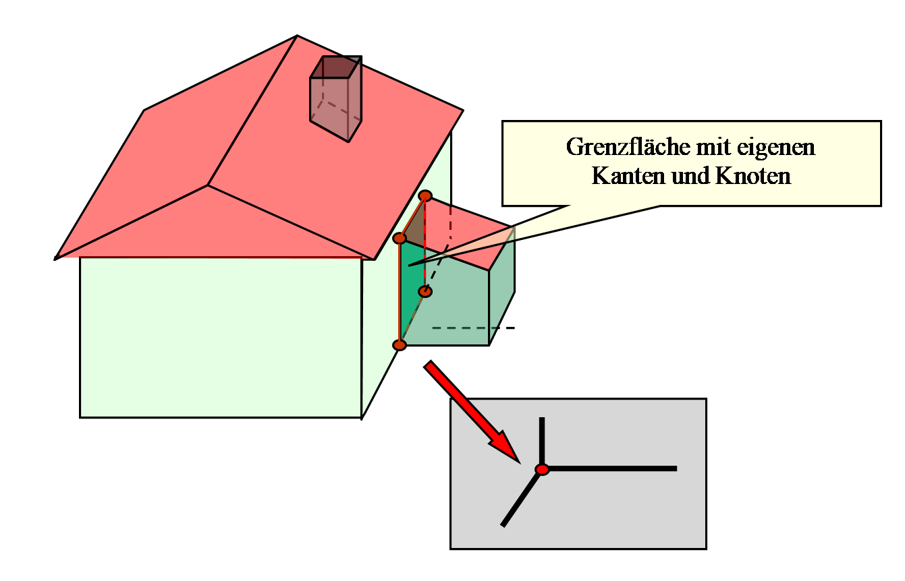

===== Objekte mit unabhängiger Geometrie

Zwei Pakete beschreiben Objekte mit unabhängiger Geometrie:

* Das Paket "AAA_UnabhaengigeGeometrie" stellt sechs Basisklassen für Fachobjekte zur Verfügung, deren Geometrie aus voneinander unabhängigen Punkten, Linien und Flächen bestehen.
* Das Paket AAA_Unabhängige Geometrie 3D stellt Basisklassen für 3D-Fachobjekte (Features) zur Verfügung, deren Geometrien voneinander unabhängig sind.

Diese Basisklassen sollen als Basis raumbezogener Objektarten mit unabhängiger Geometrie verwendet werden (z.B. Präsentationsobjekte).

[#img_20,reftext='{figure-caption} {counter:figure-num}']
.2D-Objekte mit unabhängiger Geometrie
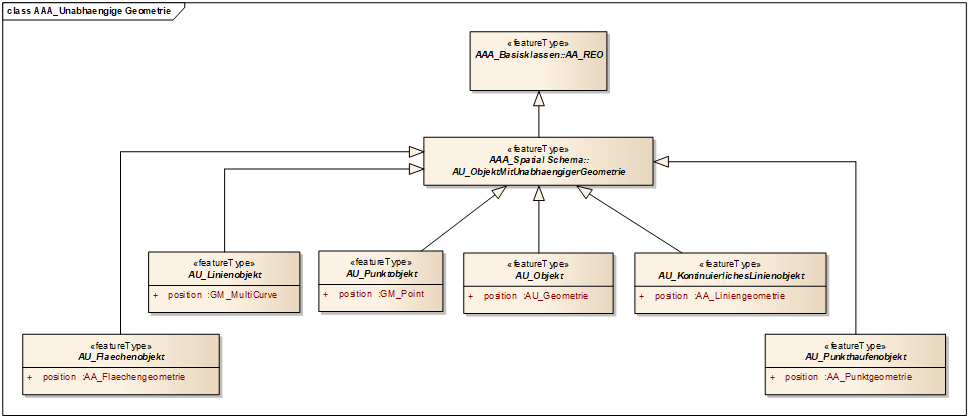

AU_Flaechenobjekt wird für Fachobjekte verwendet, die geometrisch durch Flächen beschrieben werden.

Ein AU_Linienobjekt wird geometrisch durch einen Set von Linien beschrieben (Anwendungsfall: z.B. Felssignatur).

AU_Punktobjekt beinhaltet ein Fachobjekt, das geometrisch durch einen einzelnen Punkt repräsentiert wird.

Der Auswahldatentyp "AU_Objekt" erlaubt es, Subklassen zu bilden, bei denen die konkrete Art des Geometrietyps erst auf Instanzenebene festgelegt wird. Zur Auswahl stehen verschiedendimensionale Geometrien: Punkt, Linie, Fläche und zusammengesetzte Linie. Damit ist es z.B. möglich, eine Objektart "Turm" zu bilden, die in Abhängigkeit von der Ausdehnung in der Realwelt punktförmige oder flächenförmige Geometrie hat.

Fachobjekte, die geometrisch durch zusammenhängende Linien beschrieben werden, erben von "AU_KontinuierlichesLinienobjekt". Die Geometrie eines solchen Objekts darf sich nicht kreuzen und nicht überlagern. Anwendungsfall: z.B. Leitung.

"AU_Punkthaufenobjekt" wird für ein Objekt verwendet, das geometrisch durch einen Punkt oder einen Punkthaufen repräsentiert wird. Ein Auswahldatentyp "AA_Punktgeometrie" erlaubt es, punktförmige Objekte alternativ mit einer oder mehreren Punktgeometrien zu bilden. Die Anwendung ist nur bei Objekten mit unabhängiger Geometrie sinnvoll. (z.B. Präsentationsobjekte mit Signaturhaufen mit individueller Geometrie).

Bei 3D-Objekten mit unabhängiger Geometrie sind Verschneidungen möglich. Die Modellierung ist erheblich einfacher, da keine Einschränkungen bei der gemeinsamen Nutzung unterschiedlicher Raumbezugsgrundformen bestehen. Für Visualisierungszwecke ist diese Art der Geometrie ausreichend.

Bei dem Nachweis von 3D-Geobasisdaten (Block-/ Klötzchenmodell) wird jedoch die redundanzfreie Geometrie empfohlen, bzw. sollte auf die Verschneidung von Geometrien verzichtet werden.

Das Paket "AAA_Unabhaengige Geometrie 3D" stellt Basisklassen für 3D Fachobjekte (Features) zur Verfügung, deren Geometrie aus voneinander unabhängigen 3D Punkten, 3D Linien, 3D Flächen und 3D Körpern besteht. Diese Basisklassen sollen als Basis raumbezogener Objektarten für 3D Fachanwendungen mit unabhängiger Geometrie verwendet werden (z.B. Präsentationsobjekte).

"AU_ObjektMitUnabhaengigerGeometrie_3D" ist die Oberklasse zu den acht Klassen mit unabhängiger 3D Geometrie. Ein "AU_ObjektMitUnabhaengigerGeometrie_3D" ist ein Raumbezogenes Elementarobjekt für 3D Fachanwendungen (AA_REO_3D), dessen Subklassen sich auf der Ebene der Instanzen keine Geometrie teilen. Die Klasse ist nicht direkt instanziierbar.

. AU_Punktobjekt_3D ist ein 3D Fachobjekt, das geometrisch durch einen einzelnen 3D Punkt repräsentiert wird.
. AU_PunkthaufenObjekt_3D ist ein 3D Fachobjekt, das geometrisch durch einen 3D Punkthaufen repräsentiert wird.
. AU_MehrfachLinienObjekt_3D ist ein 3D Fachobjekt, das geometrisch durch 3D Linien beschrieben wird. Es sind mehrere getrennt liegende 3D Linien zulässig.
. AU_MehrfachFlaechenObjekt_3D ist ein 3D Fachobjekt, das geometrisch durch 3D Flächen beschrieben wird. Es sind mehrere getrennt liegende 3D Flächen zulässig.
. AU_TrianguliertesOberflaechenObjekt_3D ist ein 3D Fachobjekt, das geometrisch durch räumlich zusammenhängende 3D Flächen beschrieben wird, die eine triangulierte Oberfläche (TIN) definieren (z.B. eine Geländeoberfläche).
. AU_KoerperObjekt_3D ist ein 3D Fachobjekt, das geometrisch durch 3D Körper beschrieben wird.
. AU_UmringObjekt_3D ist ein 3D Fachobjekt, das geometrisch durch ein 3D Umringspolygon beschrieben wird, und weitere 3D Umringspolygone für Enklaven aufweisen kann. Jeder Teil der Geometrie muss ein geschlossener Umring sein.
. AU_GeometrieObjekt_3D ist ein 3D Fachobjekt, das es erlaubt, Subklassen zu bilden, bei denen die konkrete Art des 3D Geometrietyps erst auf Instanzenebene z.B. in Abhängigkeit von der Detaillierungsstufe (Level of Detail) festgelegt wird (z.B. Mauern die durch 3D Flächen oder detaillierter durch 3D Körper repräsentiert werden können).

[#img_21,reftext='{figure-caption} {counter:figure-num}']
.Objekte mit unabhängiger Geometrie 3D
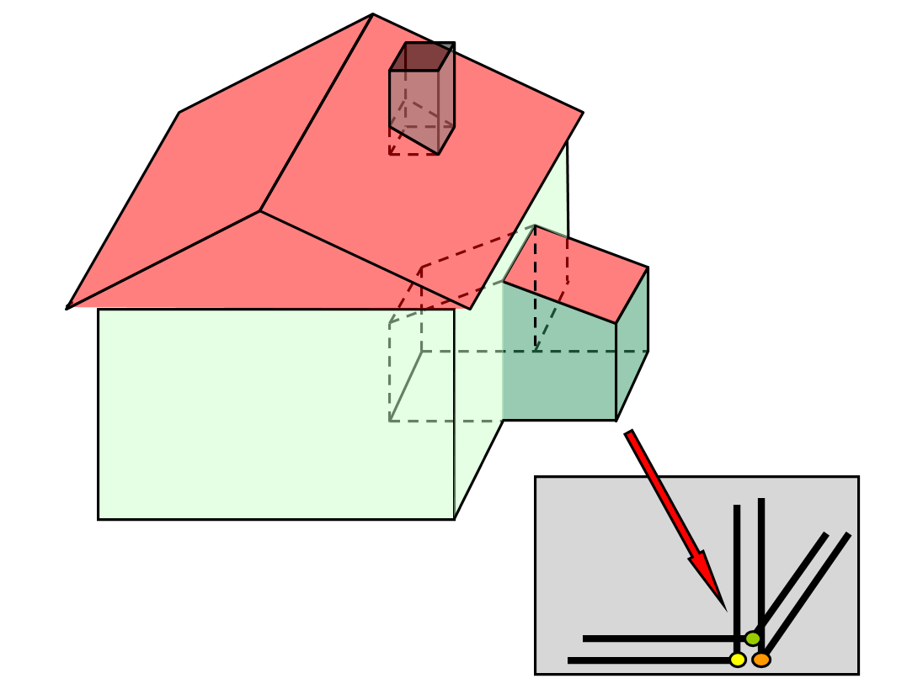

[#img_22,reftext='{figure-caption} {counter:figure-num}']
.3D-Objekte mit unabhängiger Geometrie
image::media/image22.png[media/image22,width=942,height=457]

===== Raumbezugssystem, Koordinaten

In AFIS-ALKIS-ATKIS kann für jede Geometrie das zugehörige *Koordinatenreferenzsystem (CRS)* angegeben bzw. gespeichert werden.

Nach der Norm ISO 19111 _(Spatial Referencing by Coordinates)_ besteht ein Koordinatenreferenzsystem aus zwei Komponenten, dem "Datum" und dem "Koordinatensystem" (siehe folgende Skizze).

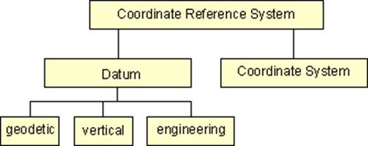

Das *Datum* ist der physikalische Teil eines CRS, das per Definition des Nullpunkts, der Orientierung der Koordinatenachsen und des Maßstabs den Bezug zur Erde festlegt. Ein Datum kann ein geodätisches Datum, ein vertikales Datum oder ein ingenieurtechnisches bzw. lokales Datum sein. Beispiele für ein geodätisches Datum sind das Deutsche Hauptdreiecksnetz (DHDN), auch "Potsdam-Datum" genannt, oder das Europäische Terrestrische Referenzsystem 1989 (ETRS89).

Das *Koordinatensystem* ist der mathematische Teil eines CRS, der durch Regeln festlegt, wie einer Geometrie, z. B. einem Festpunkt, Koordinaten zugewiesen werden. Die Koordinaten einer Geometrie können z. B. als kartesische Koordinaten (X, Y, Z), ellipsoidische Koordinaten (Breite, Länge und ggf. ellipsoidische Höhe) oder projizierte Koordinaten (Gauß-Krüger-Abbildung, UTM-Abbildung) angegeben werden.

Neben den CRS für 2-D-Lageangaben und 3-D-Positionsangaben sind für die Führung von Höhenangaben bzw. -koordinaten (z.B. NN-Höhen) eigene Koordinatenreferenzsysteme definiert. Die in Deutschland gebräuchlichen Koordinatenreferenzsysteme für Lage, Position und Höhe sind in xref:crsuom_crs_aaa[xrefstyle=full] mit ihren Bezeichnungen und Kurznamen aufgelistet.

Die Art des Koordinatenreferenzsystems bestimmt die Anzahl der vorhandenen Koordinatenwerte (z.B. Rechtswert, Hochwert oder Rechtswert, Hochwert, Höhe). Grundsätzlich können nach ISO 19111 auch zusammengesetzte CRS eingeführt werden. Bei Objekten der Objektart "Punktort" sind in AFIS-ALKIS-ATKIS gemäß der Definition der Objektart Punktort zusammengesetzte Koordinatenreferenzsysteme jedoch *nicht* zugelassen.

[[basisschema_aaa_signatur]]
==== Signaturierung, Präsentationsobjekte

Die Präsentationsobjekte sind wegen den allgemeingültigen Eigenschaften im AAA Basisschema beschrieben.

[#img_24,reftext='{figure-caption} {counter:figure-num}']
.Präsentationsobjekte
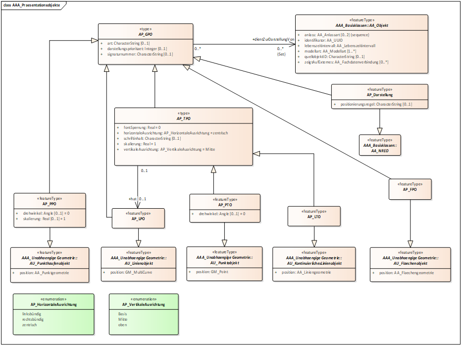

Die Präsentationsobjekte enthalten eine Signaturnummer und weitere Eigenschaften zur Steuerung der Präsentation, wie z. B. Darstellungspriorität und Art. Präsentationsobjekte müssen in ALKIS mit den entsprechenden Fachobjekten durch eine Relation "dientZurDarstellungVon" verbunden sein. In ATKIS gibt es keine derartige Regel, d.h. es dürfen "freie Präsentationsobjekte" existieren. Die Präsentation von Objekten in graphischen sowie nicht graphischen Ausgaben erfolgt gemäß nachstehender Abbildung in folgender Weise:

*Präsentation in der Karte*

[#img_25,reftext='{figure-caption} {counter:figure-num}']
.Präsentationsablauf für die Karte
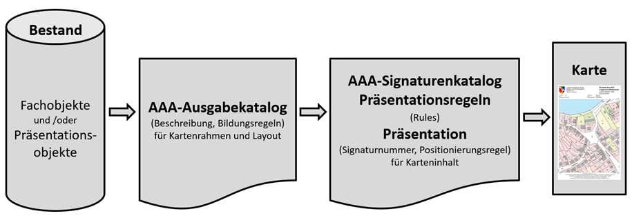

. [.underline]#Präsentationsobjekte im Bestand# +
Präsentationsobjekte werden für alle Signaturen in Form von Schrift, Symbol, Linie, Fläche angelegt, die nicht vollautomatisch für einen bestimmten Zielmaßstab erzeugt und platziert werden können. Die konkrete Signaturnummer, die eine Ableitungsregel repräsentiert, sowie die Positionierungsnummer, die für eine bestimmte Positionierungsregel steht, kann optional im Präsentationsobjekt gespeichert werden. Präsentationsobjekte sind auch dann zu bilden, wenn bei der Ausgabe von der im Signaturenkatalog festgelegten Standarddarstellung abgewichen werden soll (z.B. abweichende Schrifthöhe der Flurstücksnummer).
. [.underline]#Präsentation mittels Ableitungs- und Positionierungsregel# +
Signaturen eines Fachobjektes in Form von Schrift, Symbol, Linie, Fläche werden an einer definierten Stelle (Standardposition) unter Anwendung des Filter Encodings und einer konkreten Ableitungsregel, die zu einer bestimmten Signaturnummer führt und den Positionierungsregeln, die eine bestimmte Positionierungsnummer aktiviert, platziert. In diesem Falle wird ein Präsentationsobjekt in den Bestandsdaten nicht angelegt. Die darzustellende fachliche Information wird aus der angegebenen Attributart der Fachobjektart ermittelt. Dieser Weg wird als die Standardvariante betrachtet, der aber durchaus aus Gründen der Performance nicht immer effizient ist.
. [.underline]#Präsentation mittels gespeicherter Ableitungs- und Positionierungsregel# +
Um die Performance der Präsentation für die Standardvariante zu erhöhen, wird zu einem bestimmten Zeitpunkt (Ersteinrichtung, Fortführung) die konkrete Signaturnummer sowie die Positionierungsnummer mit der ein Fachobjekt zur Darstellung gebracht werden soll, unter dem zugeordneten Präsentationsobjekt AP-Darstellung als NREO gespeichert. Der Vorteil gegenüber der Bildung von Präsentationsobjekten (Variante 1) ist die Vermeidung von Redundanzen der Geometrie, da bei AP-Darstellung die Darstellungsgeometrie aus dem jeweiligen Fachobjekt abgeleitet wird. Zum Zeitpunkt der Präsentation wird durch Anwendung des Filter Encodings in Verbindung mit der Ableitung der Darstellungsgeometrie aus dem Fachobjekt und den gespeicherten Regeln, sprich Signaturnummer, Positionierungsnummer, die Darstellung schnellstmöglich herbeigeführt. Die Objektart AP_Darstellung wird in ALKIS dazu verwendet, um folgende Veränderungen in einer Liegenschaftskarte herbeizuführen:

* Unterdrückung einer Darstellung in der Liegenschaftskarte,
* Herbeiführung einer bestimmten Bemusterung in der Liegenschaftskarte, wie z. B. flächenhafte Bemusterung.

*Präsentation der Liegenschaftsbeschreibung*

Die Präsentation der Angaben für eine Liegenschaftsbeschreibung, wie z. B. Flurstücks- und Eigentümernachweis, erfolgt ausschließlich zur Laufzeit über die Anwendung des Filter Encodings und der Regeln, die im AAA-Ausgabekatalog hinterlegt sind. Diese Ausgabedaten werden in Verbindung mit einer konkreten Ableitungsregel aus dem nicht formalisierten Signaturenkatalog präsentiert. Die jeweiligen Textpositionen können dem entsprechenden Standbogen entnommen werden. Muster für die Produktausgabe sind ein zusätzlicher Anhalt.

[#img_26,reftext='{figure-caption} {counter:figure-num}']
.Präsentationsablauf für die Liegenschaftsbeschreibung
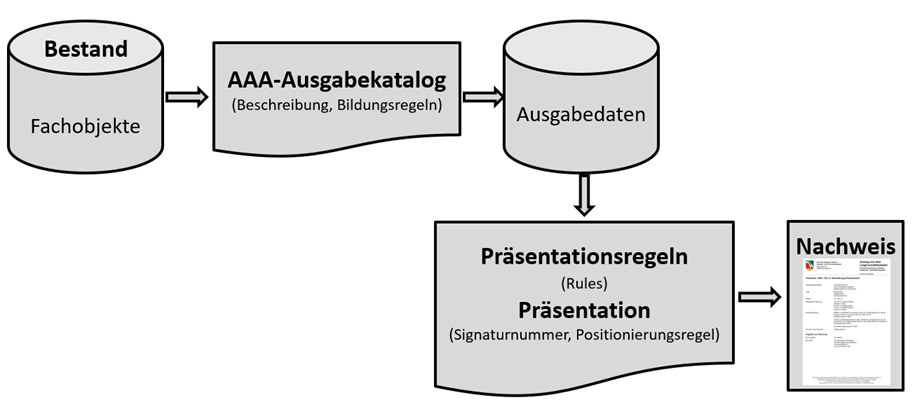

*Erzeugung der Präsentationsobjekte und AP_Darstellung für den Bestand*

Um eine effiziente Präsentation der Fachobjekte in einer Ausgabe zu gewährleisten, müssen bereits zum Zeitpunkt der Erhebung / Fortführung geeignete Präsentationsvorgaben festgelegt werden. Es werden dabei, gemäß <<img_27>> drei Fälle unterschieden:

[#img_27,reftext='{figure-caption} {counter:figure-num}']
.Präsentationsablauf in der Erhebung / Fortführung
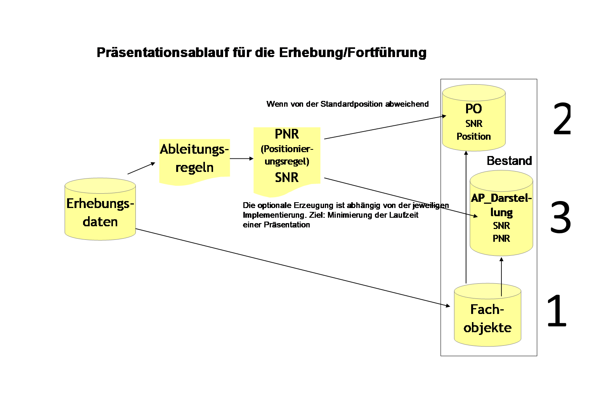

. [.underline]#Keine Festlegung von Präsentationsvorgaben# +
Die in der Erhebung / Fortführung erzeugten ALKIS- strukturierten Erhebungsdaten brauchen für eine schnelle Präsentation in einer Ausgabe keine vordefinierten Festlegungen in Form der Zuweisung einer konkreten Signatur- bzw. Positionierungsnummer. Die für eine Präsentation benötigten Angaben können direkt während der Laufzeit für eine Darstellung aus dem 3A- Datenmodell generiert werden.
. [.underline]#Speicherung von Präsentationsobjekten im Bestand# +
In der Erhebung / Fortführung wird zur Darstellung von konkreten Signaturen eines Fachobjektes ein Präsentationsobjekt angelegt, da die Signaturen z. B. nicht vollautomatisch für einen bestimmten Zielmaßstab erzeugt und platziert werden können. Hierbei werden die Angaben über die Geometrie, optional eine Signaturnummer und / oder optional eine Positionierungsnummer im Objekt gespeichert.
. [.underline]#Festlegung von Präsentationsvorgaben# +
Zur Minimierung der Laufzeit einer Präsentation kann in der Erhebung / Fortführung für ein Fachobjekt die Objektart AP_Darstellung als NREO angelegt werden, in der eine konkrete Positionierungsnummer gespeichert wird, so z. B. die Bemusterung einer Fläche. Die Geometrie für die Präsentation wird zur Laufzeit aus dem Fachobjekt mit geeigneten Methoden abgeleitet.

*Präsentationsobjekte 3D*

Das Paket AAA_Praesentationsobjekte_3D konkretisiert die Fachobjekte von AAA_Unabhaengige Geometrie 3D für die Zwecke der Präsentation. Die entsprechenden Fachobjekte können unmittelbar instanziiert werden.

Das 3D Präsentationsobjekt AP_KPO_3D wird für 3D Symbole verwendet, deren 3D Geometrie in einem externen Datenformat gespeichert wird und über eine URI referenziert wird. AP_KPO_3D leitet sich aus AU_Punktobjekt_3D ab und seine 3D Punktgeometrie positioniert das Symbol. Über eine Transformationsmatrix wird die lageunabhängige 3D Geometrie in dem externen Datenformat in den Raumbezug des Präsentationsobjektes AP_KPO_3D transformiert. Die Präsentationsobjekte sind wie andere Objekte im Objektartenkatalog in Verbindung mit dem jeweiligen Signaturenkatalog bzw. 3D Symbolbibliotheken zu definieren.

[#img_28,reftext='{figure-caption} {counter:figure-num}']
.Präsentationsobjekte_3D
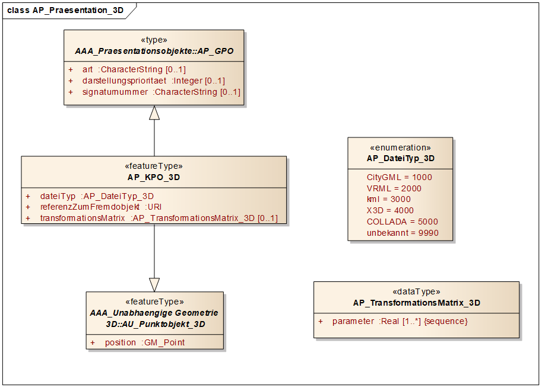

*Regelung von länderübergreifend redundanzfreier Vergabe länderspezifischer Signaturnummern*

Das AFIS-ALKIS-ATKIS-Datenmodell bringt den Anwendern neben vielen anderen Vorteilen eine länderübergreifende Vereinheitlichung der Datenbestände sowie deren Präsentation.

Der Bedarf an frei gestaltbaren Ausgaben seitens der Länder besteht. Dies belegen mehrere landespezifische Signaturenkataloge. Bei deren Schaffung wurden unterschiedliche Wege beschritten, exemplarisch hier anhand zweier Bundesländer aufgezeigt:

Baden-Württemberg hat als einziges Bundesland im ALKIS-Signaturenkatalog der AdV länderspezifische Anteile mit eigenen Signaturnummern unterbringen können. Eine Erweiterung um länderspezifische Anteile weiterer Länder ist von der AdV nicht beabsichtigt, da sie für die Pflege länderspezifischer Vorgaben nicht zuständig ist.

Nordrhein-Westfalen hat einen eigenen ALKIS-Signaturenkatalog geschaffen, dessen Inhalte unabhängig neben dem der AdV veröffentlicht werden.

Folgende Regelung gewährleistet die Redundanzfreiheit der Signaturnummern bei länderspezifischen Erweiterungen des ALKIS-Signaturenkataloges. Damit wird vermieden, dass länderübergreifende Datennutzer zukünftig möglicherweise mit identischen Signaturnummern verschiedener Länder konfrontiert werden, die inhaltlich unterschiedliche Präsentationen bewirken sollen. Es gelten folgende Vorgaben:

* Bei allen länderspezifischen Präsentationsobjekten ist das Attribut 'signaturnummer' Pflichtattribut.
* Mit länderspezifischen Signaturnummern einhergehende Präsentationsregeln sind länderspezifisch auszuprägen.
* Länderspezifische Signaturnummern bestehen aus dem Länderkürzel (bzw. "BU" oder "BKG") gemäß xref:basisschema_aaa_oids[xrefstyle=full], unmittelbar gefolgt von der vierstelligen Ziffernfolge der Signaturnummer. Sie werden in dem Attribut AP_GPO.signaturnummer (bzw. entsprechenden Erben) geführt. Beispiele: RP4141, NW0311.

[[basisschema_aaa_kartengeometrieobjekte]]
==== Kartengeometrieobjekte

Als Kartengeometrieobjekte werden diejenigen Fachobjekte definiert, die bei der Ableitung für einen bestimmten Kartenmaßstab aus Gründen der kartographischen Generalisierung ihre geometrische Form und / oder Lage verändert haben. Ein Kartengeometrieobjekt muss folgende eigenständige Informationen enthalten: Den Identifikator, die Angabe des Kartenmodells, z. B. DTK10, zu dem es gehört, die einseitige Relation _ist_abgeleitet_aus_ auf das zugrundeliegende AFIS-ALKIS-ATKIS-Objekt sowie die eigentliche Geometrie. Darüber hinaus muss es die Attribute des zugrundeliegenden AFIS-ALKIS-ATKIS-Objekts enthalten, um in den Ableitungsregeln des Signaturenkatalogs für die Präsentation ausgewertet werden zu können.

[[basisschema_aaa_punktmengenobjekte]]
==== Punktmengenobjekte

Als Punktmengenobjekte (PMO) werden Fachobjekte dann definiert, wenn einer großen Anzahl geometrischer Orte Attributwerte jeweils gleicher Attributarten zugeordnet werden soll. Dies ist im AAA-Anwendungskontext insbesondere bei Digitalen Geländemodellen, die i.d.R. Höheninformationen in einer Gitterstruktur vorhalten, der Fall. Da aber auch häufig unregelmäßig verteilte, gleichartige Informationen vorgehalten werden sollen, z.B. Höhenmesspunkte, wurde außer der Gittervariante der PMO (AD_GitterCoverage) auch eine Variante für eine beliebige Punktverteilung zugelassen (AD_PunktCoverage). Die Modellierung realisiert die Klassen aus ISO 19123 Coverages. Sie wird in der Weise eingeschränkt, dass für die Sequenz der Attributwerte (CV_SequenceType) nur "linear" zulässig ist.

[#img_29,reftext='{figure-caption} {counter:figure-num}']
.Modellierung der Punktmengenobjekte
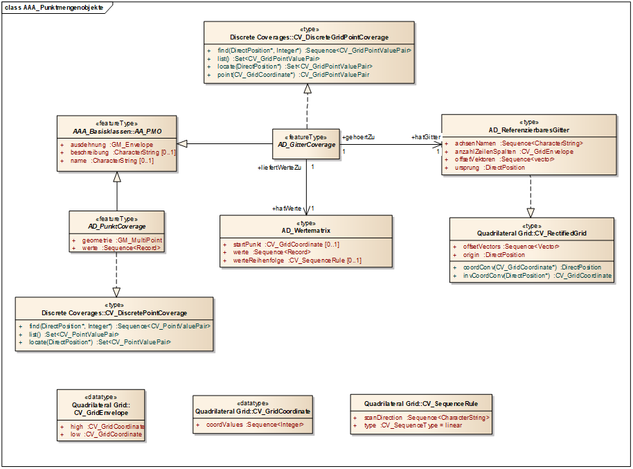

[[basisschema_aaa_fdvregelung]]
==== Regelung von länderübergreifend redundanzfreier Vergabe länderspezifischer Fachdatenverbindungen

In allen AAA-Objekten kann im Attribut 'zeigtAufExternes' eine Fachdatenverbindung untergebracht werden. Die Modellierung lässt dies auf zwei Arten zu, nämlich in Form der URN- oder der URL-Variante. Im Modell steht hierzu beim Attribut AA_Fachdatenverbindung.art folgendes:

[quote,Dokumentation Attribut AA_Fachdatenverbindung.art]
____
Diese Attributart definiert den Namensraum zur Spezifikation der Art der Fachdatenverbindung. +
Es sind URN zu verwenden, wenn es sich um einen nicht allgemein auflösbaren Namensraum handelt. Wenn URLs verwendet werden, muss die verwiesene Ressource eine Beschreibung dieser Fachdatenanbindung zurückliefern. URLs müssen das HTTP-Protokoll verwenden.
____

Fachdatenverbindungen, die sich der URL-Variante bedienen, sind aufgrund der Eindeutigkeit der URNs unproblematisch.

Folgende Regelung gewährleistet die Redundanzfreiheit der Fachdatenverbindungen bei länderspezifischen Erweiterungen mit der URN-Variante. Dadurch wird vermieden, dass länderübergreifende Datennutzer zukünftig möglicherweise mit identischen Nummern von Fachdatenverbindungen verschiedener Länder konfrontiert werden, denen inhaltlich unterschiedliche Sachverhalte in Hintergrund stehen.

In Anlehnung an die in der GeoInfoDok übliche URN-Logik:

* urn:adv:uom für Maßeinheiten,
* urn:adv:crs für Koordinatenreferenzsysteme,
* urn:adv:oid für Objektidentifikatoren

ist für Fachdatenverbindungen folgende URN zu verwenden:

* urn:<Länderkürzel>:fdv:<vierstelliger Zifferncode>
+
wobei <Länderkürzel> gemäß xref:basisschema_aaa_oids[xrefstyle=full] - jedoch in Kleinbuchstaben - ausgeprägt sein sollen und <vierstelliger Zifferncode> sich stets vierstellig aus den Ziffern 0-9 (ggf. mit führenden Nullen) zusammensetzt.
+
Beispiele: urn:rp:fdv:4711 bzw. urn:by:fdv:0203.
+
Somit wird auch in der URN-Variante der Fachdatenverbindungen die Eindeutigkeit sichergestellt. Die Zifferncodes sowie die ihnen zugeordneten Inhalte sind in jeweiliger Länderzuständigkeit auszuprägen.

* urn:adv:fdv:<vierstelliger Zifferncode>
+
wobei der vierstellige Zifferncode von der AdV festgelegt und in geeigneter Weise veröffentlicht wird (z.B. AdV-online).

[[basisschema_aaa_oids]]
==== Identifikatoren, Verknüpfungen

*Identifikatoren* stehen stellvertretend für das Objekt, das sie repräsentieren. Daher bezeichnet man sie auch als *Objektidentifikatoren* oder kurz *OID*. Die wesentlichen Eigenschaften eines Identifikators sind:

* Er ist systemweit eineindeutig, wobei durch die entsprechende Definition von "systemweit" die Forderung nach bundesweiter und fachübergreifender Eindeutigkeit erfüllt werden kann.
* Sein Entstehen zeigt an, dass ein Objekt entstanden ist.
* Er bleibt während der Lebensdauer eines Objekts unverändert. Das gilt auch bei der Migration von Daten in eine neue Version der GeoInfoDok, mit Ausnahme der untergegangenen Elemente, welche lediglich aus Gründen der Abwärtskompatibilität noch im Modell belassen wurden, siehe entsprechendes Kapitel in den <<releasenotes,Release Notes>> #*TBD*: Worauf genau in den Release Notes soll verwiesen werden?#.
* Sein Untergehen zeigt an, dass ein Objekt nicht mehr existiert.

Damit ist der Lebenszyklus von Identifikatoren identisch mit dem Lebenszyklus der Objekte, deren Repräsentanten sie sind. Die Frage, wann Identifikatoren geändert werden dürfen und wann nicht, darf somit nicht aus dv-technischer Sicht beantwortet werden, sondern es müssen fachliche Kriterien benannt werden,

* wann ein Objekt entsteht,
* welche Änderungen es ohne Identitätsverlust verkraftet und
* wann es untergeht.

So werden auch Objektidentifikatoren von Objekten, die von anderen Fachstellen im Rahmen ihrer Aufgaben erzeugt wurden, bei der Übernahme in die AAA-Datenhaltung unverändert übernommen. Auch bei Migration von Bestandsdaten in eine neue Version der GeoInfoDok beibt das ursprüngliche Lebenszeitintervall unverändert erhalten, mit Ausnahme der untergegangenen Elemente, welche lediglich aus Gründen der Abwärtskompatibilität noch im Modell belassen wurden, siehe entsprechendes Kapitel in den <<releasenotes,Release Notes>> #*TBD*: Worauf genau in den Release Notes soll verwiesen werden?#.

Für alle Fachobjekte wird eine eindeutige Bezeichnung als Objektidentifikator verwendet. Der Identifikator hat folgenden Aufbau:

[width="100%",cols="5%,30%,20%,45%a"]
|===
| |Anteile |Bedeutung |Festlegung

|1 a|
Weltweit eindeutige Kennung

(2 Zeichen)

|Nationalität |"DE" für Deutschland
|2 a|
Präfix

(6 Zeichen)

|Kennung für die den Identifikator erzeugende Implementierung oder Datenbank sowie für vorläufige Identifikatoren. a|Die Zeichen beginnen linksbündig mit den in der Norm ISO 3166-2 "Country Subdivision Code" (ISO, 15. Dezember 1998) genormten Abkürzungen der Bundesländer. Für Bundesdienststellen ist die Abkürzung "BU" vorgesehen bzw. im Falle des Bundesamtes für Kartographie und Geodäsie "BKG"; die weiteren Stellen werden durch das jeweilige Bundesland bzw. die Bundesdienststelle oder das BKG festgelegt. Soweit im Verarbeitungsprozess über die Verwendung von vollständigen Identifikatoren hinaus vorläufige Identifikatoren benötigt werden, beginnen diese linksbündig mit "_". Damit ergibt sich folgende Tabelle:

////

[cols="1,1",frame="none",grid="none"]
!===
! Baden-Württemberg ! "BW"
!Bayern !"BY"
!Berlin !"BE"
!Brandenburg !"BB"
!Bremen !"HB"
!Hamburg !"HH"
!Hessen !"HE"
!Mecklenburg-Vorpommern !"MV"
!Niedersachsen !"NI"
!Nordrhein-Westfalen !"NW"
!Rheinland-Pfalz !"RP"
!Sachsen !"SN"
!Sachsen-Anhalt !"ST"
!Saarland !"SL"
!Schleswig-Holstein !"SH"
!Thüringen !"TH"
!Bundesdienststellen !"BU"
!Bundesamt für Kartographie und Geodäsie !"BKG"
!Vorläufiger Identifikator !"_"

!===

////

Baden-Württemberg: "BW" +
Bayern: "BY" +
Berlin: "BE" +
Brandenburg: "BB" +
Bremen: "HB" +
Hamburg: "HH" +
Hessen: "HE" +
Mecklenburg-Vorpommern: "MV" +
Niedersachsen: "NI" +
Nordrhein-Westfalen: "NW" +
Rheinland-Pfalz: "RP" +
Sachsen: "SN" +
Sachsen-Anhalt: "ST" +
Saarland: "SL" +
Schleswig-Holstein: "SH" +
Thüringen: "TH" +
 +
Bundesdienststellen: "BU" +
Bundesamt für Kartographie und Geodäsie: "BKG" +
 +
Vorläufiger Identifikator: "_"

Zulässige Zeichen sind: +
A-Z, a-z, 0-9, _ ohne Umlaute und ohne ß

|3 a|
Suffix

(8 Zeichen)

|Laufende Nummer a|
Zulässige Zeichen sind: +
A-Z, a-z, 0-9 ohne Umlaute und ohne ß

|===

Beispiele für Identifikatoren sind: +
`"DENW123412345678"` (endgültiger Identifikator) +
`"DE_0000000000001"` (vorläufiger Identifikator)

Zur Realisierung einer Geodateninfrastruktur im Sinne und unter Nutzung der Schnittstellendefinitionen des Open Geospatial Consortiums (OGC) müssen alle beteiligten Stellen eine Systematik für die Vergabe der Identifikatoren und ein Service-Interface definieren, sodass sichergestellt ist, dass Objekte über ihren Identifikator ohne weiteres Wissen gefunden werden können. Hier bietet sich im Sinne einer bundesweiten Lösung ein gemeinsamer Service und auch die Publikation von AAA-Bestandsdaten als Linked Open Data an; die Systematik der Vergabe und Verteilung kann unberührt davon länderspezifisch festgelegt werden.

Um Relationen zwischen den Fachobjekten im Datenaustausch aufzubauen, werden Identifikatoren auch als Referenzen auf Fachobjekte geführt.

Identifikatoren sind unter anderem auch erforderlich, um bei der Formulierung von Fortführungen angeben zu können, welche Objekte gelöscht und welche Objekte überschrieben werden sollen. Da die Objekte dabei in ihrer konkret vorliegenden Version angesprochen werden müssen, wird der o.a. Identifikator in diesen Fällen um die Angabe von Entstehungsdatum/-zeit der angesprochenen Objektversion ergänzt.

Eine wichtige Voraussetzung für die gemeinsame Führung von Datenbeständen unterschiedlicher Herkunft ist, dass die Integrationssituation in Form von Referenzen zwischen den Daten der Vermessungsverwaltung und den Fachdaten abgebildet ist (*Verknüpfung*). Diese Verknüpfung kann einseitig in den raumbezogenen Basisinformationssystemen der Vermessungsverwaltung oder im Fachinformationssystem (einseitige Verknüpfung) oder gegenseitig in beiden Informationssystemen (gegenseitige Verknüpfung) erfolgen. Als Verknüpfungsmerkmale sind eindeutige Bezeichnungen zu definieren und zu führen. Diese können aus den o.a. Identifikatoren und / oder aus Fachkennzeichen der jeweiligen Datenbestände bestehen.

[[basisschema_aaa_modellart]]
==== Modellart

Das AA_Objekt besitzt das Attribut _modellart,_ welches eine Zuordnung zu einer oder mehreren Modellarten darstellt. Die erweiterbare Codelist "AA_WeitereModellart" erlaubt die Erfassung beliebiger, z.B. länderspezifischer Modellarten. Die Eintragung und Pflege solcher Wertearten und Bezeichner wird im Rahmen der AdV-Registry für Codelisten geregelt.

[#img_30,reftext='{figure-caption} {counter:figure-num}']
.Modellarten im Basisschema
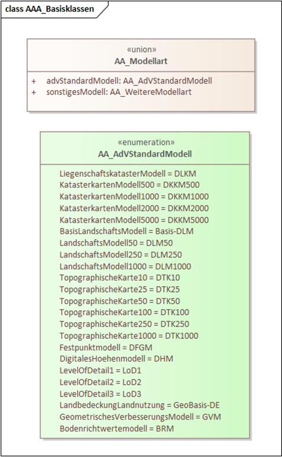

Die Enumeration AA_AdvStandardModell ist hingegen nicht erweiterbar und enthält die zulässigen Modellarten für die Anwendungsschemata der AdV. Durch die Angabe der Modellarten ist es möglich, sämtliche Elemente des Datenmodells (z.B. Objektarten, Attributarten etc.) einem oder mehreren Modellen zuzuordnen. Somit können trotz der einheitlichen und integrierten Modellierung unterschiedliche Fachsichten auf die Objekte der realen Welt abgebildet und in Form von fachspezifischen Objektartenkatalogen ausgegeben werden. Auswirkungen auf die NAS hat die Modellart jedoch nicht: Die NAS wird inhaltlich definiert durch das gesamte AAA-Anwendungsschema, wodurch auf der Ebene der Schnittstelle keine unterschiedlichen Fachsichten abgebildet werden können. Das bedeutet, es gibt nicht eine ATKIS- oder ALKIS-NAS, sondern nur *die* NAS.

Wird bei Objekt-, Attribut-, oder Wertearten keine Modellart angegeben, gibt es keine Einschränkungen bei der Verwendung von Modellarten, d.h. diese Elemente können für beliebige Modellarten verwendet werden. Umgekehrt bedeutet dies, dass bei der Angabe von Modellarten alle nicht erwähnten Modellarten asugeschlossen werden.

[[basisschema_aaa_loddef]]
==== LoD-Definition

Der Level of Detail beschreibt die Detaillierungsstufe der 3D Geometrie eines raumbezogenen Elementarobjekts. Diese wird meistens durch die Erfassungs- bzw. Ableitungsmethode für die 3D Geometrie bestimmt. Es sollen nur die Level of Detail 1 bis 3 für ALKIS 3D verwendet werden. Die inverse Relationsrolle "detailliert" verweist auf das zugehörige raumbezogene Elementarobjekt mit einer 3D Geometrie in einer geringeren Detaillierungsstufe. Die Relationsrolle "generalisiert" verweist auf das zugehörige raumbezogene Elementarobjekt mit einer 3D Geometrie in einer höheren Detaillierungsstufe.

Die 3D-Ergänzung unterstützt verschiedene Levels of Detail (LoD). LoDs werden benötigt, um Gebäude und andere 3D-Objekte einem bestimmten Detailierungsgrad zuzuordnen. Ebenso dienen sie der effizienten Visualisierung und Datenanalyse.

Zur Definition der einzelnen LoD wurden folgende Dokumente herangezogen:

* 07-062_Candidate_OpenGIS_CityGML_Implementation_Specification.pdf
* 3D_Stadtmodelle, Eine Orientierungshilfe der AG Stadtmodelle des AK Kommunales Vermessungs- und Liegenschaftswesens des Städtetages NRW

Der unterste Level LoD1 ist das Blockmodell, dort werden die Gebäude als einfacher Block mit Flachdach dargestellt. Der LoD2 stellt die unterschiedlichen Dachtypen dar, die Darstellung von Vegetation ist möglich. LoD3 ist der Level mit dem höchsten Detailierungsgrad. Dort werden detaillierte Wand- und Dachstrukturen, Vegetation und Straßenmöblierung abgebildet. Neben den visuellen Kriterien liegen den LoDs geometrische Mindestanforderungen zugrunde (siehe <<tab_lod_1to3_mit_geometrischen_genauigkeiten>>):

* die absolute Lage- und Höhengenauigkeit sowie
* die Grundfläche der darzustellenden Objekte.

[#tab_lod_1to3_mit_geometrischen_genauigkeiten,width="100%",cols="31%,23%,23%,23%",reftext='{table-caption} {counter:table-num}']
.LoD 1-3 mit geometrischen Genauigkeiten
|===
| |LoD1 |LoD2 |LoD3

|Absolute Lage-/ Höhengenauigkeit (besser als...) |5/5m |2/1m |0.5/0.5m

|Darstellung |Objektblöcke als generalisierte Form; >6*6m/3m |Objekte als generalisierte Form; >4*4m/2m |Objekte als reale Form; >2*2m/1m

|Dachform |Flachdach |Dachtyp und -ausrichtung |Reale Form

|Fremdobjekte (Straßenmöbel) |Wichtige Objekte |Prototypen |Reale Form
|===

In der Praxis wird es, in naher Zukunft, kein komplett texturiertes LoD geben. Aus diesem Grund bilden Texturierungen kein Kriterium für eine Einstufung in ein bestimmtes LoD und sind in allen LoD zugelassen.

[#img_31,reftext='{figure-caption} {counter:figure-num}']
.LoD 1
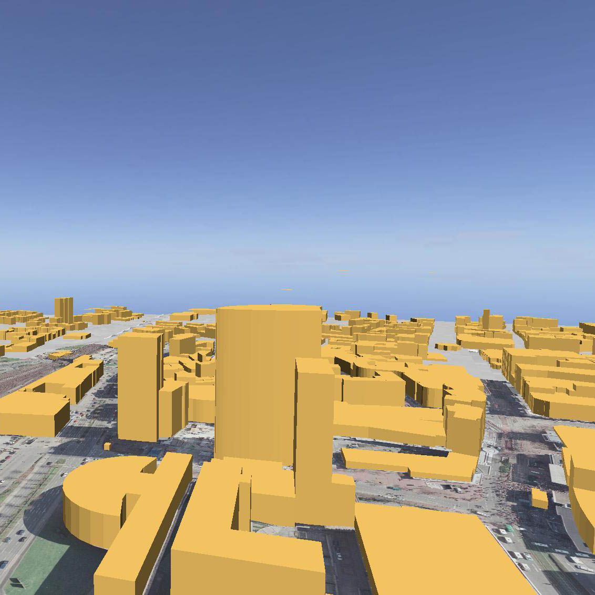

[#img_32,reftext='{figure-caption} {counter:figure-num}']
.LoD 2
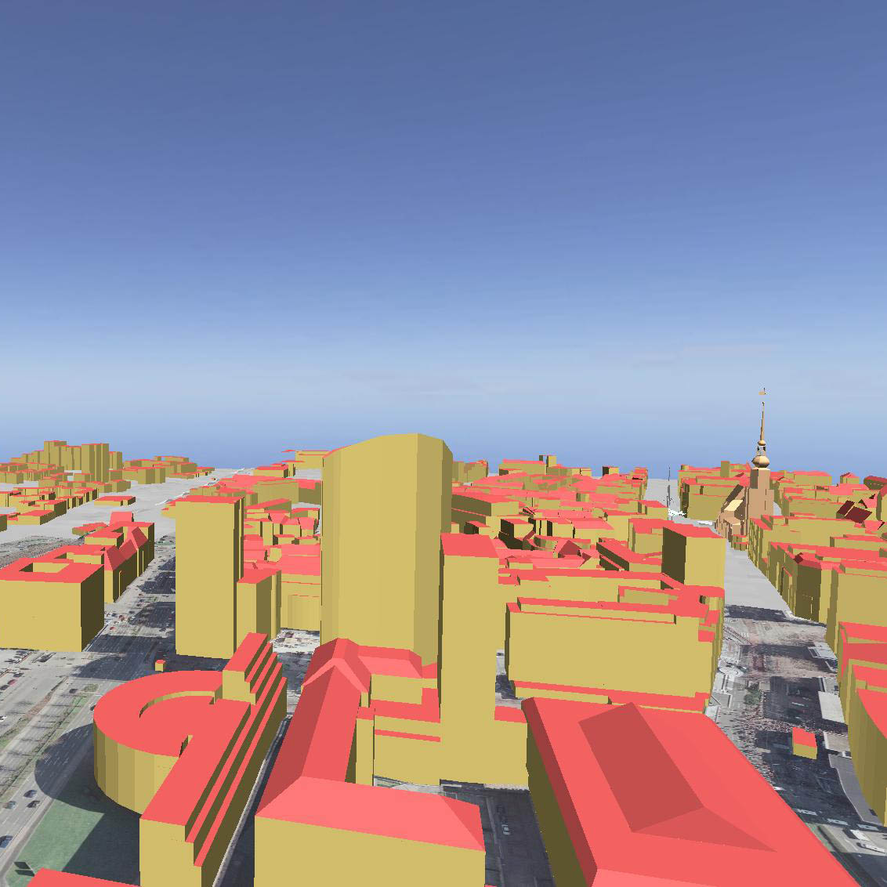

[#img_33,reftext='{figure-caption} {counter:figure-num}']
.LoD 3

[[basisschema_aaa_geometriebibs]]
==== Nutzung von Geometriebibliotheken

Die Nutzung von Geometriebibliotheken ist eine Erweiterung der Möglichkeiten der Geometrieabbildung im 3D-Bereich. Geometriebibliotheken können zur Einbindung von Prototypen verwendet werden. Beispiele hierfür sind im 3D-Bereich Bäume, Ampeln, Laternen usw. Jede prototypische Geometrie existiert nur einmal in einem lokalen, kartesischen Koordinatensystem. Diese kann im Datenbestand mehrfach, mittels URI eines speziellen Präsentationsobjektes, referenziert werden. Die prototypische Geometrie kann ein lokaler File, ein remote-File sein oder durch einen Webservice geliefert werden. Die Art der referenzierten Geometrie wird attributiv beschrieben. Die korrekte Darstellung dieser Mimetypes muss von der Visualisierungssoftware sichergestellt werden. Zur Festlegung der Positionierung der prototypischen Geometrie im Datenbestand dient eine 3D-Transformationsmatrix. Sie beinhaltet die 16 Parameter für Rotation, Translation und Skalierung der lokalen Geometrie. Die Geometrie ist ein _GM_MultiPoint_, da so Objekte mit gleichen Eigenschaften mehrfach im Datenbestand gesetzt werden können.

Die Nutzung von Geometriebibliotheken hat einige Vorteile gegenüber der expliziten Repräsentation von Objekten mittels absoluten Koordinaten:

* Speicher-effizienter als die explizite Geometrie,
* Umfangreiche Szenen können verarbeitet werden,
* Flexible Veränderung der Ausprägung von referenzierten Objekten (Austausch von Bibliotheksobjekten).

*3D-Transformationsmatrix*

[#img_34,reftext='{figure-caption} {counter:figure-num}']
.3D-Transformationsmatrix
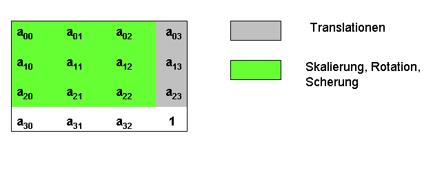

Der Datentyp _AP_TransformationsMatrix_3D_ repräsentiert eine allgemeine Transformationsmatrix in der Speicherform eines Vektors. Das Prinzip ist an Szenengraphenkonzepte angelehnt, wie sie im Bereich der Computergraphik gebräuchlich sind. Die Matrix enthält alle erforderlichen Parameter für die Transformation von homogenen Koordinaten aus beliebigen rechtwinkligen Koordinatensystemen der Prototypen in das Koordinatensystem des 3D-Modells.

[#tab_beispiel_nutzung_geometriebibliotheken,reftext='{table-caption} {counter:table-num}']
.Beispiel für die Nutzung von Geometriebibliotheken
[width="100%",cols="1,1"]
|===
a|
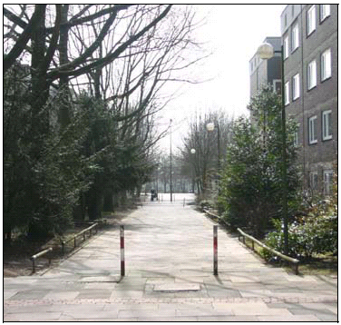 
|Realwelt-Szene

a|
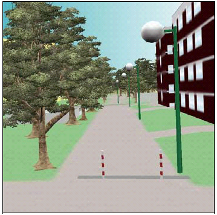

a|3D-Abbildung unter Nutzung von Geometriebibliotheken

(Begrenzungspfähle, Laterne)
|===

[[basisschema_historie]]
=== Historie, Versionskonzept

Bei den AFIS-ALKIS-ATKIS-Daten besteht die Anforderung, Versionen und historische Daten zu führen. Der Umfang der Nutzung hängt vom Informationssystem und seiner Anwendung in den Ländern ab. Eine wesentliche Anwendung des Versionskonzeptes stellt das Verfahren zur Nutzerbezogenen Bestandsdatenaktualisierung (NBA) dar.

Das Versionskonzept wurde unter Berücksichtigung folgender Modellierungsgrundsätze erarbeitet:

* Im Anwendungsschema wird nicht zwischen aktuellen und historischen Versionen unterschieden. Werden historische Versionen dauerhaft gespeichert, spricht man von Vollhistorie. Bei der Vollhistorie müssen grundsätzlich keine eigenen historischen Objektarten gebildet werden, da sämtliche Änderungen nachvollziehbar sind. Zusätzlich kann jedoch optional die Objektart "Historisches Flurstück" geführt werden, wenn historische Daten flurstücksbezogen vorgehalten werden sollen.
* Historische Objekte und Objektversionen werden in der Migration genauso behandelt, wie aktuelle Objektversionen.
* Zu jedem Objekt sind ggf. neben den aktuellen auch die historischen Informationen gespeichert (Versionen).
* Die zum Teil redundante Speicherung von Attributen eines Objekts in mehreren Versionen wird zugunsten eines schnelleren Datenzugriffs auf die entsprechende Version in Kauf genommen.

Das Versionskonzept geht davon aus, dass jedes Fachobjekt einen Identifikator, Attribute und Relationen sowie ein Lebenszeitintervall führt (Entstehungs- und Untergangsdatum). Entstehungs- und Untergangsdatum beinhalten das Datum und die Zeitangabe bis zur Sekunde. Mit dem Eintrag eines Objekts in die Bestandsdaten wird die erste Version des Objekts erzeugt und in einen Objektbehälter eingetragen. Ändert sich aufgrund einer Fortführung eine nicht objektbildende Eigenschaft, so wird eine neue Version des Objekts erzeugt, die historisch gewordene erste Version bleibt jedoch innerhalb des Objektbehälters bestehen, d.h. der Identifikator wird nicht geändert. Die neue Version erhält ein Entstehungsdatum, das gleichzeitig das Untergangsdatum der vorhergehenden Version ist. Die einzelnen Versionen eines Objekts können anhand des Lebenszeitintervalls eindeutig unterschieden werden. Durch Auswertungen der verschiedenen Versionen eines Objekts lassen sich alle Veränderungen bezogen auf einen beliebigen Zeitraum ermitteln.

Werden bei einer Fortführung objektbildende Eigenschaften geändert, führt dies aus fachlicher Sicht zum Untergang eines Objekts. Das Objekt wird historisiert, indem der letzten Version ein Untergangsdatum zugewiesen wird. Das Objekt bleibt weiterhin im Datenbestand erhalten. Zu einem beliebigen Zeitpunkt hat eine Version alle zu diesem Zeitpunkt gültigen Attribute und Relationen. Durch "Klammerung" der Versionen innerhalb eines Objektbehälters bleibt die fachliche Objektsicht stets erhalten. Durch Einführung neuer Referenzversionen des AAA-Modells können Modellelemente wegfallen. Aus Gründen der Abwärtskompatibilität können im Zuge der Migration von der bisherigen auf die neue Referenzversion u.a. neue Objekte entstehen. Dies stellt bzgl. der Historienkontinuität bei Vollhistorie eine Besonderheit dar.

*Festlegung objektbildender Eigenschaften im AAA-Modell in UML*

Im AAA-Modell in UML sind bei Attributen und Relationen Aussagen untergebracht, die festlegen, wie sich darauf bezogene Fortführungen auswirken. Diese finden sich im jeweils zum/zur Attribut/Relation gehörigen Reiter "Tagged Values" im Feld "AAA objektbildend" in Form der Belegung mit dem Wert True oder False. Alle Eintragungen im offiziell veröffentlichten AAA-Modell wurden durch die AdV vorgenommen. Im Folgenden Erläuterungen zu den getroffenen Festlegungen:

[width="100%",cols="1,1"]
|===
a|
*Festlegung im +
UML-Modell*

*(Reiter AAA / _objektbildend_ zum/zur jew. Attribut/Relation)*

|*Status der Festlegung im Reiter AAA / objektbildend*

|True |Unabänderliche AdV-Festlegung

|False |AdV-seitig vorgegebener Rahmen, d.h. es kann länderspezifisch True oder False gesetzt werden*.
|===

(*Diese Möglichkeit der Unterbringung länderspezifischer Festsetzungen ist im AAA-Modell die absolute Ausnahme).

[width="100%",cols="1,1"]
|===
a|
*Festlegung im UML-Modell*

*(Reiter AAA / _objektbildend_ zum/zur jew. Attribut/Relation)*

|*Auswirkungen der Festlegung von Spalte 1 bei Veränderung betroffener Attribute/Relationen in einer Erhebungs-komponente*

|True a|
Neues Objekt entsteht

(Delete {plus} Insert)

|False a|
Neue Objektversion entsteht

(Replace)

|===

[#img_37,reftext='{figure-caption} {counter:figure-num}']
.Versionierungsschema
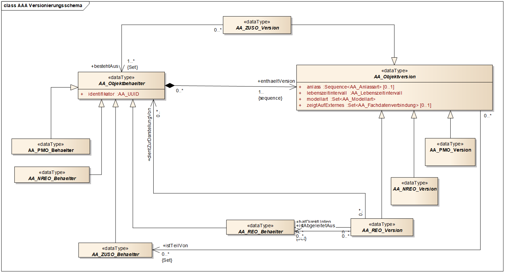

*Beispiel zum Versionskonzept*

*Änderung von Attributen*

Frau Hilde Huber wird zum Zeitpunkt t~1~ in ALKIS eingetragen, d.h. es wird ein neues Objekt der Objektart _Person_ gebildet:

////
Editor-Notiz: Wir nutzen keine Header in den folgenden Tabellen, sondern erzeugen unsere eigenen, weil Header-Zellen offenbar nicht über mehrere Zellen gehen können. Siehe dazu den Tip auf https://docs.asciidoctor.org/asciidoc/latest/tables/add-header-row/:

"The header row ignores any style operators assigned via column and cell specifiers. It also ignores alignment operators assigned to the table's column specifiers; however, any alignment operators assigned to a cell specifier in the header row are applied."

Deswegen nutzen wir in den Tabellen %noheader und NICHT options="header".
////

[%noheader,width="100%",cols="12%,22%,12%,11%,11%,11%,21%"]
|===
.2+|*Version* .2+|*Identifikator* 2+|*Zeitintervall* .2+|*Name* .2+|*Vorname* .2+|*hat_Anschrift*
|*Beginn* |*Ende* 
|Version 1 |DEBU5t44dFzb70Lg |t~1~ |t~∞~ |Huber |Hilde |DEBUf88FFgVc761s
|===

Die Zeitangabe 't~∞~ ' bedeutet, dass der fachliche Untergang des Objekts bzw. der Version in der Zukunft liegt. Zum Zeitpunkt t~2~ ändert Frau Huber ihren Namen und heißt nun Meier, d.h. vom Objekt "DEBU5t44dFzb70Lg" der Objektart _Person_ wird aufgrund der Änderung des Attributs _Name_ eine neue Version angelegt:

[%noheader,width="100%",cols="12%,22%,12%,11%,11%,11%,21%"]
|===
.2+|*Version* .2+|*Identifikator* 2+|*Zeitintervall* .2+|*Name* .2+|*Vorname* .2+|*hat_Anschrift*
|*Beginn* |*Ende* 
|Version 1 |DEBU5t44dFzb70Lg |t~1~ |t~2~ |Huber |Hilde |DEBUf88FFgVc761s
|Version 2 |DEBU5t44dFzb70Lg |t~2~ |t~∞~ |Meier |Hilde |DEBUf88FFgVc761s
|===

Der Zeitpunkt des Untergangs der Version 1 ist identisch mit dem Entstehungsdatum der Version 2 des Objekts. Zum Zeitpunkt t~3~ verkauft Frau Meier ihr einziges Grundstück. Da sie sonst keine weitere Rolle in ALKIS innehat, geht das Objekt aus fachlicher Sicht unter:

[%noheader,width="100%",cols="12%,22%,12%,11%,11%,11%,21%"]
|===
.2+|*Version* .2+|*Identifikator* 2+|*Zeitintervall* .2+|*Name* .2+|*Vorname* .2+|*hat_Anschrift*
|*Beginn* |*Ende* 
|Version 1 |DEBU5t44dFzb70Lg |t~1~ |t~2~ |Huber |Hilde |DEBUf88FFgVc761s
|Version 2 |DEBU5t44dFzb70Lg |t~2~ |t~3~ |Meier |Hilde |DEBUf88FFgVc761s
|===

Die Version 2 und damit das gesamte Objekt werden historisiert, nicht gelöscht.

Jede neue Version eines Objektes erhält eigene Relationen, die von ihr ausgehen. Relationen gehen stets von einer bestimmten Version des Objektes aus, d.h. eine Relation von einer Version zu einem anderen Objekt ist nur für diese eine Version gültig. Auf diese Weise werden sämtliche im Objektartenkatalog spezifizierten Kardinalitäten eingehalten.

Dies wird anhand des oben beschriebenen Beispiels erläutert: Frau Hilde Huber, Anschrift Ottostraße 17 in München, wird zum Zeitpunkt t~1~ in ALKIS eingetragen, d.h. es werden ein Objekt der Objektart _Person_ und ein Objekt der Objektart _Anschrift_ gebildet. Zum Zeitpunkt t~2~ ändert Frau Huber ihren Namen und heißt fortan Meier. Es wird eine neue Version des Objektes _Person_ angelegt.

In <<img_38>> repräsentieren die Pfeile eine Relation. Die Richtung des Pfeils gibt gleichzeitig die Richtung der Relation an. Die neue Version des Objektes _Person_ erhält wiederum eine Relation zum entsprechenden Objekt _Anschrift_. Das Objekt _Anschrift_ selbst wird allerdings nicht versioniert, da die Relation zum Objekt _Person_ unverändert bleibt. Ebenso würde eine neue Version des Objektes _Anschrift_, z. B. durch Berichtigung nach einem Schreibfehler, keine Änderung des Objektes _Person_ bewirken.

An diesem Beispiel ist auch erkennbar, dass eine Relation stets von der Version über den Identifikator auf den Objektbehälter zeigt und nicht auf eine Version. Der Objektbehälter bildet somit eine Art Klammer um seine verschiedenen Versionen.

[#img_38,reftext='{figure-caption} {counter:figure-num}']
.Beispiel zur Versionierung nach Änderung von Attributen
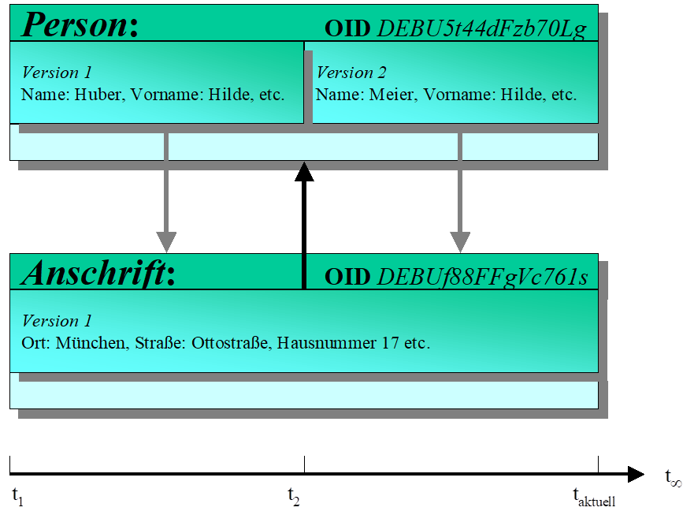

Mit dieser Technik können nur Relationen abgebildet werden, die sich auf die jeweils aktuelle Version der beteiligten Objekte beziehen.

*Änderung von Relationen*

Änderungen bei Relationen führen ebenso zur Versionierung von Objekten wie Attributänderungen. Relationen ändern sich immer dann, wenn das Objekt, auf das die Relation zeigt, neu entsteht, ausgetauscht wird oder wegfällt.

In einem modifizierten Beispiel zur <<img_38>> wird dies in <<img_39>> erläutert. Frau Hilde Huber zieht zum Zeitpunkt t~3~ um, von der Ottostraße 17 in München, zur Platanenallee 34a in Berlin. Das Objekt _Anschrift_ mit der OID "DEBUf88FFgVc761s", auf welches die Relation _hat_Anschrift_ vom Objekt _Person_ ausgehend zeigt, wird ausgetauscht (neue OID "DEBUk41233THjbkO"). Damit ändert sich die betreffende Relation beim Objekt _Person_ und das Objekt _Person_ muss versioniert werden.

[#img_39,reftext='{figure-caption} {counter:figure-num}']
.Beispiel zur Versionierung nach Änderung von Relationen
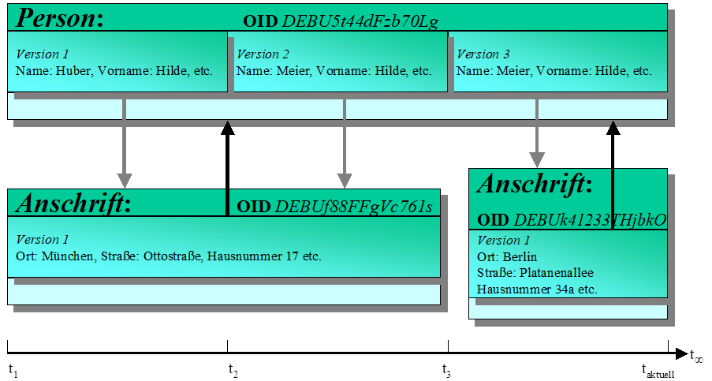

Tabellarisch ergibt sich folgendes Bild:

[%noheader,width="100%",cols="12%,22%,12%,11%,11%,11%,21%"]
|===
.2+|*Version* .2+|*Identifikator* 2+|*Zeitintervall* .2+|*Name* .2+|*Vorname* .2+|*hat_Anschrift*
|*Beginn* |*Ende* 
|Version 1 |DEBU5t44dFzb70Lg |t~1~ |t~2~ |Huber |Hilde |DEBUf88FFgVc761s
|Version 2 |DEBU5t44dFzb70Lg |t~2~ |t~3~ |Meier |Hilde |DEBUf88FFgVc761s
|Version 3 |DEBU5t44dFzb70Lg |t~3~ |t~∞~ |Meier |Hilde |DEBUk41233THjbkO
|===

[[basisschema_abwaertskompatibilitaet]]
=== Abwärtskompatibilität

Um die Versionierung der GeoInfoDok durch die AdV und die Einführung neuer Referenzversionen bei den AdV-Mitgliedsverwaltungen zu erleichtern, können aus dem Datenmodell entfernte Elemente in den Bestandsdaten bei der Einführung einer neuen Referenzversion weiterverwendet werden. Grundsätzliche modellierungstechnische Voraussetzung ist allerdings, dass auf Änderungen verzichtet wird, die eine Abwärtskompatibilität verhindern, was nicht in allen Fällen möglich ist.

Zur Realisierung einer weitgehenden Abwärtskompatibilität zur Vorgängerversion wurden in der GeoInfoDok-Version (7.0.3) einige der Änderungen der Version 7.0 wieder rückgängig gemacht, um die grundsätzliche Möglichkeit zu schaffen, die in der Version 6.0.1 untergegangenen Elemente weiter zu verwenden.

Um klarzustellen, dass bestimmte Informationen nur noch wegen der Abwärtskompatibilität im Anwendungsschema geführt werden, werden die betroffenen Objekt-, Attribut-, Relations- und Wertearten durch Tagged Value im UML-Datenmodell gekennzeichnet.

Zur Kennzeichnung von Informationen, die nur noch wegen der Abwärtskompatibilität im Anwendungsschema enthalten sind, werden daher die betroffenen Objekt-, Attribut-, Relations- und Wertearten in Anlehnung an ISO 19135-1 durch ein Stereotype "retired" [stillgelegt] im UML-Modell gekennzeichnet. Eine Ausgabe der mit "stillgelegt" gekennzeichneten Elemente in den abgeleiteten Objektartenkatalogen ist mit den AdV-Tools möglich. Zusätzlich wird in einem Tagged Value die Version der GeoInfoDok angegeben, bis zu der das stillgelegte Element gültig war ("gültig bis").

[#img_40,reftext='{figure-caption} {counter:figure-num}']
.Beispiel für eine zurückgezogene Objektart (AX_Grenzuebergang)
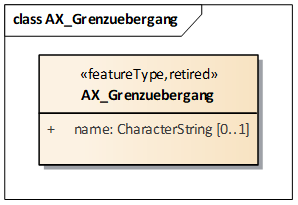 

[#img_41,reftext='{figure-caption} {counter:figure-num}']
.Beispiel für eine zurückgezogene Attributart ('bezeichnung' in AX_Schleuse)
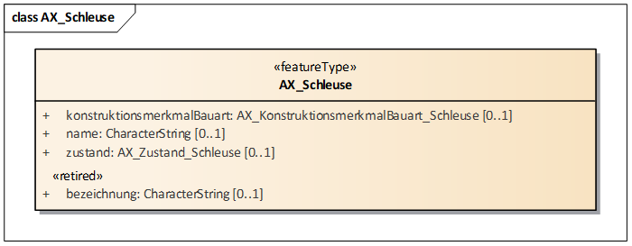

Bei der Migration werden alle Objekte/Objektversionen, auch die bereits historisierten, in das Modell der neuen Version migriert. Sofern ein Objekt noch aktuell ist, aber nur noch wegen der Abwärtskompatibilität geführte Modellelemente verwendet, ist die Objektversion - und das gesamte Objekt - mit der Migration zu beenden und ein neues Objekt (oder mehrere) gemäß dem Anwendungsschema der neuen GeoInfoDok-Version zum selben Zeitpunkt neu zu erzeugen.

Beispiel: Ein noch aktuelles Objekt, das derzeit eine "wegfallende" Werteart verwendet. In diesen Fällen werden mit der Migration die aktuellen Objektversionen beendet und neue Objektversionen aktuell, die nicht mehr die "zurückgezogenen" Eigenschaften (Attributarten und Relationsarten) oder Wertearten verwenden.

Die bessere Abwärtskompatibilität bietet auch Möglichkeiten zur Rückmigration von Daten, was auch der föderalen Führung der AAA-Geobasisdaten entgegenkommt und mehr Flexibilität beim Einführungsdatum einer neuen Version ermöglicht. Zu beachten ist, dass eine Rückmigration in Vorgängerversionen der GeoInfoDok mit vertretbarem Aufwand in der Regel nie vollständig erfolgen kann.

*Lückenlose historische Recherchen und Datenabgaben*

Bei den Daten haltenden Stellen besteht neben einer verbesserten Abwärtskompatibiliät zudem der Bedarf, dass historische Objekte (d.h. historische Objektversionen und geschlossene Objektbehälter) auch in Nachfolgeversionen der GeoInfoDok enthalten bleiben. Dabei wurden folgende Anforderungen berücksichtigt:

* Historische Abfragen für die Erzeugung von Bestandsdatenauszügen und NBA sind möglich und liefern dieselben fachlichen Ergebnisse wie vor der Migration.
* Bestehende NBA-Verfahren werden ohne erneute Grundausstattung weiter unterstützt.
* Eine Abgabe an Nutzer, die ggf. noch in der alten GeoInfoDok-Version (FinV, Grundbuch, Statistik, Bundesnetzagentur, etc.) arbeiten, ist in der alten Struktur möglich.

*Auswirkungen der Abwärtskompatibilität auf die NAS*

Die Festlegungen zur besseren Abwärtskompatibilität wirken sich auf die NAS folgendermaßen aus:

* In den neuen XML-Schemadateien tauchen die alten (gelöschten) Elemente in unveränderter Form noch auf, d.h. die Schemadateien werden lediglich durch die neu hinzugekommenen Elemente ergänzt
* Die XML-Validierung mittels Schemadatei unterscheidet nicht zwischen "retired" und aktuellen Elementen__.__Gleichwohl gelten hier die Regeln der GeoInfoDok (Modell und Hauptdokument). Beispiel: in der 7.0.3 darf bei der OA_Schleuse das Attribut "Bezeichnung" nicht mehr erscheinen.
* Annahme: Nur die jeweils aktuelle Referenzversion ist implementiert. Daraus werden abgelöste Referenzversionen bedient. Bei der Einführung weiterer Versionen muss noch geklärt werden, wie weit zurück die Abwärtskompatibilität mit vertretbarem Aufwand realisiert werden kann.

*Auswirkungen der Abwärtskompatibilität auf die Datenführung*

Die Festlegungen zur besseren Abwärtskompatibilität wirken sich auf die Datenführung folgendermaßen aus:

* In der Implementierung der GeoInfoDok-Referenzversion dürfen Elemente, die mit "retired" gekennzeichnet sind, nicht mehr in Ausgaben (Bestandsdatenauszüge, NAS, Ausgabeprodukte) dieser Referenzversion vorkommen, ausgenommen entsprechende Rückmigrationsausgaben.
* Solange Datenbestände geführt werden, die auf zurückgezogenen (retired) Elementen basieren, können historisierte Daten aus der Datenbank nicht gelöscht werden.
* Ein Benutzungsauftrag bzw. eine NBA lässt anhand seines Namensraumes erkennen, ob er, bzw. sie eine rückmigrierte Benutzung oder eine aktuelle ist.

*Änderungen bei Benutzungsaufträgen, wie z.B. der Nutzerbezogenen Bestandsdatenaktualisierung*

* Die Einführung von "retired"-Elementen wird nur bei den AAA-Bestandsdaten berücksichtigt, nicht aber bei Elementen zur Datenführung, wie z.B. dem NBA-Verfahren. Gleichwohl werden die Änderungen im Folgenden beschrieben, die für das NBA-Verfahren notwendig sind, um die Abwärtskompatibilität zu realisieren:Die AX_BenutzergruppeNBA wurde um ein Attribut <abgabeversion> mit einer Enumerationsliste der zulässigen Versionen als Pflichtattribut erweitert.
+
[#img_42,reftext='{figure-caption} {counter:figure-num}']
.Neue Attributart 'abgabeversion' zur Selektion von Objekten verschiedener GeoInfoDok-Versionen
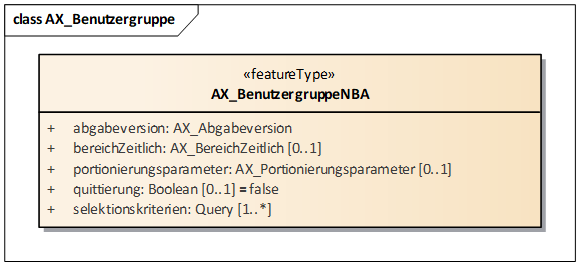

* Die Enumerationsliste besteht aus den Informationen der alten und aktuellen Referenzversion, hier "6.0.1" und "7.1.2". Es ist die volle Versionsnummer anzugeben und nicht nur der Namespace.
* Für Bestandsdatenauszüge reicht der Benutzungsauftrag im jeweiligen Namespace, um Daten im alten Format abgeben zu können.
* Objektarten, die mit Einführung einer neuen Version "retired" werden, sind nur bis zur Vorgängerversion gültige Objektarten. Beispiel: OA_Grenzuebergang wird mit der Version 7.1.2 "retired", dann ist diese OA nur bis zur letzten Version, 6.0.1, gültig. In der OA wird ein entsprechendes "Tagged Value" gesetzt.
* In der NAS-XSD sind alle Objektarten enthalten, unabhängig davon, ob "retired" oder nicht. Eine Unterscheidung ist nicht möglich. Mit der Benutzung in einer Vorgängerversion der GeoInfoDok werden
** auch sämtliche OA selektiert, die mit der Selektionsversion retired wurden oder schon waren
** alle optionalen Elemente der neuen Version rückmigriert oder weggelassen; Rückmigrationsregeln sind zu erstellen und zu beachten.
* Rückmigration ist nur möglich, solange Abwärtskompatibilität gewährleistet ist. Bei neuen Vollversionen (Änderung der ersten Stelle) ist die Abgabe in die Vorgängerversion nur eingeschränkt möglich. Die rückmigrierbaren und nicht-rückmigrierbaren Elemente sind anzugeben (z.B. in einer Migrationstabelle).
* Bei der Einführung neuer Vollversionen mit ggf. vielen nicht-abwärtskompatiblen Änderungen ist aus fachlicher Sicht zu prüfen, ab wann die Abgabe in das alte System nicht mehr sinnvoll möglich ist (z.B. neue Werteart bei Pflichtattribut ist nicht rückmigrierbar, da es keine 9998 mehr gibt).

[[basisschema_qaundmetadaten]]
=== Qualitäts- und Metadaten

Das gemeinsame AFIS-ALKIS-ATKIS-Datenmodell sieht die Erfassung und Führung von Qualitäts- und Metadaten auf der Grundlage der ISO-Normen:

* ISO 19109 Geographic Information - Rules for Application Schema,
* ISO 19113 Geographic Information - Quality Principles,
* ISO 19114 Geographic Information - Quality Evaluation Procedures und
* ISO 19115-1 Geographic Information - Metadata

vor.

Die *Qualitätsdaten* werden dabei nach nicht quantifizierbaren Überblicksinformationen (Zweck, Verwendung und Historie) und quantifizierbaren Informationen (den Datenqualitäts-Elementen _Vollständigkeit_, _logische Konsistenz_, _geometrische_, _inhaltliche und zeitliche Genauigkeit_) unterschieden.

Die Angabe der Qualitätsinformationen erfolgt als Metadaten gemäß der Norm ISO 19115 und darüber hinaus für quantitative, aggregierte Qualitätsangaben bei Bedarf in Form von detaillierten Qualitäts-Bewertungsprotokollen gemäß Norm ISO 19114, was jedoch nicht Bestandteil der GeoInfoDok ist und daher hier nicht weiter spezifiziert wird.

Beispiel für eine Qualitätsangabe zu einem Punktort mit den folgenden Eigenschaften:

- _Datenerhebung 'Aus Katastervermessung ermittelt (1000)'_
- _Erhebungsdatum '01.04.1990'_
- _Erhebungsstelle Katasteramt X_
- _Berechnungsdatum '01.01.1994'_
- _keine Angabe zur berechnenden Stelle_
- _Genauigkeitswert 0,022 m_
- _Genauigkeitsstufe 2000_
- _Vertrauenswürdigkeit 1200_

Diese Qualitätsangaben werden in der NAS wie folgt kodiert:

[source,xml,linenumbers]
----
<?xml version="1.0" encoding="UTF-8"?>
<AX_DQPunktort xmlns="http://www.adv-online.de/namespaces/adv/gid/7.1" xmlns:gmd="http://www.isotc211.org/2005/gmd" xmlns:gml="http://www.opengis.net/gml/3.2"
  xmlns:xlink="http://www.w3.org/1999/xlink" xmlns:xsi="http://www.w3.org/2001/XMLSchema-instance" xmlns:gco="http://www.isotc211.org/2005/gco" xmlns:xsd="http://www.w3.org/2001/XMLSchema"
  xsi:schemaLocation="http://www.adv-online.de/namespaces/adv/gid/7.1 http://repository.gdi-de.org/schemas/adv/nas/7.1/aaa.xsd">
  <herkunft>
    <gmd:LI_Lineage>
      <gmd:processStep>
        <gmd:LI_ProcessStep>
          <gmd:description>
            <AX_LI_ProcessStep_Punktort_Description>Erhebung</AX_LI_ProcessStep_Punktort_Description>
          </gmd:description>
          <gmd:dateTime>
            <gco:DateTime>1990-04-01T00:00:00Z</gco:DateTime>
          </gmd:dateTime>
          <gmd:processor>
            <gmd:CI_ResponsibleParty>
              <gmd:organisationName>
                <gco:CharacterString>Katasteramt X</gco:CharacterString>
              </gmd:organisationName>
              <gmd:role>
                <gmd:CI_RoleCode codeList="http://schemas.opengis.net/iso/19139/20070417/resources/Codelist/gmxCod

elists.xml#CI_RoleCode" codeListValue="processor">processor</gmd:CI_RoleCode>
              </gmd:role>
            </gmd:CI_ResponsibleParty>
          </gmd:processor>
          <gmd:source>
            <gmd:LI_Source>
              <gmd:description>
                <AX_Datenerhebung_Punktort>1000</AX_Datenerhebung_Punktort>
              </gmd:description>
            </gmd:LI_Source>
          </gmd:source>
        </gmd:LI_ProcessStep>
      </gmd:processStep>
      <gmd:processStep>
        <gmd:LI_ProcessStep>
          <gmd:description>
            <AX_LI_ProcessStep_Punktort_Description>Berechnung</AX_LI_ProcessStep_Punktort_Description>
          </gmd:description>
          <gmd:dateTime>
            <gco:DateTime>1994-01-01T00:00:00Z</gco:DateTime>
          </gmd:dateTime>
        </gmd:LI_ProcessStep>
      </gmd:processStep>
    </gmd:LI_Lineage>
  </herkunft>
  <genauigkeitswert>
    <gmd:DQ_RelativeInternalPositionalAccuracy>
      <gmd:result>
        <gmd:DQ_QuantitativeResult>
          <gmd:valueUnit xlink:href="urn:adv:uom:m"/>
          <gmd:value>
            <gco:Record xsi:type="gml:doubleList">0.022</gco:Record>
          </gmd:value>
        </gmd:DQ_QuantitativeResult>
      </gmd:result>
    </gmd:DQ_RelativeInternalPositionalAccuracy>
  </genauigkeitswert>
  <genauigkeitsstufe>2000</genauigkeitsstufe>
  <vertrauenswuerdigkeit>1200</vertrauenswuerdigkeit>
</AX_DQPunktort>
----

Vorgaben:

* Gemäß xref:nasschema_encrules_input[] (letzter Spiegelstrich) sowie xref:nasschema_encrules_schemaabbildungsregeln[] (erster Absatz) #*TBD:* Sind das immer noch die passenden Referenzen?# und dem darin referenzierten ISO/TS 19139 8.5.4 ist für Enumerationen das spezifische Element aus dem AAA-Fachschema, welches gco:CharacterString substituiert, zu verwenden.
* Wird eine Quelle zu einem Prozesschritt angegeben, so wird diese in den LI_ProcessStep eingebettet, um eine Zuordnung zu ermöglichen. Die Elemente des UML-Modells werden somit bei der Ableitung der XML-Schemadateien in eine ISO-konforme Struktur überführt (das UML-Modell enthält Vereinfachungen, die im Shape-Change-Prozess ISO-konform abgebildet werden).
* Sofern eine Stelle zu einer Erhebung oder Berechnung angegeben wird, ist als Rolle "processor" anzugeben.
* In der Rollenangabe ist ein Codelistenverweis erforderlich, der gemäß ISO/TS 19139 8.5.5 eine URL sein muss. Im Beispiel ist eine URL auf ein Code-List-Dictionary im OGC-Schemarepository angegeben. Dies kann alternativ - wie bei Schemaverweisen - auch ein anderer gültiger Verweis auf ein Code-List-Dictionary sein.
* Der Name der verantwortlichen Stelle wird im Klartext angegeben.
* Bei den Einheiten des Genauigkeitswerts sind nur die in der GeoInfoDok 8.2.2 angegebenen Einheiten erlaubt.
* Gemäß Beispiel in ISO/TS 19139 9.7.4.1.4 d) soll bei gco:Record der Datentyp in xsi:type angegeben werden. Im Fall von Koordinatengenauigkeiten soll dies "doubleList" aus dem GML-Schema sein, da Genauigkeitsangaben ein oder mehrere Werte enthalten können. Es wird die Einheit "m" verwendet, gemäß xref:crsuom_uom_aaa_angabe[] "urn:adv:uom:m".

*Metadaten* sind "Daten über Daten" und dienen der Beschreibung der Geodaten hinsichtlich nutzerrelevanter Aspekte zur Bewertung der Eignung der Daten und des Zugriffs auf dieselben. ISO unterscheidet etwa 400 optionale, obligatorische und bedingt obligatorische Metadatenelemente, gegliedert in inhaltliche Einheiten (entities) sowie in die folgenden Abschnitte (sections):

* Identifikation,
* Datenqualität,
* Fortführung,
* Raumbezogene Eigenschaften,
* Referenzsystem,
* Ausdehnung,
* Inhalt,
* Anwendungsschema,
* Signaturenkatalog,
* Vertrieb,
* Nutzungsbedingungen.

Qualitäts- und Metadaten können gemäß ISO für einen Datenbestand (Sammlung von logisch zusammengehörigen Objekten), für Berichtsgruppen (Teilmengen eines Datenbestandes) und für einzelne Objekte angegeben werden.

Der gemeinsame AFIS-ALKIS-ATKIS-Metadatenkatalog wird weiter unten näher beschrieben.

[[basisschema_oks]]
=== Objektartenkataloge

Die Struktur der Objektartenkataloge ist durch die ISO-Norm 19110 _Feature Cataloguing Methodology_ vorgegeben. Aufgrund der Objektorientierung ist es auch möglich, die Methoden im Objektartenkatalog zu beschreiben, wovon im AAA-Datenmodell bislang allerdings nur selten Gebrauch gemacht wurde. Die Vorgaben zur Struktur eines Objektartenkatalogs sind logisch getrennt zu sehen von der Beschreibung dieser Objektarten in einem Datenmodell. Daher ist das Schema "AAA-Objektartenkatalog" außerhalb des AAA-Anwendungsschemas eigenständig modelliert. Das gleiche gilt für die Vorgaben zur Beschreibung der Ausgaben, Signaturen und Präsentationsvorschriften. Das gemeinsame Anwendungsschema erweitert diese Strukturen im Paket _AAA-Katalog_ um einige Inhalte, die für die Anwendungen AFIS, ALKIS und ATKIS zusätzlich benötigt werden.

Kataloge werden zur einfacheren Implementierung ausschließlich vollständig versioniert und ausgetauscht.

[#img_43,reftext='{figure-caption} {counter:figure-num}']
.Erweiterungen der genormten Struktur der Objektartenkataloge
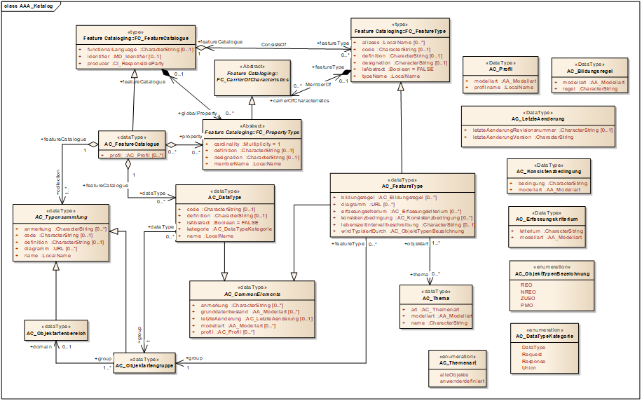

Die Objektartenkataloge werden mit Hilfe eines Skripts direkt aus dem UML-Datenmodell abgeleitet und als editier- und lesbare Formate PDF und HTML veröffentlicht.

[[basisschema_ausgabekatalog]]
=== Ausgabekatalog

Die GeoInfoDok wird in der Modellierungssprache UML originär in Enterprise Architect (EA) modelliert. Im Rahmen der Modularisierung wurde auch der AFIS-ALKIS-ATKIS-Ausgabekatalog (AAA_AK) aus dem AFIS-ALKIS-ATKIS-Anwendungschema (Paket NAS-Operationen) exportiert und kann damit auch eine eigenständige Versionierung erfahren. Neben den Schemadateien des AAA-Anwendungsschemas (NAS-Operationen.xsd, aaa.xsd, AAA-Fachschema.xsd, AAA-Basisschema.xsd) gibt es auch die des Ausgabekataloges (AAA-Ausgabekatalog.xsd).

Der AFIS-ALKIS-ATKIS-Ausgabekatalog (AAA_AK) beschreibt die Inhalte der Standardausgaben der AdV. Insbesondere sind dies die AFIS-Einzelpunktnachweise, die AFIS-Punktlisten und die beschreibenden ALKIS-Standardausgaben und ALKIS-Ausgaben.

Im AAA_AK sind die Regeln zur Auswertung der Bestandsdaten in verbaler Form hinterlegt, damit in den Ergebnissen immer 'menschen'lesbare Informationen entstehen. Die weitere Verwendung dieser Daten in den zugehörigen Standardprodukten wird dann in den nicht formalisierten Signaturenkatalogen für AFIS und ALKIS beschrieben.

Der AAA_AK ist auch in der Form eines Objektartenkatalogs veröffentlicht.

[[basisschema_sks]]
=== Signaturenkataloge

Bei den Signaturenkatalogen wird zwischen den 'formalisierten' und 'nicht formaltisierten' Signaturenkatalogen unterschieden.

Die nicht formalisierten Signaturenkataloge beinhalten die Darstellungsregeln für die beschreibenden Ausgaben aus dem AFIS-ALKIS-ATKIS-Ausgabekatalog (AAA_AK).

Mit den formalisierten Signaturenkataloge wurden die Signaturierungsregeln für graphische Ausgaben in ein Objektmodell gefasst. Die Grundlagen für die Modellierung befinden sich im Anwendungsschema AFIS-ALKIS-ATKIS-Signaturenkatalog (AAA_SK). Der Signaturenkatalog kann aufgrund der Modularisierung ebenfalls eigenständig versioniert werden.

[[basisschema_sks_nichtformalisiert]]
==== Nicht formalisierte Signaturenkataloge (nFSK)

Die nicht formalisierten Signaturenkataloge sind für die AdV-Produkte, die i.d.R. in der Ausgabe keinen Raumbezug nutzen, notwendig.

Hierzu zählen:

* ALKIS
** Flurstücksnachweis (ggf. mit Bodenschätzung)
** Flurstücks- und Eigentümernachweis (ggf. mit Bodenschätzung)
** Grundstücksnachweis
** Bestandsnachweis
** Amtliche Flächenstatistik
** Fortführungsnachweis und Fortführungsmitteilungen
** Gebäudenachweis
** Liegenschaftskarte (Rahmen)
* AFIS
** AFIS-Punktlisten
** AFIS-Einzelpunktnachweise

Die bisher verwendeten Teile A bis G sind in den jeweiligen Signaturenkatalog zusammengefasst. Ergänzt werden diese durch Standbögen (für die Darstellungen der Positionen auf dem jeweiligen Ausgabemedium) und Muster der Präsentationsausgaben für die AdV-Standardprodukte. Im Falle der Liegenschaftskarte werden die Karteninhalte mit Hilfe des formalisierten Signaturenkatalaog erzeugt.

[[basisschema_sks_formalisiert]]
==== Formalisierter Signaturenkatalog (fSK)

Die Vorgaben zur Struktur eines Signaturenkatalogs (SK) haben übergeordneten Charakter und sind deshalb logisch getrennt zu sehen von der Beschreibung von fachlichen Objektarten in einem Datenmodell. Daher ist das Schema "AAA-Signaturenkatalog" außerhalb des AAA-Anwendungsschemas eigenständig modelliert.

[#img_44,reftext='{figure-caption} {counter:figure-num}']
.Schema SK-Objektmodell
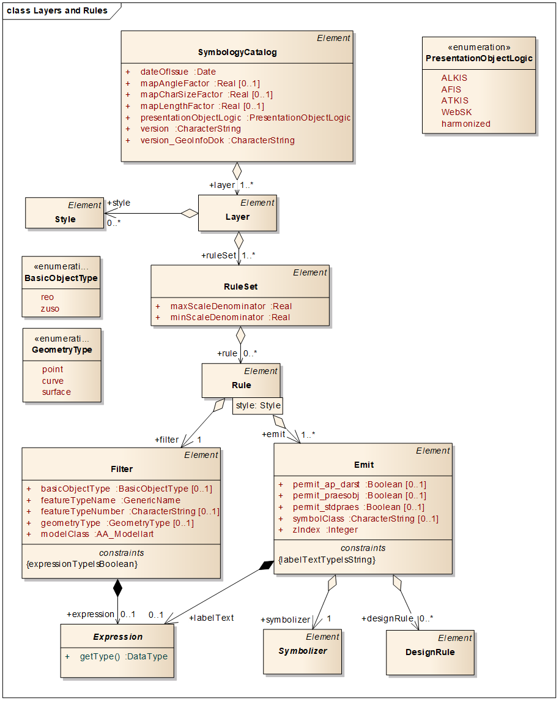

Kern der Modellierung ist eine SK-Definitionssprache, _Map-Definition-Language_ ("MDL", ursprünglich "SDL" genannt), welche alle SK-Definitionen in einer lesbaren, aber dennoch automatisiert verarbeitbaren Form darstellen kann. Ein zentrales MDL-Repository speichert den Stand des SKs in MDL und definiert damit die Referenzversion des SK.

Ein MDL-Compiler leitet aus dem in MDL definierten SK automatisch SK-Dokumente in HTML und PDF ab. Ein weiterer Output des MDL-Compilers ist eine Repräsentierung des SK in "SK-XML", einer XML-Sprache, die im Wesentlichen denselben Inhalt wie MDL bedient. Die Repräsentierung in SK-XML soll es ermöglichen, daraus einfach externe Repräsentierungen des SK zu generieren, um handelsübliche GIS-Software zu unterstützen. Die Umsetzungen aus SK-XML sollen durch externe Akteure erfolgen.

Da MDL und SK-XML naturgemäß strukturell verwandt sind, liegt es nahe, beide auf der Basis eines gemeinsamen, in UML definierten, Objektmodells zu entwickeln.

[[basisschema_prozesse]]
=== Prozesse, Vorgänge und Aktivitäten

[[basisschema_prozesse_grundsaetze]]
==== Grundsätze

Im Rahmen der Zuständigkeit des amtlichen Vermessungswesens sind die Aufgaben Erhebung, Qualifizierung, Führung (Ersteinrichtung, Fortführung), Benutzung und Übertragung von Daten auszuführen. Jede dieser Aufgaben äußert sich in einem oder mehreren Prozessen. Es gibt Erhebungs-, Qualifizierungs-, Führungs-, Benutzungs- und Transferprozesse.

Die Geoinformationen des amtlichen Vermessungswesens bestehen aus den originären Bestandsdaten und den temporären Datenbeständen der Erhebungsdaten, Fortführungsdaten, Ausgabedaten und Transferdaten.

Die Projektsteuerung im AAA-Basisschema steuert den Ablauf aller Prozesse in Form von Vorgängen und Aktivitäten, womit vollständige Geschäftsprozesse beschrieben werden können. Sie stellt lediglich eine optionale Rahmenvorgabe dar, die inhaltlich durch die länderspezifischen Geschäftsprozesse zu untersetzen ist. In der <<img_45>> werden die Prozesse und Daten der Geoinformationen des amtlichen Vermessungswesens dargestellt. Die im Rahmen des AdV-Projektes "Modellierung der Geoinformationen des amtlichen Vermessungswesens" fachlich zu modellierenden Bestandteile werden von einer gestrichelten Linie umrahmt.

[#img_45,reftext='{figure-caption} {counter:figure-num}']
.Prozesse und Daten der Geoinformationen des amtlichen Vermessungswesens
image::media/image45.png[media/image45,width=520,height=324]

Zu einem Prozess gehören mehrere aufeinander aufbauende Aktivitäten, die zu Vorgängen zusammengefasst und fachlich gegliedert werden können. Zur Beschreibung der Prozesse (Vorgänge und Aktivitäten) werden folgende Sprachmittel verwendet:

* Aktivitäten als Bestandteil der UML-Klassen,
* Textliche Beschreibung der Bearbeitungsschritte,
* Die graphische Darstellung der Vorgänge erfolgt entsprechend der UML- Notation in Sequenzdiagrammen
* Auswerteregeln des AAA-Ausgabekataloges zur Beschreibung der Selektions- und Auswertefunktionalität bei der Erstellung von Standardausgaben

[[basisschema_prozesse_vorgang]]
==== Vorgang und Aktivität

Für eine vollständige Anwendungsbeschreibung sind Vorgänge und Aktivitäten zu definieren, die Daten in funktionelle Abhängigkeiten setzen und das dynamische Verhalten der Anwendung definieren. Vorgänge sind den einzelnen Prozessen im AAA-Anwendungsschema zugeordnet. Dies kann aus der <<img_46>> entnommen werden.

[#img_46,reftext='{figure-caption} {counter:figure-num}']
.Vorgänge im AAA-Anwendungsschema
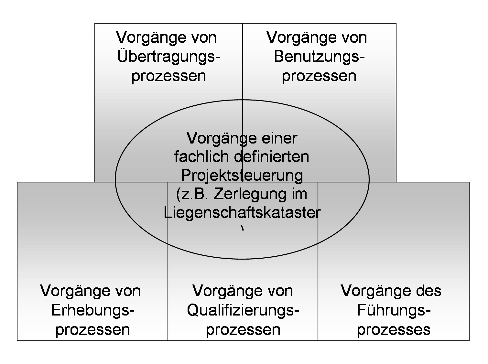

Ein Vorgang beinhaltet die Darstellung von Bearbeitungsschritten der Prozesse Qualifizierung, Führung, Benutzung und Übertragung, in denen auf verschiedene Aktivitäten verwiesen wird.

Eine Aktivität beschreibt das Verhalten eines Objekts und besteht aus einer Sequenz von Anweisungen. Den Anstoß dazu erhält ein Objekt durch eine Nachricht, die durch Eingaben des Nutzers oder durch Aktivitäten anderer Objekte ausgelöst werden (Eingabeparameter). Das Ergebnis der Aktivität wird in Form von Ausgabeparametern bereitgestellt. Aktivitäten werden objektbezogen definiert und sind im UML-Modell Bestandteil einer Klasse.

[[basisschema_prozesse_aaa]]
==== Prozesse des AFIS-ALKIS-ATKIS-Anwendungsschemas

Mit einem Prozess wird ein Quelldatenbestand in einen Zieldatenbestand überführt. Der Benutzungsprozess beispielsweise überführt die Bestandsdaten in temporäre Ausgabedaten.

Zur Steuerung der verschiedenen Prozesse werden spezielle Klassen gebildet, die Steuerungsparameter für den Ablauf von Prozessen beinhalten, wie z. B. "AX_Benutzungsauftrag" im Benutzungsprozess des AAA-Anwendungsschemas.

[[basisschema_prozesse_aaa_erhebung]]
===== Erhebungsprozess

Quelldaten werden mit den bekannten geodätischen Mess- und Erkundungsmethoden in der realen Welt erhoben oder aus kartographischen Darstellungen und anderen Unterlagen erfasst. Die Zieldaten des Erhebungsprozesses sind die objektstrukturierten Erhebungsdaten, die eine Grundlage zur Fortführung der amtlichen Geoinformationen bilden.

[[basisschema_prozesse_aaa_qualifizierung]]
===== Qualifizierungsprozess

Im Qualifizierungsprozess werden die digitalen, objektstrukturierten Erhebungsdaten nach einer Qualifizierung in Fortführungsdaten überführt. Er dient der Qualitätssicherung und stellt sicher, dass die Fortführungsdaten den Qualitätsanforderungen entsprechen.

Die Zieldaten des Qualifizierungsprozesses sind die Fortführungsdaten.

[[basisschema_prozesse_aaa_fuehrung]]
===== Führungsprozess

Im Führungsprozess sind Ersteinrichtung und Fortführung der Geoinformationen zusammengefasst, wobei die Ersteinrichtung als Sonderfall der Fortführung betrachtet werden kann. Beim Führungsprozess werden die Fortführungsdaten (Daten und Metadaten) durch Anwendung geeigneter Methoden in den Bestand überführt.

Die Zieldaten des Führungsprozesses sind die Bestandsdaten.

Die für die Einrichtung und Fortführung notwendigen Funktionalitäten sind im Rahmen der Austauschschnittstelle in xref:nasops_funktionsumfang_primaernachweise[], darüber hinaus gehende implizite Funktionen eines Führungssystems in xref:nasops_implfunkt[] beschrieben. Das konzeptuelle Fachmodell für die Fortführung von ALKIS sowie die exakten Abläufe bei der Fortführungsverarbeitung sind in der Dokumentation zur Objektart "AX_Fortfuehrungsauftrag" enthalten. Ferner zeigt ein Sequenzdiagramm eine beispielhafte Illustration der Beschreibung zum "AX_Fortfuehrungsauftrag".

[[basisschema_prozesse_aaa_benutzung]]
===== Benutzungsprozess

Benutzungsprozesse überführen Bestandsdaten in Ausgabedaten entsprechend den fachlichen Vorgaben

* in Form von Bestandsdatensätzen zur universellen Weiterverarbeitung beim Nutzer,
* als aufbereitete Bestandsdaten mit festgelegtem Inhalt in einem einheitlichen Erscheinungsbild des amtlichen Vermessungs- und Katasterwesens (Präsentationsausgaben, Auswertungen etc.) sowie
* als Änderungsdaten nach der Fortführung (Nutzerbezogene Bestandsdatenaktualisierung-NBA).

Eine Ausgabe kann Bestandsobjekte, historisierte Objekte (aus Gründen der Abwärtskompatibilität) sowie temporär erzeugte Objekte beinhalten.

Zur Strukturierung der Ausgabedaten und für Elementangaben, die nicht aus den Attributarten des Bestandes entnommen werden können, die aber für eine Ausgabe notwendig sind, werden temporäre Objektarten gebildet (z.B. AX_K_Fortfuehrungsfall_FM). Temporäre Objektarten sind keine AA_Objekte, sondern Datentypen, die im AAA-Ausgabekatalog beschrieben sind. Sie besitzen keinen Identifikator und kein Lebenszeitintervall. Sie werden auch nicht im Bestand geführt.

Die temporäre Prozessobjektart "AX_Benutzungsauftrag" des Anwendungsschemas enthält wesentliche Angaben zur Steuerung des Benutzungsprozesses, wie Umfang der Ausgabe, Antragsnummer, Anlassart, Benutzungsparameter, Ausgabename usw. und wird zu Beginn des Benutzungsprozesses erzeugt. Durch die Attributart "Benutzungsparameter" werden die erforderlichen Parameter für die Kosten- und Gebührenberechnung, die außerhalb der Geoinformationen des amtlichen Vermessungswesens vorgenommen wird, bereitgestellt. Die übrigen für eine Ausgabe notwendigen temporären Objektarten entstehen durch Methoden innerhalb des Benutzungsprozesses aus den Bestandsobjektarten.

Die temporären Objektarten, insbesondere die temporären Ausgabe- Objektarten, werden so modelliert, dass Relationen innerhalb einer Ausgabe vermieden werden.

Ausgabeobjektarten können je nach Anforderung auch unter Beachtung des Signaturenkatalogs präsentiert werden. Die Verbindungen und der Informationsfluss zwischen dem Objektartenkatalog, dem Ausgabekatalog, dem Signaturenkatalog und den Ausgaben können aus der nachfolgenden Schemadarstellung entnommen werden.

[#img_47,reftext='{figure-caption} {counter:figure-num}']
.Ausgabeschema von ALKIS
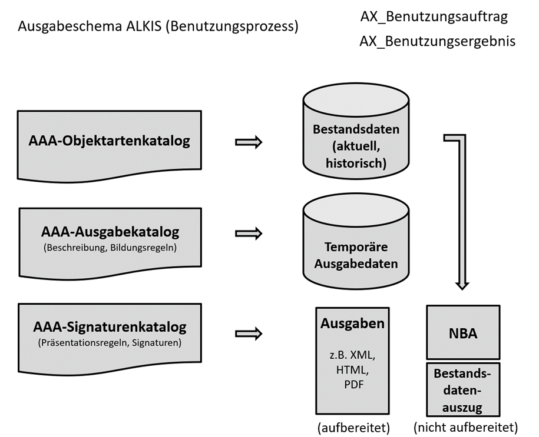

Demnach werden z. B. für eine Präsentationsausgabe die Objektarten der Bestandsdaten an Hand einer definierten Abfrageabfolge aufbereitet zu einer temporären Ausgabeobjektart entwickelt. Anschließend erfolgt unter Berücksichtigung der erforderlichen Signaturierung und des Präsentationslayouts eine Ausgabe am Bildschirm bzw. als Druckausgabe. Möglich ist aber auch die Abgabe von nicht aufbereiteten Ausgabedatensätzen, die von Nutzern unter Verwendung eigener Layoutvorgaben aufbereitet werden können.

[[basisschema_prozesse_aaa_transfer]]
===== Transferprozess

Übertragungsprozesse treten bei der Übernahme von Daten Dritter in Form von Fortführungsdaten und bei der Abgabe von Ausgabedaten an Kunden auf. Übertragungsprozesse zur Datenübernahme empfangen Ausgaben der Systeme Dritter einschließlich Transferfunktionen in Form von Transferdaten. Übertragungsprozesse zur Datenabgabe ergänzen Ausgabedaten um Transferfunktionen und erzeugen aus ihnen Transferdaten für Systeme Dritter.

[[basisschema_projektsteuerung]]
=== Projektsteuerung

Die im Paket "AAA_Projektsteuerung" definierten Klassen beschreiben einen Strukturrahmen zur Beschreibung einer Projektsteuerung. Die Klassendiagramme "AA_Antrag", "AA_Projektsteuerungskatalog" und "AA_Meilenstein" zeigen das Konzept der modellierten Projektsteuerung.

[[basisschema_projektsteuerung_antrag]]
==== Antrag

Dreh- und Angelpunkt der Projektsteuerung ist die Objektart AA_Antrag. Diese Objektart realisiert eine "Mini-Antragsverwaltung", d.h. eine Schnittstelle zur externen Antragsverwaltung. Dadurch wird es möglich, bei einem Eintrag in der externen Antragsverwaltung (Geschäftsbuch) direkt einen Bezug zu diesem Antrag (mit Raumbezug) zu generieren.

Das Antragsobjekt verwaltet außerdem die Wiedervorlage des Antrags und unterstützt die Überwachung der Projektsteuerungs-Objekte. Mit dem Raumbezug kann nach bestehenden Prozessen gesucht werden, um konkurrierende Anträge zu ermitteln oder um andere benachbarte Anträge bei der Bearbeitung zu berücksichtigen. Die fachliche Reihenfolge konkurrierender Anträge ist durch den Sachbearbeiter festzulegen. Das Antrags-Objekt wird mit dem Projektsteuerungs-Objekt (AA_Projektsteuerung) verbunden, um die Zuordnung des Antrags zu einem oder mehreren Projektsteuerungs-Objekten festzulegen und um die nicht zulässigen Kombinationen zu überwachen. Weiterhin steuert und überwacht das Projektsteuerungs-Objekt die korrekte Abwicklung der Vorgänge im Teilprozess "fachtechnische Qualifizierung". Die Fortführungsanlässe werden beim Projektsteuerungs-Objekt geführt.

Der Vorgang ist Teil einer Projektsteuerung und setzt sich aus einzelnen Aktivitäten zusammen. Die Vorgänge stellen in sich abgeschlossene Arbeitsschritte dar. Ein vorzugebender Arbeitsablauf ("Workflow") legt die Reihenfolge und Abhängigkeiten der Vorgänge und deren Arbeitsschritte fest. Die Vorgänge werden in Gruppen zusammengefasst und in einer bestimmten Reihenfolge nacheinander bzw. nebeneinander bearbeitet. Die Entscheidung über den Abschluss des einzelnen Vorganges wird im Status (Meilenstein) dokumentiert.

[#img_48,reftext='{figure-caption} {counter:figure-num}']
.Klassendiagramm "AA_Antrag"
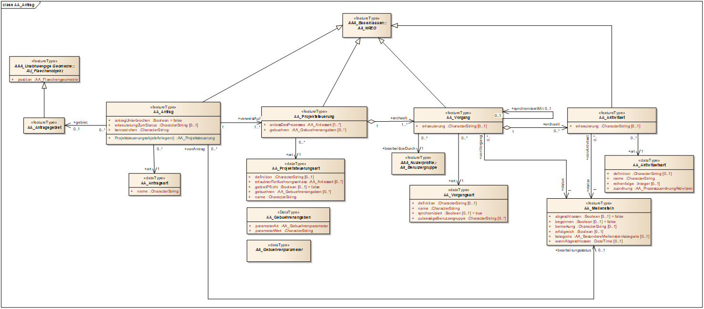

[[basisschema_projektsteuerung_katalog]]
==== Projektsteuerungskatalog

Der Projektsteuerungskatalog definiert die innerhalb eines Projektsteuerungs-Objektes dieser Art erlaubten Fortführungsanlässe. Er beinhaltet die Projektsteuerungs- und Vorgangsarten. Die Projektsteuerungsart bündelt Projektsteuerungs-Objekte, die eine gemeinsame Charakteristik aufweisen. Analoges gilt für die Vorgangsart.

[#img_49,reftext='{figure-caption} {counter:figure-num}']
.Klassendiagramm "AA_Projektsteuerungskatalog"
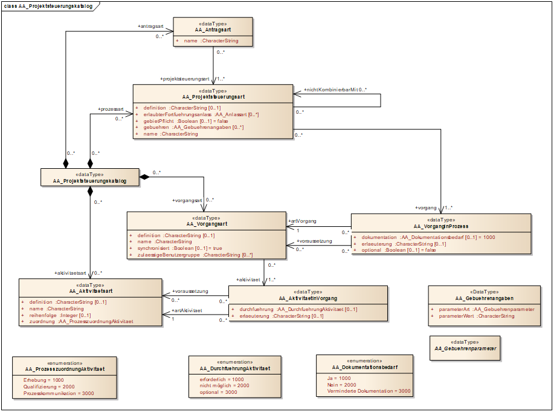

[[basisschema_projektsteuerung_meilenstein]]
==== Meilenstein

Hierbei handelt es sich um einen Datentyp, der zu einem Vorgang usw. den aktuellen Zustand und die Verantwortlichkeiten vermerkt.

[#img_50,reftext='{figure-caption} {counter:figure-num}']
.Klassendiagramm "AA_Meilenstein"
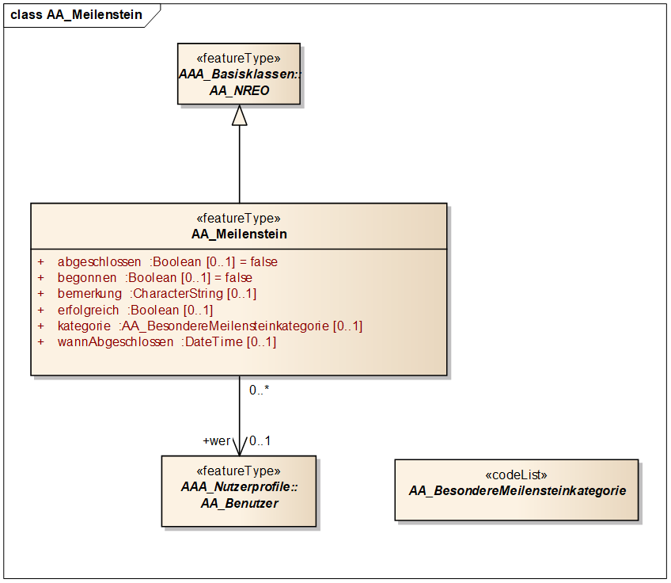

Eine anwendungsbezogene Erläuterung der Projektsteuerung des AAA-Basisschemas für das Fachschema ALKIS befindet sich in der GeoInfoDok in den "Erläuterungen zu ALKIS". Weitere Einzelheiten und Zusammenhänge können hieraus entnommen werden.