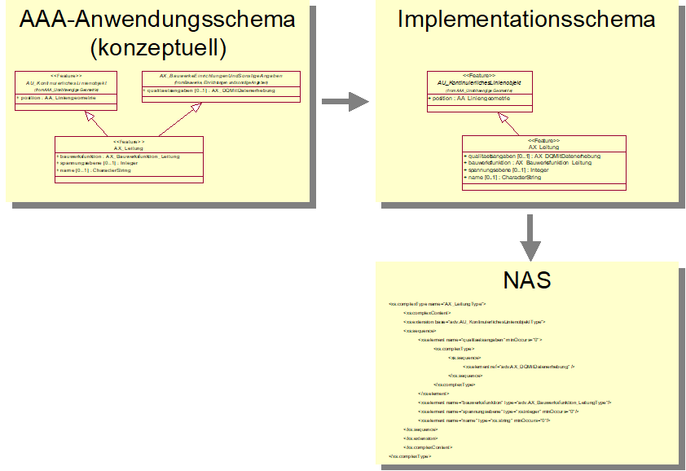
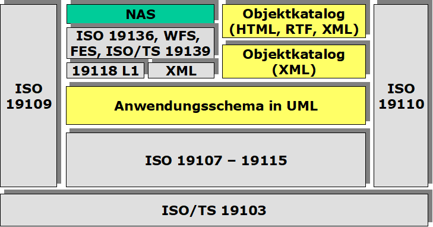
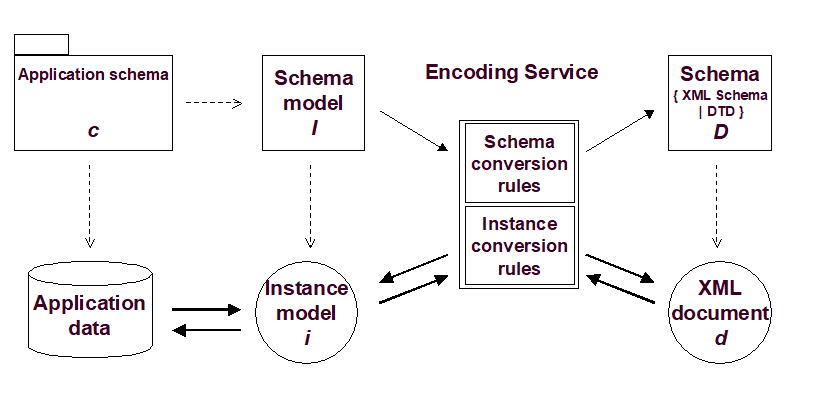
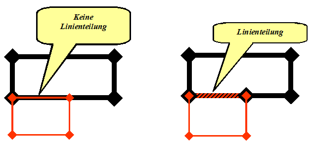

[[nasschema]]
== Die Kodierung des NAS-Schemas

In xref:aaareferenzmodell[] sind die Grundlagen und Zusammenhänge für die mit dieser Dokumentation zu beschreibenden Geoinformationen erläutert. Das dort festgelegte Referenzmodell stellt unter anderem auch den Bedarf für den Datenaustausch dar. Soweit es erforderlich ist, den Datenaustausch als AdV-Standard einheitlich zu definieren, enthält dieses Kapitel die Festlegungen zu den zu verwendenden Austauschschnittstellen. Die in der Folge aufgeführten XML-Schemadateien sind im GDI-DE-Schema-Repository unter http://repository.gdi-de.org/schemas/adv/nas/ verfügbar.

[[nasschema_nas]]
=== Normbasierte Austauschschnittstelle (NAS)

Die Normbasierte Austauschschnittstelle (NAS) wird verwendet, wenn Geoinformationen ausgetauscht werden sollen, die im gemeinsamen AFIS-ALKIS-ATKIS-Anwendungsschema modelliert wurden. Dabei kann es sich um Informationen handeln, die in ihrer Struktur den gespeicherten Datenbeständen, einschließlich der Zusatzdaten (Präsentationsobjekte, Kartengeometrieobjekte, vgl. xref:aaareferenzmodell[]) entsprechen, oder um Ausgaben auf Basis dieser Bestandsdaten (Bestandsdatenauszug, NBA).

Informationen aus daraus abgeleiteten Sichten auf diese Datenbestände (z.B. AFIS-, ALKIS-, oder ATKIS-spezifische Ausgabeobjektarten) werden über ein eigenes XML Schema kodiert.

Dasselbe gilt unverändert für die weiteren Kataloge (Objektartenkatalog und Signaturenkatalog), für die ebenfalls XML Schemata spezifiziert sind. Die GeoInfoDok macht jedoch keine Vorgaben zur Kodierung von Datenbeständen, bei denen der Objektbezug völlig verloren geht (z.B. rein graphisch strukturierte Daten) oder Daten, die nach einem anderen Basisschema zu definieren sind (z.B. DXF-Daten).

Entsprechend wird sie dort eingesetzt, wo der Anwendungsschwerpunkt nach Anforderung des Nutzers auf

* der Originalität der Daten,
* der vollen Auswertbarkeit und
* der differenzierten Fortführbarkeit

liegt.

[[nasschema_normen_standards]]
=== Normen und Standards

Die Standards AFIS, ALKIS und ATKIS der AdV sind in dieser Dokumentation in konzeptueller Form auf der Grundlage der Norm ISO 19109 _Rules for Application Schema_ beschrieben. Dies bedeutet insbesondere:

* Modellierung in UML, derzeit mit dem Softwarewerkzeug _Enterprise Architect,_
* Einhaltung der Regelungen von ISO/TS 19103 und ISO 19109 für die Verwendung von UML,
* Verwendung von ISO 19107 (und damit implizit auch ISO 19111), ISO 19115-1, und ISO 19123 sowie
* Automatisierte Ableitung und Darstellung der Objektartenkataloge gemäß ISO 19110.

Die automatisierte Ableitung der Schnittstelle für den Austausch von AFIS-, ALKIS- und ATKIS-Objekten, die NAS, vervollständigt dieses Bild.

ISO 19118 _Encoding_ definiert zu diesem Zweck u.a. ein Rahmenwerk für die Erstellung von so genannten _Encoding Rules_ zur Ableitung von Schnittstellen-Definitionen für den Datenaustausch aus einem UML-Anwendungsschema. Das in ISO 19118 Kapitel 8 definierte Rahmenwerk für _Encoding Rules_ wird für die NAS angewendet (Level-1-Konformität mit ISO 19118).

Für die NAS wird ein zweistufiger Codierungsprozess angewandt (siehe xref:img_51[]):

* Im ersten Schritt wird aus dem konzeptuellen, implementierungs­plattform­unabhängigen AAA-Anwendungsschema skriptgestützt ein Implementierungs­schema in UML für ein GML-Anwendungsschema abgeleitet. Alle Elemente des Implementierungsschemas sind zu den Vorgaben aus ISO 19136 Annex E oder - im Falle von Metadatenelementen - zu ISO/TS 19139 konform. ISO 19136 ist identisch mit dem OGC Standard _Geography Markup Language_, kurz GML.
* Im zweiten Schritt wird das Implementierungsschema nach den Encoding Rules von ISO 19136 Annex E mit den Erweiterungen nach GML 3.3 Kapitel 12 und - im Falle von Metadatenelementen - ISO/TS 19139 in ein GML Anwendungsschema überführt.

Hierbei wird darauf zurückgegriffen, dass die im AAA-Anwendungsschema verwendeten Typen aus ISO/TS 19103, ISO 19107, ISO 19111 und ISO 19123 durch ISO 19136 (GML) und dem darauf aufbauenden GML Application Schema - Coverages in standardisierter XML-Schema-Implementierung vorliegen. Für ISO 19115-1 liegt derzeit noch keine standardisierte Codierung vor und es wird unverändert das XML Schema aus ISO/TS 19139 verwendet, was bei der geringfügigen Nutzung von ISO 19115-1 keine konzeptuellen Probleme bedeutet.

[#img_51,reftext='{figure-caption} {counter:figure-num}']
.Zweistufiger Ableitungsprozess der NAS

Da das AAA-Anwendungsschema und somit auch die NAS neben der Codierung von Fachobjekten auch Operationen auf einem System zur Haltung von Bestandsdaten umfasst (Fortführen, Einrichten, Sperren/Entsperren von Objekten, Reservieren von Fachkennzeichen, Erfragen von Ausgabeprodukten einschließlich der Nutzerbezogenen Bestandsdatenaktualisierung), werden die GML-Objektarten unter Verwendung von Elementen der zu GML komplementären OGC-Spezifikationen Web Feature Service (WFS) und Filter Encoding Standard (FES) in entsprechende, grundsätzlich Web-Service-fähige, Operationen eingebettet. In diesem Sinne ist eine AFIS-ALKIS-ATKIS-Datenhaltung mit einem gekapselten Web Feature Server zu vergleichen, der zusätzlich AFIS-ALKIS-ATKIS-spezifische Anforderungen berücksichtigt.

Gemäß den in xref:basisschema_modellierung[] genannten Grundlagen verfolgt die AdV mit der Implementierung von AFIS, ALKIS und ATKIS das Ziel, Grundlagen für die gemeinsame, ganzheitliche und fachübergreifende Nutzung von Geodaten zu schaffen. In diesem Sinne soll soweit wie möglich auf bestehende oder absehbare Standardfunktionalitäten von Anwendungssoftware zurückgegriffen werden.

In der NAS wird entsprechend auf die Spezifikation von AdV-spezifischen Lösungen für das Codieren von Daten soweit wie möglich verzichtet. Da die internationalen Standards an einigen Stellen für die speziellen Anforderungen der AdV präzisiert werden müssen, ist der Einsatz des Web Feature Service und Filter Encoding nur mit AFIS-ALKIS-ATKIS-spezifischen Erweiterungen möglich.

Es ist wichtig festzuhalten, dass das plattformunabhängige, konzeptuelle Modell im AAA-Anwendungsschema vollständig beschrieben ist. Bei der Abbildung auf spezifische Implementierungsmodelle (wie z.B. XML-Repräsentierungen) werden auch zukünftig Anpassungen an den IT/GI-Mainstream erforderlich werden.

Über die genannten Normen der Normfamilie ISO 19100 hinaus werden zur Definition der NAS folgende Standards herangezogen (siehe xref:referenzen[] für die genauen Quellen):

* Unified Modeling Language
* XML
* XML Schema
* XLink
* XPath
* OGC Web Feature Service
* OGC Filter Encoding
* OGC Web Services Common Specification
* OGC Geography Markup Language — Extended schemas and encoding rules
* OGC GML Application Schema - Coverages

[#img_52,reftext='{figure-caption} {counter:figure-num}']
.Einbettung der NAS in Normen und Standards

Dadurch, dass GML-Anwendungsschemata auf standardisierte XML-Komponenten, z.B. für Geometrietypen, zurückgreifen und es in GML Regeln gibt, wie XML Schema bei der Definition eines Anwendungsschemas zu verwenden ist, kann auch generische GML-Software - sofern sie die verwendeten XML-Komponenten implementiert hat - durch Analyse des GML-Anwendungsschemas der NAS AFIS-ALKIS-ATKIS-Objekte grundsätzlich verarbeiten und syntaktisch interpretieren. Dies gilt auch dann, wenn die Software zuvor kein Wissen über die NAS und AFIS-ALKIS-ATKIS besessen hat.

Mit dem von der NAS verwendeten *GML-Profil* werden aus diesem Grunde auch Anforderungen an die Fähigkeiten von Software spezifiziert und dokumentiert. Bei der Festlegung des Profils wurde auch die Zielsetzung berücksichtigt, dass dieses Profil auch über AFIS, ALKIS und ATKIS hinaus Anwendungsanforderungen abdecken soll und sich von einer AdV-internen Festlegung zu einer breiter akzeptierten Festlegung entwickelt.

Durch die Spezifikation der NAS in Form von Operationen auf einer Bestandsdatenhaltung und nicht als reines "Datenformat" sind die GML-Objekte in der NAS i.d.R. in die XML-Elemente der Operationsaufrufe und -ergebnisse eingebettet. Im Fall des Bestandsdatenauszugs zum Beispiel ist die Menge der GML-Objekte, d.h. das GML-Dokument, in das NAS-Ergebnisdokument eingebettet und kann aus diesem auf einfache Weise erkannt und extrahiert werden.

[[nasschema_kodierung]]
=== Kodierungsprozess

Die Norm ISO 19118 beschreibt den durchzuführenden Kodierungs- und Dekodierungsprozess in allgemeiner Form folgendermaßen:

[#img_53,reftext='{figure-caption} {counter:figure-num}']
.XML-basierende Kodierungsregeln gemäß ISO 19118

Der Prozess geht dabei von folgenden Rahmenbedingungen aus:

* Es existiert ein formal (z.B. in UML) beschriebenes Anwendungsschema.
* Auf der Basis von Umwandlungsregeln (Schema Conversion Rules) und ggf. Steueranweisungen bzw. -parametern werden die Informationen des UML-Anwendungsschemas in eine oder mehrere XML-Schemadateien überführt.
* In gleicher Weise werden die auf dem Anwendungsschema beruhenden Anwendungsdaten (Objekt-Instanzen) mit Hilfe von Umwandlungsregeln (Instance Conversion Rules) in eine XML-Datei überführt, die in ihrem Aufbau den Definitionen der XML-Schema-Datei entspricht.

Im Kontext der NAS wird die Umwandlung des AAA-Anwendungsschemas (UML) in das GML Anwendungsschema der NAS (XML Schema) mit den folgenden Mitteln durchgeführt:

* Umwandlung des Anwendungsschemas mit dem NAS-Tool in das Implementierungsschema (unter Verwendung der Java-Klasse NasTransformer_7)
* Anwendung der Encoding Rules mit dem Open-Source-Tool ShapeChange über das NAS-Tool und Erzeugung der NAS-Schemadateien.
** Die ShapeChange Konfigurationsdatei wurde hierzu an die AAA-spezifischen Modellrahmenbedingungen angepasst.

[[nasschema_encrules]]
=== NAS Encoding Rules

Im Folgenden werden die "NAS Encoding Rules" beschrieben. Die Struktur erfüllt die Anforderungen aus ISO 19118 Kapitel 8 und richtet sich zur einfachen Vergleichbarkeit an ISO 19118 Annex A aus.

ISO 19118 legt in Kapitel 8 Anforderung an Encoding Rules fest. Eine Encoding Rule beschreibt Abbildungsregeln mit denen Daten aus einer Eingangsdatenstruktur (Instanzen gemäß dem AAA-Anwendungsschema in _Enterprise Architect_) in eine Ausgabedatenstruktur (XML-Datei gemäß NAS) überführt werden können. Eine Encoding Rule deckt folgende Themen ab:

* Voraussetzungen
.. Anwendungsschema
.. Zeichensatz und unterstützte Sprachen
.. Austausch-Metadaten (_exchange metadata)_
.. Identifikatoren
.. Updatemechanismen
* Eingangsdatenstruktur
* Ausgabedatenstruktur
* Abbildungsregeln
* Beispiele

[[nasschema_encrules_voraussetzungen]]
==== Voraussetzungen

*Anwendungsschema*

Das AAA-Anwendungsschema wurde auf der Basis der Regeln für Anwendungsschemata aus ISO/TS 19103 und ISO 19109 entwickelt.

Zur größeren Klarheit werden im Anwendungsschema die folgenden zusätzlichen Stereotypen verwendet:

* «FeatureType» im Sinne der Definition in ISO 19136 Annex E,

Zusätzlich werden UML Tagged Values wie in ISO 19136 E.2.1 spezifiziert im Modell verwendet sowie zwei weitere UML Tagged Values "xsdEncodingRule" und "reverseRoleNAS" unterstützt. Hierbei gelten die folgenden Regeln:

* version, targetNamespace und xmlns: aktuelle Werte gemäß der Version des AAA-Anwendungsschemas, nur im AAA-Anwendungsschema-Paket
* gmlProfileSchema: Verweis auf die Datei des GML-Profils, nur im AAA-Anwendungsschema-Paket
* xsdDocument: Dateiname der XML-Schema-Datei, wird neben dem AAA-Anwendungsschema-Paket auch bei den Paketen des AAA-Basisschema, des AAA-Fachschema und der NAS-Operationen gesetzt

* Bei Klassen werden die folgenden UML Tagged Values gesetzt:

** noPropertyType: "true" bei «FeatureType»; "false" bei «DataType» und «Union»
** byValuePropertyType: "false" bei «FeatureType», «DataType» und «Union>
** isCollection: "false" bei «FeatureType», «DataType» und «Union>
** asDictionary: "true", nur bei «CodeList»

* Bei Attributen und Assoziationsrollen werden die folgenden Tagged Values gesetzt:

** sequenceNumber
** inlineOrByReference: "byReference" bei «FeatureType»-wertigen Eigenschaften, sonst "inline"
** isMetadata: "true" bei allen Qualitätsangaben, sonst "false"; zu Qualitätsangaben werden alle Typen gezählt, die mit einer der folgenden Zeichenketten beginnen: "LI_", "DQ_", "AX_DQ", "AX_LI"

*Zeichensatz und unterstützte Sprachen*

Wie in ISO 19118 A.2.3 spezifiziert, soll grundsätzlich der _Universal Character Set_ (UCS) von "ISO-10646-1" als Zeichenvorrat verwendet werden. Dieser ist identisch mit dem _Unicode Character Repertoire._

Als _Character Encoding_ für NAS-Daten soll einheitlich "UTF-8" (_UTF = UCS Transformation Format_) verwendet werden. "UTF-8" ist auch der Standardwert in XML, falls eine Encoding-Angabe fehlt. Gemäß der Vorgaben des IT-Planungsrates [KOSIT-01] wird eine Teilmenge von Unicode als Zeichensatz verwendet.

Sprache ist Deutsch ("de") oder Sorbisch (Niedersorbisch bzw. Obersorbisch).

*Exchange Metadata*

Im Zuge der Modellierung der Aufträge und Ergebnisse werden jeweils die erforderlichen Exchange Metadata modelliert und mit der automatischen Umsetzung nach XML Schema überführt.

*Identifikatoren*

Identifikatoren sind in der NAS nur auf der Ebene der Fachobjekte definiert, d.h. in allen XML-Elementen, die Typen repräsentieren, welche eine Unterklasse von AA_Objekt sind. Bei diesen sind die Identifikatoren stets anzugeben (mit Ausnahme der weiter unten definierten Fälle). Identifikatoren an allen übrigen Elementen werden überlesen und nicht beachtet.

Die Identifikatoren an Fachobjekten sind stets im Sinne von UUIDs zu verstehen, d.h. sie sind innerhalb der "_AFIS-ALKIS-ATKIS-Application-Domain_" eindeutig.

Der AAA-Identifikator besteht stets aus 16 Zeichen. Der Aufbau wird in xref:basisschema_aaa_oids[] beschrieben.

*Updatemechanismen*

Ein Updatemechanismus im Sinne von ISO 19118 Kapitel 8 wird über die NAS-Operationen unterstützt.

[[nasschema_encrules_input]]
==== Eingangsdatenstruktur

Das AAA-Anwendungsschema verwendet einige Konstruktionen in UML, die in den Abbildungsregeln von ISO 19136 Annex E, GML 3.3 Kapitel 12 und ISO/TS 19139 nicht unterstützt werden, bzw. die für die Codierung vereinfacht werden sollen. Daher erfolgt eine skriptgestützte Umsetzung des konzeptuellen AAA-Anwendungsschemas in UML in ein Implementierungsschema (siehe oben #*TBD:* Genaue Referenz?#). Hierzu wird ein neues Paket "NAS" als Kopie des Pakets "AFIS-ALKIS-ATKIS Anwendungsschema" angelegt und transformiert.

Das Skript nimmt die folgenden Änderungen vor:

* Multiple Vererbung: Weder ISO 19136 / GML 3.3 noch ISO/TS 19139 unterstützen in den Abbildungsregeln multiple Vererbung, das AAA-Modell verwendet diese jedoch in Mixin-Klassen (z.B. AP_GPO, AX_Katalogeintrag). Die Mixin-Klassen werden aufgelöst:
** Alle Attribute werden in die nächsten in der NAS codierten Subtypen kopiert.
** Alle Relationen zu den Mixin-Klassen werden ebenfalls jeweils auf die nächsten in der NAS codierten Subtypen kopiert. Dabei wird der Rollenname durch Anhängen des Klassennamens geändert, um die Eindeutigkeit der Eigenschaftsnamen zu gewährleisten.
** Die «Type»-Klassen werden gelöscht.
* Nicht navigierbare Assoziationsrollen werden
** navigierbar gesetzt
** sofern nicht vorhanden mit dem Namen "inversZu_" und den Namen der inversen Rolle versehen
** mit einer minimalen Kardinalität von "0" versehen
** der UML Tagged Value "reverseRoleNAS" wird auf "true" gesetzt
* Die Modellelemente, die Inhalte besitzen, die nicht in die NAS umgesetzt werden, werden bei der Ableitung des Implementierungsmodells für den Datenaustausch entfernt.
** Pakete:
*** "AAA Versionierungsschema"
** Attribute:
*** "AA_Objekt.identifikator"
** Klassen:
*** "AA_ObjektOhneRaumbezug"
*** "AX_Fortfuehrung"
*** "AX_Datenbank"
*** "AX_Operation_Datenbank"
*** "AX_TemporaererBereich"
*** "AX_NeuesObjekt"
*** "AX_GeloeschtesObjekt"
*** "AX_AktualisiertesObjekt"
*** "AX_Fortfuehrungsobjekt"

* Die Modellelemente, die Inhalte besitzen, die auf spezifische Weise in die NAS umgesetzt werden sollen, werden entsprechend angepasst:
**  Die Eigenschaften von AA_PMO und AA_Objekt werden wie bei Mixin-Klassen (siehe oben #*TBD:* Genaue Referenz?#) auf "AD_PunktCoverage" und "AD_GitterCoverage" übertragen, die konzeptuellen Attribute "AA_PMO.ausdehnung", "AD_PunktCoverage.geometrie" und "AD_PunktCoverage.werte" gelöscht. Zusätzlich werden Vererbungsbeziehungen auf "CV_DiscreteGridPointCoverage" bzw. "CV_DiscretePointCoverage" gesetzt.
** Die folgenden Typen erhalten ein neues Attribut und werden von den konzeptuellen Typen (TS-Klassen) entkoppelt:
*** "TA_PointComponent.position : GM_Point"
*** "TA_CurveComponent.position : GM_Curve"
*** "TA_SurfaceComponent.position : GM_Surface"
*** "TA_MultiSurfaceComponent.position : GM_Object" (die Werte müssen entweder GM_Surface oder GM_MultiSurface sein)
** Die Assoziation mit der Rolle "TA_MultiSurfaceComponent.masche" wird entsprechend gelöscht.
** Die folgenden Attribute erhalten einen neuen Typ:
*** "AU_Punkthaufenobjekt.position : GM_MultiPoint"
*** "AU_KontinuierlichesLinienobjekt.position : GM_Curve"
*** "AU_Flaechenobjekt.position : GM_Object"
*** "AG_Flaechenobjekt.position : GM_Object"
*** "AG_Punktobjekt.position : GM_Point"
*** "AU_Objekt.position : GM_Object"
*** "AG_Objekt.position : GM_Object"
*** "AU_GeometrieObjekt_3D.position : GM_Object"
*** "AU_MehrfachLinienObjekt_3D.position : GM_Object"
*** "AU_MehrfachFlaechenObjekt_3D.position : GM_Object"
*** "AU_UmringObjekt_3D.position : GM_MultiCurve"
*** "AU_PunkthaufenObjekt_3D.position : GM_MultiPoint"
*** "AP_TransformationsMatrix_3D.parameter : doubleList"
*** "AX_DQOhneDatenerhebung.herkunft : LI_Lineage"
*** "AX_DQMitDatenerhebung.herkunft : LI_Lineage"
*** "AX_DQErhebung3D.herkunft3D : LI_Lineage "
*** "AX_DQPunktort.herkunft : LI_Lineage"
*** "AX_DQDachhoehe.herkunft : LI_Lineage"
*** "AX_DQBodenhoehe.herkunft : LI_Lineage"
*** "AX_Schwereanomalie_Schwere.wert : Measure"
*** "AX_DQSchwere.genauigkeitswert : Measure"
*** "AX_Schwere.schwerewert : Measure"
*** "AX_VertikalerSchweregradient.genauigkeitVertikalerSchweregradient : Measure"
*** "AX_VertikalerSchweregradient.wertVertikalerSchweregradient : Measure"
*** "AX_Leitung.spannungsebene : Measure"
*** "AX_Sperrauftrag.uuidListe : URI"
*** "AX_Entsperrauftrag.uuidListe : URI"
*** "ExceptionFortfuehrung.bereitsGesperrteObjekte : URI"
*** "ExceptionFortfuehrung.nichtMehrAktuelleObjekte : URI"
*** "ExceptionAAAFortfuehrungOderSperrung.bereitsGesperrteObjekte : URI"
*** "ExceptionAAAFortfuehrungOderSperrung.nichtMehrAktuelleObjekte : URI"
*** "ExceptionAAAEntsperren.uuidListe : URI"
*** "DCP.HTTP : URI"
*** "DCP.email : URI"
*** "AX_Fortfuehrungsergebnis.fortfuehrungsnachweis : Any"
+
[NOTE]
======
Der Datentyp wird im Implementierungsschema der NAS auf "Any" geändert (dies wird in GML zu gml:AbstractObject), da der in den NAS nur nachrichtlich referenzierte Fortführungsnachweis im Ausgabekatalog spezifiziert ist und dieser separat versioniert wird. Dies verhindert, dass NAS und das Implementierungsschema des Ausgabekatalog wechselseitig voneinander abhängig sind. Alle Werte des Attributs "fortfuehrungsnachweis" müssen eine Kodierung von AX_Fortfuehrungsnachweis aus einer von der AdV veröffentlichten Version des Implementierungsschemas des Ausgabekatalogs sein.
======
** Verweise in den Projektsteuerungskatalog werden als XLink-Verweis realisiert (über MapEntries in der ShapeChange-Konfiguration der NAS):
*** "AA_Antrag.art : AA_Antragsart"
*** "AA_Projektsteuerung.art : AA_Projektsteuerungsart"
*** "AA_Vorgang.art : AA_Vorgangsart"
*** "AA_Aktivitaet.art : AA_Aktivitaetsart"
** Die Klassen des Projektsteuerungskatalogs werden gelöscht:
*** "AA_Antragsart"
*** "AA_Projektsteuerungsart"
*** "AA_Vorgangsart"
*** "AA_Aktivitaetsart"
*** "AA_Projektsteuerungskatalog"
*** "AA_AktivitaetInVorgang"
*** "AA_VorgangInProzess"
*** "AA_Dokumentationsbedarf"
*** "AA_DurchfuehrungAktivitaet"
*** "AA_ProzesszuordnungAktivitaet"
** Als Folge der obigen Anpassungen können außerdem die folgenden Typen gelöscht werden:
*** "AA_Liniengeometrie"
*** "AA_Flaechengeometrie"
*** "AU_Geometrie"
*** "AG_Geometrie"
*** "AU_Geometrie_3D"
*** "AA_Punktgeometrie"
*** "AA_Punktgeometrie_3D"
*** "AA_MehrfachLinienGeometrie_3D"
*** "AA_MehrfachFlaechenGeometrie_3D"
*** "AA_PunktLinienThema"
*** "AX_LI_ProcessStep_OhneDatenerhebung"
*** "AX_LI_ProcessStep_MitDatenerhebung"
*** "AX_LI_ProcessStep_Punktort"
*** "AX_LI_ProcessStep_Bodenhoehe"
*** "AX_LI_ProcessStep_Dachhoehe"
*** "AX_LI_ProcessStep3D"
*** "Acceleration"
*** "AccelerationGradient"
*** Voltage
*** "AD_ReferenzierbaresGitter"
*** "AD_Wertematrix"
*** "AA_UUID"
** Bei allen Klassen wird das UML Tagged Value "xsdEncodingRule" gesetzt: "iso19136_2007" außer bei Typen, die mit einer der Zeichenketten "AX_DQ", "AX_LI" oder "AX_Datenerhebung" beginnen; bei diesen wird "iso19139_2007" verwendet.

* Hinweis: Sofern Attributen und Relationsrollen der Mixin-Klasse in Subtypen aus einem anderen Anwendungsschema kopiert werden, dann folgt daraus, dass in der NAS die XML-Elemente der kopierten Attribute / Relationsrollen in dem XML-Namensraum des Subtypen und nicht in dem XML-Namesraum der Mixin-Klasse definiert werden.
+
Beispiel: Die Ausgabeobjektart AX_Liegenschaftskarte erbt die beiden Attributarten "koordinatenangaben" und "enthaelt" von der Mixin-Klasse AA_Objektliste aus dem AAA-Anwendungsschema. Durch das beschriebene Vorgehen werden die XML-Elemente für die beiden Attribute im Namensraum des Ausgabekatalogs ('http://www.adv-online.de/namespaces/adv/aaa-ak/2.0') und nicht im Namensraum des AAA-Anwendungsschemas ('http://www.adv-online.de/namespaces/adv/gid/7.1') definiert.

Das Instanzenschema wird auf der Basis des Implementierungsschemas von ISO 19136 E.2.2 übernommen.

[[nasschema_encrules_output]]
==== Ausgabedatenstruktur

Die Ausgabedatenstruktur ist unter ISO 19136 E.2.3 erläutert.

[[nasschema_encrules_schemaabbildungsregeln]]
==== Schema-Abbildungsregeln

Relevante Fundstellen für die Schema-Abbildungsregeln sind: ISO 19136 E.2.4 mit den Erweiterungen aus GML 3.3 Kapitel 12 und - für Klassen mit dem UML Tagged Value xsdEncodingRule mit dem Wert "iso19139_2007" - ISO/TS 19139 Kapitel 8.

Die Werte des UML Tagged Value "reverseRoleNAS" werden im XML Schema in appinfo-Annotationen an dem Element ausgegeben, das der Assoziationsrolle entspricht.

Das von der AdV spezifizierte Schema für WFS-Erweiterungen codiert die in xref:nasops_funktionsumfang_erweiterungenogc[] beschriebenen Erweiterungen.

Die importierten, von Dritten definierten und verwalteten Schemata (OWS Common 1.1, GML 3.2, GML 3.3, Xlink 1.1, ISO/TS 19139:2007, WFS 2.0 und Filter Encoding 2.0 werden in den jeweiligen kanonischen Schema-Repositories referenziert.

*Abbildungsregeln für Instanzen*

Dieser Abschnitt beschreibt die Abbildung des Instanzenmodells in entsprechende XML-Elemente. Das Ergebnis der Abbildung ist ein valides XML-Dokument (NAS-Dokument). Entsprechend gezippte XML-Dokumente sind ebenfalls gültige NAS-Dokumente. Als Komprimierungsverfahren zugelassen sind "zip" und "gzip".

Die Datei enthält:

* Den XML-Header, der fest ist: "<?xml version="1.0" encoding="UTF-8" ?>". Die Verwendung von "UTF-8" wird für das Encoding vorgeschrieben.
* Das Root-Element aus einer Auftrags- oder Ergebnis-XSD-Datei mit einem Verweis auf den AdV-Namespace "http://www.adv-online.de/namespaces/adv/gid/version" und die XSD-Datei.
* Elemente in Übereinstimmung mit der referenzierten XSD-Datei.

Jedes Objekt im Instanzenschema wird in ein entsprechendes Element überführt. Das passende Element trägt denselben Namen wie die Klasse, zu der das Objekt gehört. Das "gml:id"-Attribut, das den Identifikator trägt, wird gesetzt.

Jede Eigenschaft des Objekts, d.h. jedes Attribut und jede Rolle in einer Assoziation, wird entsprechend der in den Schema-Abbildungsregeln definierten Abbildung auf XML-Elemente abgebildet, i.d.R. in ein lokales Element mit dem Namen des Attributs oder der Rolle.

*Codierung von Identifikatoren in der NAS*

Der AAA-Identifikator besteht stets aus 16 Zeichen. Der Aufbau wird in xref:basisschema_aaa_oids[] beschrieben.

In der NAS ist der AAA-Identifikator im XML-Attribut gml:id zu codieren. Beispiel:

[source,xml]
----
<AX_Gebaeude gml:id="DEST123412345678">
   <!-- ... -->
</AX_Gebaeude>
----

Um die dokumentenweite Eindeutigkeit des gml:id-Attributs zu gewährleisten, wird die Angabe immer dann um Entstehungsdatum/-zeit ergänzt, wenn mehrere Versionen eines Objekts in einem XML-Dokument vorkommen. Dies kommt insbesondere in den folgenden Fällen vor:

* In einem Bestandsdatenauszug werden mehrere Versionen eines Objekts selektiert.
* Ein Objekt wird in einem Fortführungsauftrag mit mehreren Fortführungsfällen mehrfach geändert.
* In der Einrichtung werden auch historische Objektversionen migriert.

Datum und Uhrzeit werden hierbei in 16 Zeichen ohne Trennzeichen kodiert, damit sie den Bedingungen einer XML ID genügen, also in der folgenden Form: CCYYMMDDThhmmssZ.

Beispiel:

[source,xml]
----
<AX_Gebaeude gml:id="DEST12341234567820010101T110000Z">
   <!-- ... -->
</AX_Gebaeude>

<!-- ... -->

<AX_Gebaeude gml:id="DEST12341234567820070313T125420Z">
   <!-- ... -->
</AX_Gebaeude>
----

Zusätzlich zur gml:id ist der Identifikator ebenfalls in der in ISO 19136 vordefinierten Objekteigenschaft, gml:identifier, zu codieren. Hierbei gelten die folgenden Regeln:

* Als codeSpace ist "http://www.adv-online.de/" zu verwenden.
* Es wird stets der Identifikator (also ohne Entstehungsdatum/-zeit) angegeben.
* Der Identifikator wird als globaler Identifikator, d.h. als URN (siehe unten #*TBD:* Genaue Referenz?#) codiert.

Beispiel:

[source,xml]
----
<AX_Gebaeude gml:id="DEST123412345678">
   <gml:identifier codeSpace="http://www.adv-online.de/">
      urn:adv:oid:DEST123412345678
   </gml:identifier>
   <!-- ... -->
</AX_Gebaeude>
----

In der NAS kommen zwei Arten von Verweisen auf Objekte vor:

* Verweise von einem Objekt auf ein anderes Objekt werden stets als XLink repräsentiert. Innerhalb der NAS sind Verweise auf andere AAA-Objekte ausnahmslos über http://www.ietf.org/rfc/rfc2141.txt[URNs] auszudrücken. Uniform Resource Names (URNs) dienen als global eindeutige, persistente, Speicherort-unabhängige Identifikatoren. URNs von AAA-Identifikatoren beginnen alle mit "urn:adv:oid:", ergänzt durch den Identifikator. +
Beispiel: "urn:adv:oid:DEST123412345678".
* Verweise aus einem Selektionskriterium auf ein bestimmtes Objekt über einen Identifikator (fes:ResourceId/@rid). Hier ist stets der Identifikator ohne URN-Kontext anzugeben. In einigen Fällen ist hierbei zur Aktualitätsprüfung ebenfalls das 16-stellige Entstehungsdatum/-zeit ohne Trennzeichen anzugeben. Die entsprechenden Fälle werden in xref:nasops_funktionsumfang[] spezifiziert.

*Codierung von Geometrieeigenschaften in der NAS*

Auf die Kodierung der Orientierung von Linien (Curves) wurde im AAA-Basisschema verzichtet. Da die Richtung einer Linie aber fallweise (z.B. Fließrichtung von Gewässern) eine Bedeutung hat, muss a) die Erfassung in positiver Richtung erfolgen und b) sichergestellt werden, dass diese Richtung im Zuge der Verarbeitung und Speicherung unverändert bleibt. Damit kann davon ausgegangen werden, dass die Linienorientierung in der NAS immer positiv ist und es einer gesonderten Kennzeichnung nicht bedarf.

Bei Flächenumringen liegt die begrenzte Fläche gemäß ISO 19107 immer zur Linken der in positiver Richtung orientierten begrenzenden Linien.

Um die NAS möglichst einfach zu gestalten, wird Geometrie ausschließlich redundant ausgetauscht. NAS-Daten aufnehmende Programmsysteme müssen Topologie bzw. gemeinsame Geometrienutzung selbst erkennen - sofern sie sich für diese Information interessieren. Die Einstiegshürde für die Nutzung von AFIS-ALKIS-ATKIS-Daten wird dadurch möglichst niedrig gehalten.

Das "Erkennen" von Geometrieteilung wird durch die folgenden Punkte - auf möglichst einfache Weise - definiert.

Topologische Objekte und solche mit gemeinsam genutzter Geometrie können Themen zugeordnet werden. Topologische Beziehungen und gemeinsame Geometrienutzung sind nur innerhalb eines Themas möglich. Ein Thema ist immer auf eine Modellart beschränkt.

Damit zwei Geometrien identisch sind, müssen sie identische Definitionen in einem <Point> bzw. einer <Curve> besitzen, ein identischer Geometrieverlauf allein ist bei Linien nicht ausreichend.

Zur Erläuterung folgende Themendefinition für die Modellart Basis-DLM

[source,xml]
----
<AX_Themendefinition>
  <name>Tatsächliche Nutzung Basis-DLM</name>
  <art>1000</art>
  <objektart>AX_Hafenbecken</objektart>
  <objektart>AX_StehendesGewaesser</objektart>
  <objektart>AX_Meer</objektart>
  <objektart>AX_Fliessgewaesser</objektart>
  <objektart>AX_Gewaesserachse</objektart>
  <objektart>AX_Wohnbauflaeche</objektart>
  <objektart>AX_IndustrieUndGewerbeflaeche</objektart>
  <objektart>AX_Halde</objektart>
  <objektart>AX_Bergbaubetrieb</objektart>
  <objektart>AX_TagebauGrubeSteinbruch</objektart>
  <objektart>AX_FlaecheBesondererFunktionalerPraegung</objektart>
  <objektart>AX_SportFreizeitUndErholungsflaeche</objektart>
  <objektart>AX_Friedhof</objektart>
  <objektart>AX_FlaecheGemischterNutzung</objektart>
  <objektart>AX_Landwirtschaft</objektart>
  <objektart>AX_Wald</objektart>
  <objektart>AX_Gehoelz</objektart>
  <objektart>AX_Heide</objektart>
  <objektart>AX_Moor</objektart>
  <objektart>AX_Sumpf</objektart>
  <objektart>AX_UnlandVegetationsloseFlaeche</objektart>
  <objektart>AX_Strassenverkehr</objektart>
  <objektart>AX_Platz</objektart>
  <objektart>AX_Bahnverkehr</objektart>
  <objektart>AX_Flugverkehr</objektart>
  <objektart>AX_Schiffsverkehr</objektart>
  <objektart>AX_Bahnstrecke</objektart>
  <objektart>AX_Strassenachse</objektart>
  <objektart>AX_Fahrbahnachse</objektart>
  <objektart>AX_Fahrwegachse</objektart>
  <modellart>Basis-DLM</modellart>
  <dimension>2000</dimension>
</AX_Themendefinition>
----

Zur Erläuterung hier ein Beispiel bestehend aus 42003 AX_Strassenachse, 41006 AX_FlaecheGemischterNutzung und 41008 AX_SportFreizeitUndErholungsflaeche, welche aufgrund der Themendefinition in gemeinsamen Positionen über identische Koordinatenpaare verfügen.

[source,xml]
----
<!-- ... -->
  <AX_Strassenachse gml:id="DETHTL2500005JpT">
    <!-- ... -->
    <modellart>
      <AA_Modellart>
        <advStandardModell>Basis-DLM</advStandardModell>
      </AA_Modellart>
    </modellart>
    <istTeilVon xlink:href="urn:adv:oid:DETHTL25000056OE"/>
    <position>
      <gml:Curve gml:id="A285">
        <gml:segments>
          <gml:LineStringSegment>
            <gml:posList>640244.590 5648317.260 640186.230 5648414.980</gml:posList>
          </gml:LineStringSegment>
          <gml:LineStringSegment>
            <gml:posList>640186.230 5648414.980 640127.410 5648513.460</gml:posList>
          </gml:LineStringSegment>
        </gml:segments>
      </gml:Curve>
    </position>
    <!-- ... -->
  </AX_Strassenachse>
<!-- ... -->
<AX_FlaecheGemischterNutzung gml:id="DETHTL2500005Lu4">
    <!-- ... -->
    <modellart>
      <AA_Modellart>
        <advStandardModell>Basis-DLM</advStandardModell>
      </AA_Modellart>
    </modellart>
    <position>
      <gml:Surface gml:id="A3EN">
        <gml:patches>
          <gml:PolygonPatch>
            <gml:exterior>
              <gml:Ring>
                <gml:curveMember>
                  <gml:Curve gml:id="A3EO">
                    <gml:segments>
                      <gml:LineStringSegment>
                        <gml:posList>640186.230 5648414.980 640127.410 5648513.460</gml:posList>
                      </gml:LineStringSegment>
                    </gml:segments>
                  </gml:Curve>
                </gml:curveMember>
                <gml:curveMember>
                  <gml:Curve gml:id="A3EP">
                    <gml:segments>
                      <gml:LineStringSegment>
                        <gml:posList>640127.410 5648513.460 640224.910 5648555.150</gml:posList>
                      </gml:LineStringSegment>
                    </gml:segments>
                  </gml:Curve>
                </gml:curveMember>
                <gml:curveMember>
                  <gml:Curve gml:id="A3EQ">
                    <gml:segments>
                      <gml:LineStringSegment>
                        <gml:posList>640224.910 5648555.150 640276.083 5648460.442</gml:posList>
                      </gml:LineStringSegment>
                    </gml:segments>
                  </gml:Curve>
                </gml:curveMember>
                <gml:curveMember>
                  <gml:Curve gml:id="A3ER">
                    <gml:segments>
                      <gml:LineStringSegment>
                        <gml:posList>640276.083 5648460.442 640186.230 5648414.980</gml:posList>
                      </gml:LineStringSegment>
                    </gml:segments>
                  </gml:Curve>
                </gml:curveMember>
              </gml:Ring>
            </gml:exterior>
          </gml:PolygonPatch>
        </gml:patches>
      </gml:Surface>
    </position>
    <!-- ... -->
  </AX_FlaecheGemischterNutzung>
<!-- ... -->
<AX_SportFreizeitUndErholungsflaeche gml:id="DETHTL2500005KVW">
    <!-- ... -->
    <modellart>
      <AA_Modellart>
        <advStandardModell>Basis-DLM</advStandardModell>
      </AA_Modellart>
    </modellart>
    <position>
      <gml:Surface gml:id="A2R7">
        <gml:patches>
          <gml:PolygonPatch>
            <gml:exterior>
              <gml:Ring>
                <gml:curveMember>
                  <gml:Curve gml:id="A2R8">
                    <gml:segments>
                      <gml:LineStringSegment>
                        <gml:posList>640244.590 5648317.260 640186.230 5648414.980</gml:posList>
                      </gml:LineStringSegment>
                    </gml:segments>
                  </gml:Curve>
                </gml:curveMember>
                <gml:curveMember>
                  <gml:Curve gml:id="A2R9">
                    <gml:segments>
                      <gml:LineStringSegment>
                        <gml:posList>640186.230 5648414.980 640276.083 5648460.442</gml:posList>
                      </gml:LineStringSegment>
                    </gml:segments>
                  </gml:Curve>
                </gml:curveMember>
                <gml:curveMember>
                  <gml:Curve gml:id="A2RA">
                    <gml:segments>
                      <gml:LineStringSegment>
                        <gml:posList>640276.083 5648460.442 640329.780 5648363.250</gml:posList>
                      </gml:LineStringSegment>
                    </gml:segments>
                  </gml:Curve>
                </gml:curveMember>
                <gml:curveMember>
                  <gml:Curve gml:id="A2RB">
                    <gml:segments>
                      <gml:LineStringSegment>
                        <gml:posList>640329.780 5648363.250 640244.590 5648317.260</gml:posList>
                      </gml:LineStringSegment>
                    </gml:segments>
                  </gml:Curve>
                </gml:curveMember>
              </gml:Ring>
            </gml:exterior>
          </gml:PolygonPatch>
        </gml:patches>
      </gml:Surface>
    </position>
    <!-- ... -->
  </AX_SportFreizeitUndErholungsflaeche>
<!-- ... -->
----

[#img_54,reftext='{figure-caption} {counter:figure-num}']
.Erläuterung zur Linienteilung

Identität bei Linien wird stets auf der Ebene der "_GM_Curve_" untersucht. Sie ist gegeben, wenn alle Positionen der Geometriedefinition in Lage und Reihenfolge sowie verwendeter Interpolationsart identisch sind. Hierbei ist auch eine Umkehrung der Reihenfolge erlaubt.

Zwei Positionen sind identisch, wenn ihr Abstand kleiner als die vorzugebende Koordinatenauflösung ist. In AFIS-ALKIS-ATKIS ist diese für metrische Lagekoordinaten auf 3 Nachkommastellen (mm) festgelegt. Diese Festlegung gilt unabhängig von der tatsächlichen Genauigkeit der Koordinaten.

Zur Erläuterung werden die beiden Situationen aus <<img_54>> beispielhaft codiert. Zuerst die linke Situation (ohne Linienteilung):

[source,xml,linenumbers]
----
<!-- ... -->
<AX_Flurstueck gml:id="DEBY000000000001">
  <!-- ... -->
  <position>
    <gml:Surface srsName="urn:adv:crs:DE_DHDN_3GK3" gml:id="_1">
      <gml:patches>
        <gml:PolygonPatch>
          <gml:exterior>
            <gml:Ring gml:id="_2">
              <gml:curveMember>
                <gml:Curve gml:id="_3">
                  <gml:segments>
                    <gml:LineStringSegment>
                      <gml:posList>601085.954 5943996.138</gml:posList>
                      <gml:posList>601085.954 5943998.138</gml:posList>
                    </gml:LineStringSegment>
                  </gml:segments>
                </gml:Curve>
              </gml:curveMember>
              <gml:curveMember>
                <gml:Curve gml:id="_4">
                  <gml:segments>
                    <gml:LineStringSegment>
                      <gml:posList>601085.954 5943998.138</gml:posList>
                      <gml:posList>601078.954 5943998.138</gml:posList>
                    </gml:LineStringSegment>
                  </gml:segments>
                </gml:Curve>
              </gml:curveMember>
              <gml:curveMember>
                <gml:Curve gml:id="_5">
                  <gml:segments>
                    <gml:LineStringSegment>
                      <gml:posList>601078.954 5943998.138</gml:posList>
                      <gml:posList>601078.954 5943996.138</gml:posList>
                    </gml:LineStringSegment>
                  </gml:segments>
                </gml:Curve>
              </gml:curveMember>
              <gml:curveMember>
                <gml:Curve gml:id="_6">
                  <gml:segments>
                    <gml:LineStringSegment>
                      <gml:posList>601078.954 5943996.138</gml:posList>
                      <gml:posList>601085.954 5943996.138</gml:posList>
                    </gml:LineStringSegment>
                  </gml:segments>
                </gml:Curve>
              </gml:curveMember>
            </gml:Ring>
          </gml:exterior>
        </gml:PolygonPatch>
      </gml:patches>
    </gml:Surface>
  </position>
  <!-- ... -->
</AX_Flurstueck>
<!-- ... -->
<AX_Gebaeude gml:id="DEBY000000000002">
  <!-- ... -->
  <position>
    <gml:Surface srsName="urn:adv:crs:DE_DHDN_3GK3" gml:id="_7">
      <gml:patches>
        <gml:PolygonPatch>
          <gml:exterior>
            <gml:Ring gml:id="_8">
              <gml:curveMember>
                <gml:Curve gml:id="_9">
                  <gml:segments>
                    <gml:LineStringSegment>
                      <gml:posList>601082.954 5943994.138</gml:posList>
                      <gml:posList>601082.954 5943996.138</gml:posList>
                    </gml:LineStringSegment>
                  </gml:segments>
                </gml:Curve>
              </gml:curveMember>
              <gml:curveMember>
                <gml:Curve gml:id="_10">
                  <gml:segments>
                    <gml:LineStringSegment>
                      <gml:posList>601082.954 5943996.138</gml:posList>
                      <gml:posList>601078.954 5943996.138</gml:posList>
                    </gml:LineStringSegment>
                  </gml:segments>
                </gml:Curve>
              </gml:curveMember>
              <gml:curveMember>
                <gml:Curve gml:id="_11">
                  <gml:segments>
                    <gml:LineStringSegment>
                      <gml:posList>601078.954 5943996.138</gml:posList>
                      <gml:posList>601078.954 5943994.138</gml:posList>
                    </gml:LineStringSegment>
                  </gml:segments>
                </gml:Curve>
              </gml:curveMember>
              <gml:curveMember>
                <gml:Curve gml:id="_12">
                  <gml:segments>
                    <gml:LineStringSegment>
                      <gml:posList>601078.954 5943994.138</gml:posList>
                      <gml:posList>601082.954 5943994.138</gml:posList>
                    </gml:LineStringSegment>
                  </gml:segments>
                </gml:Curve>
              </gml:curveMember>
            </gml:Ring>
          </gml:exterior>
        </gml:PolygonPatch>
      </gml:patches>
    </gml:Surface>
  </position>
  <!-- ... -->
</AX_Gebaeude>
<!-- ... -->

----

Und zum Vergleich die rechte Situation, bei der die untere Kante des Flurstücks zur Herstellung der Geometrieidentität im oben beschriebenen Sinne in zwei Kanten in der Erhebungskomponente aufgetrennt wurde:

[source,xml,linenumbers]
----
<!-- ... -->
<AX_Flurstueck gml:id="DEBY000000000001">
  <!-- ... -->
  <position>
    <gml:Surface srsName="urn:adv:crs:DE_DHDN_3GK3" gml:id="_1">
      <gml:patches>
        <gml:PolygonPatch>
          <gml:exterior>
            <gml:Ring gml:id="_2">
              <gml:curveMember>
                <gml:Curve gml:id="_3">
                  <gml:segments>
                    <gml:LineStringSegment>
                      <gml:posList>601085.954 5943996.138</gml:posList>
                      <gml:posList>601085.954 5943998.138</gml:posList>
                    </gml:LineStringSegment>
                  </gml:segments>
                </gml:Curve>
              </gml:curveMember>
              <gml:curveMember>
                <gml:Curve gml:id="_4">
                  <gml:segments>
                    <gml:LineStringSegment>
                      <gml:posList>601085.954 5943998.138</gml:posList>
                      <gml:posList>601078.954 5943998.138</gml:posList>
                    </gml:LineStringSegment>
                  </gml:segments>
                </gml:Curve>
              </gml:curveMember>
              <gml:curveMember>
                <gml:Curve gml:id="_5">
                  <gml:segments>
                    <gml:LineStringSegment>
                      <gml:posList>601078.954 5943998.138</gml:posList>
                      <gml:posList>601078.954 5943996.138</gml:posList>
                    </gml:LineStringSegment>
                  </gml:segments>
                </gml:Curve>
              </gml:curveMember>
              <gml:curveMember>
                <gml:Curve gml:id="_6">
                  <gml:segments>
                    <gml:LineStringSegment>
                      <gml:posList>601078.954 5943996.138</gml:posList>
                      <gml:posList>601082.954 5943996.138</gml:posList>
                    </gml:LineStringSegment>
                  </gml:segments>
                </gml:Curve>
              </gml:curveMember>
              <gml:curveMember>
                <gml:Curve gml:id="_7">
                  <gml:segments>
                    <gml:LineStringSegment>
                      <gml:posList>601082.954 5943996.138</gml:posList>
                      <gml:posList>601085.954 5943996.138</gml:posList>
                    </gml:LineStringSegment>
                  </gml:segments>
                </gml:Curve>
              </gml:curveMember>
            </gml:Ring>
          </gml:exterior>
        </gml:PolygonPatch>
      </gml:patches>
    </gml:Surface>
  </position>
  <!-- ... -->
</AX_Flurstueck>
<!-- ... -->
<AX_Gebaeude gml:id="DEBY000000000002">
  <!-- ... -->
  <position>
    <gml:Surface srsName="urn:adv:crs:DE_DHDN_3GK3" gml:id="_8">
      <gml:patches>
        <gml:PolygonPatch>
          <gml:exterior>
            <gml:Ring gml:id="_9">
              <gml:curveMember>
                <gml:Curve gml:id="_10">
                  <gml:segments>
                    <gml:LineStringSegment>
                      <gml:posList>601082.954 5943994.138</gml:posList>
                      <gml:posList>601082.954 5943996.138</gml:posList>
                    </gml:LineStringSegment>
                  </gml:segments>
                </gml:Curve>
              </gml:curveMember>
              <gml:curveMember>
                <gml:Curve gml:id="_11">
                  <gml:segments>
                    <gml:LineStringSegment>
                      <gml:posList>601082.954 5943996.138</gml:posList>
                      <gml:posList>601078.954 5943996.138</gml:posList>
                    </gml:LineStringSegment>
                  </gml:segments>
                </gml:Curve>
              </gml:curveMember>
              <gml:curveMember>
                <gml:Curve gml:id="_12">
                  <gml:segments>
                    <gml:LineStringSegment>
                      <gml:posList>601078.954 5943996.138</gml:posList>
                      <gml:posList>601078.954 5943994.138</gml:posList>
                    </gml:LineStringSegment>
                  </gml:segments>
                </gml:Curve>
              </gml:curveMember>
              <gml:curveMember>
                <gml:Curve gml:id="_13">
                  <gml:segments>
                    <gml:LineStringSegment>
                      <gml:posList>601078.954 5943994.138</gml:posList>
                      <gml:posList>601082.954 5943994.138</gml:posList>
                    </gml:LineStringSegment>
                  </gml:segments>
                </gml:Curve>
              </gml:curveMember>
            </gml:Ring>
          </gml:exterior>
        </gml:PolygonPatch>
      </gml:patches>
    </gml:Surface>
  </position>
  <!-- ... -->
</AX_Gebaeude>
<!-- ... -->

----

Die Themen werden in der NAS-Datei wie folgt abgebildet:

* Die Themen, und dies gilt sowohl für "TS_Theme" als auch das "PunktLinienThema", sind (implizite) Realisierungen von GM_Complex und sind letztlich eine Aggregation von geometrischen Elementen. Sie können im AFIS-ALKIS-ATKIS-Kontext nur in einer vollständigen Form (Art der Themendeklaration = "alle Objekte", Klassenthemen) vorkommen.
* Bei der vollständigen, klassenbezogenen Form liegen alle Objekte einer Objekt-art automatisch in diesem Thema. Es besteht keine "Wahlmöglichkeit".

Die bis zur GeoInfoDok Version 6.0.1 mögliche, instanzenbezogene Angabe der geometrischen Identität ist nicht mehr vorgesehen, da eine eindeutige Zuordnung zwischen einer geometrischen Identität und dem entsprechenden Thema nicht möglich war, sondern nur allgemeingültig für alle Instanzen in den Produkt-Metadaten angegeben werden konnte. Zudem waren keine fachlichen Anforderungen zur Erfassung und Führung dieser Funktionalität bekannt.

*Codierung von Verweisen auf Koordinatenreferenzsysteme in der NAS*

Grundsätzlich muss jede Geometrieeinheit in der NAS-Datei (Punkt, Linie, Fläche) auf ein Koordinatenreferenzsystem (CRS) verweisen. Dies kann entweder implizit durch Angabe des CRS bei einer übergeordneten Geometrieeinheit oder explizit bei der jeweiligen Geometrieeinheit erfolgen. Der Verweis erfolgt durch Angabe eines http://www.w3.org/Addressing[URI] _(Uniform Resource Identifier)_. Um diese Angabe nicht immer bei jeder Objektgeometrie machen zu müssen, werden in den Exchange Metadata der NAS alle verwendeten Referenzsysteme angegeben, von denen eines als Standardreferenzsystem gekennzeichnet werden kann. Für Geometrien, die in diesem Standardreferenzsystem vorliegen, muss keine Angabe zum Koordinatenreferenzsystem mehr gemacht werden. Das dafür vorgesehene Attribut bei GML-Geometrien "srsName" ist in diesen Fällen nicht vorhanden. Für alle Geometrien, die nicht im Standardreferenzsystem vorliegen, ist das Attribut zu belegen. Hierbei sind die in xref:crsuom_crs_aaa[] beschriebene Syntax und die dort definierten Bezeichnungen zu verwenden.

Bei NAS-Dokumenten, die Objekte in einer "FeatureCollection" enthalten, ist das Standardreferenzsystem im Attribut "srsName" des "gml:Envelope" anzugeben.

Darüber hinaus dient die Deklaration der verwendeten Koordinatenreferenzsysteme in den Exchange Metadata der Angabe der für das Referenzsystem geltenden Koordinatenauflösung bzw. der Anzahl der relevanten Nachkommastellen. Diese kann von Referenzsystem zu Referenzsystem unterschiedlich sein und macht keine Aussage über die Genauigkeit der Koordinaten. In AFIS-ALKIS-ATKIS ist die Koordinatenauflösung für metrische Lagekoordinaten auf 3 Nachkommastellen (mm) festgelegt. Die Angabe der relevanten Nachkommastellen ist notwendig, da sowohl GML als auch ISO 19107 _Spatial Schema_ keine Einschränkungen diesbezüglich machen und auch keine Möglichkeiten dazu vorsehen (Datentyp: _decimal_ oder _double_). Folgende Definition wird in den NAS Schema-Dateien verwendet:

[source,xml,linenumbers]
----
<xs:complexType name="AA_Koordinatenreferenzsystemangaben">
  <xs:sequence>
    <xs:element name="crs" type="gml:CRSPropertyType"/>
    <xs:element name="anzahlDerNachkommastellen" type="xs:integer"/>
    <xs:element name="standard" type="xs:boolean"/>
  </xs:sequence>
</xs:complexType>

----

*Codierung von Verweisen auf Maßeinheiten in der NAS*

Grundsätzlich muss jeder mit einer Maßeinheit versehene Wert in der NAS-Datei (z.B. Längen, Flächen, Winkel) auf eine Maßeinheit verweisen. Der Verweis erfolgt durch Angabe eines http://www.w3.org/Addressing[URI] _(Uniform Resource Identifier)_ im Attribut "uom". Hierbei sind die in xref:crsuom_uom_aaa[] beschriebene Syntax und die dort definierten Bezeichnungen zu verwenden.

*Codierung von Verweisen auf Werte aus Codelisten*

Jedes Attribut mit einem Wert aus einer Codelist wird in der NAS als Verweis auf einen Codelistenwert in einer Registry für Codelisten (siehe xref:registry_codelists[]) codiert. Der Verweis wird als HTTP URI in einem xlink:href-Attribut codiert. Hierbei ist der Text des Wertes im Attribut xlink:title aufzunehmen.

Beispiel:

[source,xml]
----
<AX_Flurstueck gml:id="DEBBxxxxxxxxxxxx">
  <!-- ... -->
  <anlass xlink:title="Ersteinrichtung" xlink:href="https://registry.gdi-de.org/codelist/de.adv-online.gid/AA_Anlassart/000000"/>
  <!-- ... -->
</AX_Flurstueck>
----

*Codierung von Zeilenumbrüchen in Schriftinhalten von Präsentationsobjekten*

Für eine korrekte Darstellung von Schriftinhalten wird gelegentlich ein Zeilenumbruch nötig. Dieser muss im Schriftinhalt eines Präsentationsobjektes durch ein entsrechendes LF-Zeichen "\n" angegeben werden. In XML wird ein LF durch ein Zeichen - typischerweise #xA - repräsentiert.

[[nasschema_gmlprofil]]
=== GML-Profil für die NAS

Als Bestandteil der NAS wird ein GML-Profil dokumentiert, das die GML-Elemente und -Typen auf den benötigten Umfang eingrenzt und in der aktuellen Version nicht benötigte Teile, wie die Topologie oder nicht unterstützte Objekteigenschaften, "ausblendet".

Neben der Weglassung von fachlich nicht benötigten GML-Strukturen wurde auch eine Reihe von zusätzlichen Festlegungen zur Verwendung von GML in der NAS getroffen. Ziel ist die Beschränkung von Freiräumen der Codierung, sodass die Verarbeitung von NAS-Dokumenten erleichtert wird:

. Bei GML-Objekten, die neben der Verwendung von normalen auch Array-Eigenschaften erlauben, wurde eine der Varianten, i.d.R. die Array-Eigenschaften, gestrichen.
. Bei der Darstellung von GM_PolyhedralSurface in den Daten wird die Verwendung von gml:Surface mit genau einem gml:PolygonPatch vorgeschrieben. (gml:Polygon darf in diesen Fällen nicht verwendet werden und ist ausschließlich in Filterausdrücken erlaubt.)
. Da die Mehrzahl der unter Verwendung von GM_MultiSurface definierten Flächenobjekte (z.B. Flurstücke) aus lediglich einer einzigen Fläche bestehen, wird vorgeschrieben, dass bei einer einzigen Fläche stets gml:AbstractSurface zu verwenden ist und die Verwendung von gml:MultiSurface nur bei mehreren getrennten Flächen erlaubt ist.
. Bei der Darstellung von GM_Ring in den Daten wird die Verwendung von gml:Ring mit gml:Curve vorgeschrieben (gml:LinearRing darf in diesen Fällen nicht verwendet werden und ist ausschließlich in Filterausdrücken erlaubt).
. Für Koordinatenangaben muss gml:pos (bei gml:Point) bzw. gml:posList (bei anderen Geometrieobjekten) verwendet werden.
. Die Standardeigenschaften von GML-Objekten "gml:name" und "gml:description" dürfen nur in GML-Dictionaries verwendet werden, nicht in Eigenschaften von Objekten im Namespace der NAS.
. Bei GMD-Objekten ist bei der Abbildung der DQ-Element in der NAS als gmd:LI_Lineage-Elemente folgendes zu beachten:
.. Es darf nur das Element gmd:processStep enthalten sein
.. Das Element muss mindestens einmal vorkommen
.. Das Element darf maximal so oft vorkommen, wie im konzeptuellen Modell beschrieben (d.h. in der Regel einmal, bis auf in AX_DQPunktort, dort zweimal).

Es ist zu beachten, dass die Schemadatei des Profils (gmlProfileNAS.xsd) standardmäßig nicht zum Validieren verwendet wird (aufgrund der Regeln, wie in XML Schema die schemaLocation-Attribute interpretiert werden). Um Fehlinterpretationen auszuschließen wurde auch der Namespace der Schemadatei des GML-Profils auf einen anderen Namespace als den von XML Schema geändert. Sofern lokal die Schemadatei zu Validierungszwecken verwendet werden soll, ist der Dateiinhalt entsprechend anzupassen.