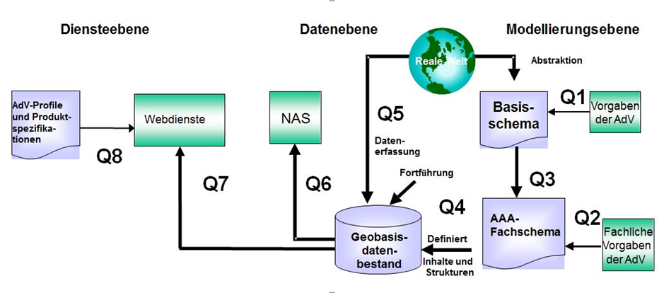
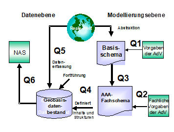
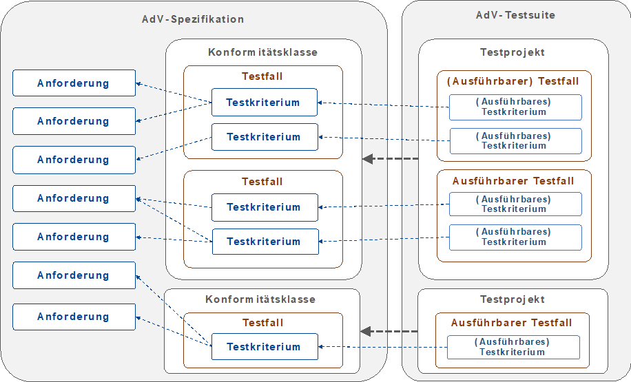
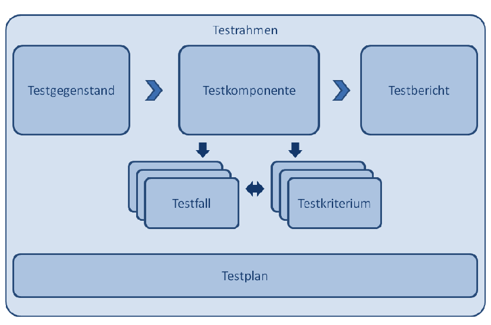

[[qa]]
== Qualitätssicherung

=== AdV-Qualitätssicherungssystem

Die AdV hat folgende Eckpunkte des Qualitätssicherungssystems für die Geodaten des amtlichen Vermessungswesens beschlossen:

"Durch bundeseinheitliche Festlegung, Benennung und beschreibende und quantitative Qualitätsmerkmale kennzeichnet und sichert die AdV die Qualität der geotopographischen und liegenschaftsbeschreibenden Produkte des amtlichen Vermessungswesens. Dabei sind die bundesweite Aktualität, Einheitlichkeit, Vollständigkeit und Verfügbarkeit der Produkte wesentliche Qualitätsmerkmale. Die Vermessungsverwaltungen gewährleisten die Einhaltung der AdV-Produktqualität durch standardisierte Prüfverfahren und erklären die Konformität mit den AdV-Standards."

[#img_58,reftext='{figure-caption} {counter:figure-num}']
.Das AdV-Qualitätssicherungsmodell für AAA und Dienste

Die Qualitätsprüfaspekte Q1 bis Q6 sind spezifisch für das AAA-Anwendungsschema, sie lassen sich prinzipiell aber auch auf andere Produktspezifikationen übertragen. Die Qualitätsprüfaspekte Q7 und Q8 gelten für die Bereitstellung von Geobasisdaten über Dienste. Q7 steht für die Qualitätssicherung der Austauschdaten gegenüber den Austauschschemata der Produktspezifikationen (*Inhalt*) und Q8 beschreibt die Qualitätssicherung der Dienste gegenüber den Profilen, Produktspezifikationen (*Diensteparameter*).

Ziel ist eine umfassende Qualitätssicherung für die Geodaten des amtlichen Vermessungswesens als Ergebnis des Konzeptions- und Produktionsprozesses. Die Konzeption (AAA-Basisschema, AAA-Fachschema; Profile für Dienste und Metadaten) liegt in den Händen der AdV, während die Produktion der Datenbestände im Einklang mit dem AAA-Anwendungsschema, die Beschreibung mit Metadaten und die Bereitstellung über Schnittstellen und Dienste Aufgabe der Vermessungsverwaltung eines jeden einzelnen Landes ist.

=== Qualitätssicherungsmodell für das AAA-Anwendungsschema

[#img_59,reftext='{figure-caption} {counter:figure-num}']
.Das Qualitätssicherungsmodell des AFIS-ALKIS-ATKIS-Projektes

Angewendet auf das AAA-Anwendungsschema bedeuten die verschiedenen Qualitätsprüfaspekte (Q1 bis Q6) folgendes:

Q1 misst das AAA-Basisschema an den strategisch-fachlichen Vorgaben der AdV, Q2 misst das AAA-Fachschema an den fachlichen Vorgaben der AdV. Mit Q3 wird festgestellt, ob das AAA-Fachschema den Regeln des AAA-Basisschemas entspricht. Q1, Q2 und Q3 prüfen die konzeptionelle, interne Qualität.

Q4 prüft den Geobasisdatenbestand auf Übereinstimmung mit dem AAA-Anwendungsschema und auf die Einhaltung der dort niedergelegten Qualitätsangaben, z.B. die Konsistenzbedingungen der jeweiligen Version.

Q5 vergleicht den Geobasisdatenbestand mit der realen Welt , Q6 betrifft die Qualität der NAS zum Nutzer.

Im Einzelnen ergibt sich folgendes Qualitätsprüfungsschema:

[width="99%",cols="6%,67%,16%,11%",]
|===
| | |AdV |Länder

|*1.* |*AdV-Regelwerke und Standards zur Entwicklung von Verfahren und Programmsystemen* | |

| |Qualitätssicherung des AAA-Basisschemas gegenüber den Vorgaben der AdV (Q1) |X |

| |Qualitätssicherung des gemeinsamen AAA-Fachschemas gegenüber den fachlichen Vorgaben der AdV (Q2) |X |

| |Qualitätssicherung des gemeinsamen AAA-Fachschemas gegenüber dem AAA-Basisschema (Q3) |X |

| |Qualitätssicherung der Datenbestände (ALKIS/ATKIS/AFIS) gegenüber dem gemeinsamen AAA-Anwendungsschema (Q4) | |X

| |Qualitätssicherung der Austauschdaten gegenüber der NAS (Q6) |Grundsätze |X

|*2.* |*Vorgaben für die AdV-Produktqualität* | |

| |Festlegung von beschreibenden und bewertenden Qualitätsmerkmalen für einheitliche Produkte einschl. Aktualität, Einheitlichkeit, Vollständigkeit und Verfügbarkeit. |X |

|*3.* |*Vorgaben für Qualitätssicherung der Bestandsdaten* | |

| |Qualitätssicherung der Bestandsdaten gegenüber der fachlichen Realität (Q5) | |X

|*4.* |*Qualitätssicherung (als Teil des Qualitätsmanagements)* | |

| |Konformitätserklärung durch die Vermessungsverwaltungen | |X
|===

Die Qualitätssicherungsgrundsätze zu Q6 gehen davon aus, dass bei Datenabgaben aus +
AFIS/ALKIS/ATKIS keine Überprüfung der entstehenden NAS-Dateien gegenüber dem Modell vorgenommen werden muss. Die modellkonforme Implementierung hat dies anhand der jeweils gültigen XML-Schemadateien (XSD) sicher zu stellen; die Interoperabilität ist zu gewährleisten. Die Datenübernahme ist Bestandteil des Qualifizierungsprozesses. In diesem Rahmen müssen entsprechende Prüfwerkzeuge zur Verfügung stehen, die anhand der jeweils gültigen XML-Schemadateien (XSD) die Qualität der Übernahmedaten sicherstellen. Die Prüfung der Austauschdaten gegenüber den NAS-Schema unterscheidet die Prüfung der Wohlgeformtheit der XML-Datei und die Prüfung der Gültigkeit der XML-Datei (Prüfwerkzeug für beides z.B. Xerces).

Die Ergebnisse der Qualitätssicherung für das AAA-Anwendungsschema sind in folgenden Dokumenten unter http://www.adv-online.de/veroeffentlichungen veröffentlicht.

[width="100%",cols="100%",]
|===
|Dokumente zum Qualitätsmanagement
|Qualitätssicherung des gemeinsamen AAA-Fachschemas gegenüber den +
fachlichen Vorgaben der AdV (Q2)
|Qualitätssicherung des gemeinsamen AAA-Fachschemas gegenüber +
dem AAA-Basisschema (Q3)
|Anlagen zu Q3
|Qualitätssicherung der Austauschdaten gegenüber der NAS (Q6)
|===

=== AdV-Testsuite

Zur Gewährleistung der fach- und stellenübergreifenden Interoperabilität müssen die von den AdV-Mitgliedsverwaltungen geführten aktuellen Geobasisdaten und der daraus abgeleiteten Geodatendienste anhand der abgestimmten AdV-Spezifikationen überprüft werden. Die Interoperabilität ist die Voraussetzung, dass die Geobasisdaten, Geodatendienste und Metadaten tatsächlich auch bundesweit einheitlich von den Nutzern in ihren webbasierten Geoinformationssystemen verwendet werden können. Die AdV-Spezifikationen bilden den Maßstab der Datenqualitätsprüfungen.

Damit die jeweiligen AdV-Mitgliedsverwaltungen ihre Daten und Dienste prüfen können, wird eine geeignete Testplattform (AdV-Testsuite) bereitgestellt, mit der die Datenqualitätstests operationalisiert werden können. Dabei geht es nicht um eine offizielle Zertifizierung, sondern um den technischen Vorgang zur Überprüfung von Anforderungen aus AdV-Spezifikationen als Teil einer umfassenden Qualitätssicherung der amtlichen Geobasisdaten.

Die AdV-Testsuite deckt insbesondere folgende Konformitätsprüfungen ab:

* Datentests für AdV-Produktstandards und technische Regelwerke (z.B. Produkte der GeoInfoDok, externe und interne Datenformatbeschreibungen der ZSHH, Produktstandard für Orthophotos),
* AdV-Diensteprofile und AdV-Produktspezifikationen für Dienste (inkl. der AdV-INSPIRE-Produktspezifikationen für Dienste),
* Metadaten.

Die begonnene Implementierung erfolgt nach einem Stufenkonzept. Der erste Realisierungsschritt umfasst zunächste nur die Konformitätstests für Daten der GeoInfoDok. Die Tests beziehen sich auf die in den AdV-Spezifikationen enthaltenen Anforderungen, in der Regel auf Vorgaben aus dem aktuellen AAA-Anwendungsschema. Abhängig von den Anwendungsfällen und von bestimmten Anforderungen der AdV-Mitgliedsverwaltungen können Tests offline und/oder online durchgeführt werden.

Für den Betrieb der AdV-Testsuite ist die strukturierte Erfassung und Pflege aller Testkriterien für alle AdV-Spezifikationen in einer *zentralen Registry* realisiert. Ein Prozessmodell zur Fortführung der Testkriterien ist ebenso festgelegt wie die konkreten Zuständigkeiten. Die Fortschreibung der Testkriterien der GeoInfoDok wird durch den AAA-Revisionsausschuss wahrgenommen.

Neben dem Betrieb der AdV-Testsuite wurde auch der Betrieb der technischen Plattform zur Führung der Testkriterien (*Testsuite-Registry*) sichergestellt. Die Testsuite-Registry ist somit das zentrale Verzeichnis sämtlicher Testkriterien, Testfälle und Konformitätsklassen für alle Spezifikationen (nicht nur GeoInfoDok). Auf AdV-online wird der Link auf die Registry mit den Testkriterien zu den jeweiligen GeoInfoDok-Versionen veröffentlicht.

=== Systematik und Dokumentation der Qualitätssicherung

Qualitätssicherung von Daten, Metadaten oder Diensten erfolgt immer gegen Anforderungen , die in Spezifikationen festgelegt worden sind.

Innerhalb einer Spezifikation werden Anforderungen zu einer oder mehreren Konformitätsklassen gruppiert. Konformitätsklassen sind dabei die Einheiten, gegen über denen man für einen Testgegenstand Konformität prüfen bzw. veröffentlichen will. Ein Testgegenstand der AdV ist vom Typ i.d.R. ein Datenbestand, ein Metadatensatz oder ein Webdienst. Alle Anforderungen in einer Konformitätsklasse beziehen sich stets auf denselben Typ von Testgegenständen.

Konformitätsklassen können untereinander Abhängigkeiten haben. Ist zum Beispiel eine Konformitätsklasse A von einer anderen Konformitätsklasse B abhängig, dann kann ein Prüfgegenstand nur konform zu A sein, wenn er auch konform zu B ist.

Für jede Konformitätsklasse werden jeweils Testkriterien spezifiziert, die alle Anforderungen der Klasse abdecken müssen. Ein Testkriterium stellt eine Testeinheit im Sinne einer kleinstmöglichen, unteilbaren und eigenständigen Testbedingung zur Prüfung einer einzelnen Qualitätsanforderung dar. Die Testkriterien werden innerhalb einer Konformitätsklasse wiederum zu sachlogisch zusammenhängenden Testfällen gruppiert.

Um die Erfüllung der Anforderungen prüfen zu können, müssen die notwendigen Tests für die Prüfung festgelegt werden. Im besten Fall sind in einer Spezifikation die Anforderungen bereits als solche klar ausgewiesen und sowohl eindeutig als auch testfähig formuliert. In diesem Fall ist die Festlegung der Testkriterien eher eine formale Arbeit. Im Normalfall lassen die Formulierungen in Spezifikationen Interpretationsspielräume und die fachliche Abstimmung der Testkriterien ist eine wichtige Aufgabe für eine verlässliche Prüfung.

<<img_60>> zeigt die Begriffe im Kontext. Dabei wird auf der rechten Seite der Abbildung die Implementierung der spezifizierten Tests im Rahmen der AdV-Testsuite dargestellt. Die zugehörigen Begriffe werden weiter unten erläutert.

[#img_60,reftext='{figure-caption} {counter:figure-num}']
.Hierarchie von Konformitätsklasse, Testfall und Testkriterium

<<img_61>> stellt den grundsätzlichen Aufbau einer Testumgebung wie der AdV-Testsuite dar.

[#img_61,reftext='{figure-caption} {counter:figure-num}']
.Schematischer Ablauf von Datentests

Ein Testprojekt umfasst die *Testfälle* und *Testkriterien* einer Konformitätsklasse und wird zur automatisierten Prüfung in einem Testrahmen unter Verwendung einer Testkomponente verfügbar gemacht. Die *Testkomponente* ist eine Software zur Ausführung von Testläufen, bei denen ein Testgegenstand gegen ein oder mehrere Testprojekte geprüft wird. Die Ergebnisse werden im Testrahmen als *Testbericht* verfügbar gemacht. Basis des gesamten Systems ist ein zentrales Dokument, der sogenannte *Testplan*. Er beschreibt alle Aspekte der Tests und den verwendeten Ansatz.

Bei Datentests wird es in der Regel eine 1-zu-1-Beziehung zwischen fachlichen Testkriterien und ausführbaren Testkriterien geben, aber bei komplexeren Prüfabläufen wie bei den Tests von Webdiensten ist das nicht der Fall.