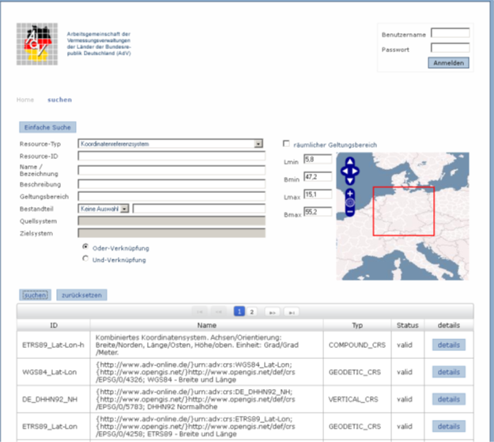

[[registry]]
== Registry

Gemäß ISO 19135 ist eine Registry ein Informationssystem, in dem ein Register geführt wird. Ein Register wiederum ist eine Zuordnung von sog. Identifiern zu Ressourcen und deren Beschreibungen. Eine Ressource ist in diesem Sinn ein Sachverhalt, der in Abgrenzung zu anderen Sachverhalten eindeutig beschrieben werden kann. Ein Identifier ermöglicht es, Ressourcen der Registry eindeutig zu referenzieren.

Registries nehmen in Geodateninfrastrukturen eine zentrale Rolle ein, da sie das Verwalten, Auffinden und Nutzen von den in der Infrastruktur vorhandenen Geoinformationsressourcen ermöglichen. Dazu gehören beispielsweise Datenprodukte, Dienste, Anwendungsschemata (in UML/XML), Koordinatenreferenzsysteme, Maßeinheiten, Codelisten, Daten- und Objektarten, Dienstetypen oder auch Zeichenvorschriften und Symbole. Die Ressourcen selbst sowie wichtige kennzeichnende Eigenschaften, die für das Verwalten, Auffinden und Nutzen von besonderer Bedeutung sind, werden über eine Registry verfügbar gemacht.

[[registry_crsuom]]
=== Registry für Koordinatenreferenzsysteme und Maßeinheiten

Aufgrund der fachlichen Notwendigkeit im Bereich der AdV wird im Auftrag des Arbeitskreis Raumbezug (AK RB) der AdV derzeit ein webbasiertes Register für Koordinatenreferenzsysteme aufgebaut, um aus amtlicher Quelle verlässliche CRS-Beschreibungen bereitzustellen. Die Umsetzung erfolgt durch die Projektgruppen AFIS (AK RB) und GDI-Standards (AK IK) der AdV. Mit dem GDI-DE Modellprojekt Registry erfolgt ein kontinuierlicher Austausch. Die Umsetzung basiert auf den ISO-Normen:

* ISO 19111 Spatial referencing by coordinates,
* ISO 19127 Geodetic codes and parameter sowie
* ISO 19135 Procedures for item registration.

Als Ressourcen für die Umsetzung wurden Ressourcen ausgewählt, die in nahezu jeder NAS-Datei verwendet werden:

* Koordinatenreferenzsysteme (Abkürzung: CRS) mit den dazugehörigen Bestandteilen wie Koordinatensysteme, Datum, Koordinatenoperationen, usw,
* Maßeinheiten (Abkürzung: UoM), die auch von den Koordinatenreferenzsystemen verwendet werden.

Eine Web-Schnittstelle stellt für entsprechend berechtigte Stellen eine Benutzeroberfläche als Auskunftssystem mit Suche sowie eine Oberfläche zur Pflege des AdV-CRS-Registers bereit.

[#img_57,reftext='{figure-caption} {counter:figure-num}']
.Prototyp CRS-Registry der AdV

Folgende Akteure sieht das AdV-CRS-Register derzeit vor:

[width="100%",cols="60%,40%",options="header"]
|===
|*Rolle* |*Rollenbesetzung*
a|
*Register-Owner*

(Eigentümer der CRS-Registry)

|AdV
|*Operationeller Betrieb der Registry* |BKG
a|
*Register-Manager*

(fachlich verantwortliche Stelle für die tatsächliche Pflege)

|AAA-Revisionsausschuss der AdV
a|
*Control-Body*

(fachlich verantwortliche Stelle, die über neue Einträge entscheidet)

|PG AFIS des Arbeitskreis Raumbezug der AdV
a|
*Submitting-Organisations*

(Stelle, die Änderungswünsche übermitteln darf)

|AAA-Revisionsausschuss/BKG/Länder
|*Nutzer* |Jeder, öffentlich zugänglich
|===

Die AdV-Registry für CRS und Maßeinheiten liegt prototypisch vor und soll in Zusammenarbeit mit der Betriebsstelle GDI-DE zu einer zentralen Komponente der Geodateninfrastruktur in Deutschland weiterentwickelt werden. Dementsprechend könnten sich die aufgelisteten Rollen noch ändern.

Ein Registry-Dienst soll zunächst nicht zur Anwendung kommen. Nach derzeitiger Beschlusslage in der AdV ist derzeit noch nicht beabsichtigt, die CRS-Liste dieses Dokuments durch die CRS-Registry zu ersetzen. Insofern hat die GeoInfoDok weiterhin normativen Charakter in Bezug auf die CRS in Deutschland.

[[registry_codelists]]
=== Registry für Codelisten

Häufig verwendete oder nach einem vorgegebenen Konzept zu beschreibende Eigenschaften von Geoobjekten werden im AAA-Datenmodell häufig durch Codes abgebildet. Die Menge der möglichen Werte ist in der Regel in einer Codeliste aufgeführt. Die Codeliste wird meist gemeinsam mit dem Datenmodell veröffentlicht. Datenerfassern muss diese Codeliste, die Bedeutung der einzelnen Codes, der Pflege- und Qualitätszustand bekannt sein, um für die Erfassung den passenden Wert auswählen zu können.

Teilweise sind die in einer Codeliste verfügbaren Codes allerdings nicht ausreichend. Im AdV-Modell wird mitunter nur die gemeinsame Sicht abgedeckt, aber nicht die länderspezifischen Bedürfnisse. In diesem Fall ist von der AdV vorgesehen, dass bestimmte Codelisten auch länderspezifisch erweitert werden können. Um die Vergabe von gleichen Codes und damit inkonsistente Datenbestände zu verhindern, ist es notwendig, die Pflege der länderspezifischen Codelisten (z.B. Modellarten) zu organisieren. Eine Registry ist hierfür ein geeignetes Werkzeug, das es ermöglicht, die Pflege von nationalen und länderspezifischen Codelisten sowie auch anderen Codelisten zu organisieren.

Der Einsatz eines Registers für Codelisten unterstützt:

* die zuständigen Stellen bei der Pflege der Codelisten und der Codes,
* die Datenerfasser bei der Auswahl geeigneter Codes und Erstellung von harmonisierten Geodatensätzen und
* die Anwender bei der Interpretation der Codes in einem Datensatz.

Eine Registry kann verschiedene Ressourcen enthalten. Sind die Ressourcen die Codelisten des AAA-Anwendungsschemas, wird der Begriff einer Code-Listen- und Enumerations-Registry verwendet. Abgekürzt wird dieser Begriff mit CER. Zunächst werden Definitionen und Regelungen von ISO und AdV zu der Thematik dargestellt, dann folgt das eigentliche CER-Konzept.

[[registry_codelists_regelungen]]
==== Definitionen und Regelungen zu Code-Listen und Enumerationen

Eine *Codeliste* definiert einen Wertebereich, in dem für jeden zulässigen Wert ein Code zugeordnet wird (ISO 19136). Die Abgrenzung der Begriffe "Enumeration" und "CodeList" erfolgt gemäß ISO 19103:

Eine *Enumeration* ist eine abschließende Sammlung von zulässigen Werten mit dem Stereotyp «enumeration» versehen. Enumerationen können nicht erweitert werden.

Eine *Codelist* ist eine nicht abschließende Sammlung von zulässigen Werten mit dem Stereotyp «codeList» versehen. Codelisten können erweitert werden.

ISO 19103 unterscheidet zwei Arten von Codelisten: Solche mit dem Tagged Value "codeList" (diese werden von einer einzigen zuständigen Stelle geführt) und solche ohne diesen Tagged Value (diese können beliebig von jedem Benutzer des zugehörigen Anwendungsschemas erweitert werden).

Im Basisschema gebrauchte Code-Listen, die von ihrem Charakter her a) von den anwendungsspezifischen Subschemata gefüllt werden müssen und b) zur Integration unterschiedlicher Anwendungen erweiterbar sein müssen, werden im Basisschema in der Regel als leere Klassen definiert und mit dem Stereotype «CodeList» versehen. In einigen Fällen sind bei Codelisten im Basisschema Wertearten angegeben (z.B. bei AA_Anlassart). Erweiterungen und Änderungen dieser Listen führen nicht zu einer neuen Version der Austauschschnittstelle. Sie erscheinen demnach nicht im Ausgabe-Schema, sondern werden in Form eines dictionaries in einer "externen" XML-Datei geführt. Sie werden an zentraler Stelle mit der Möglichkeit des online-Zugriffs geführt und gepflegt. Mit den Implementierungen des AAA-Modells wächst der Bedarf für ein Konzept zur Erweiterung dieser Codelisten. Hat sich z.B. Land XYZ im Sinne des AdV-Leitfadens zur Fachdatenanbindung eine länderspezifische Ausgabe geschaffen, so fehlt noch ein Code in der Codelist AX_Anlassart_Benutzungsauftrag, um die Erzeugung eben dieser Ausgabe initiieren zu können.

Alle Codelisten des AAA-Fachschemas führen vier- oder sechsstellige Ganzzahl-Codes (wegen führenden Nullen ungleich Integer). Für eine länderspezifische Erweiterung kommen folgende Codelisten mit folgender Stellenzahl in Frage:

[width="100%",cols="72%,28%",options="header"]
|===
a|
Codelist
a|
Stellenzahl

a|
AA_Anlassart

a|
6

a|
AA_Anlassart_Benutzungsauftrag

a|
4

a|
AA_WeitereModellart

a|
unbegrenzt

|===

Die länderspezifische Erweiterung von Codelisten des AAA-Fachschemas (hier speziell der Codes) wird mit dem zweistelligen Länderkürzel (vgl. xref:basisschema_aaa_oids[xrefstyle=full]) eingeleitet. Dem BKG steht das dort vorgesehene dreistellige Kürzel "BKG" zur Verfügung.

Als weitere Zeichen sind die Ziffern {0-9} und Zeichen {A-Z, a-z, ohne Umlaute} zulässig. Groß- und Kleinschreibung wird unterschieden.

Die Stellenanzahl des länderspezifischen Codes einschließlich Präfix sollte zur Erleichterung der Implementierung mit der des AdV-Codes identisch sein. Zukünftig könnte bei Fachinformationssystemen ggf. Bedarf an einer größeren Stellenzahl bestehen.

Beispiele:

* Ein länderspezifischer vierstelliger Benutzungsanlass z.B. lautet "RP10" oder auch "RPA6".
* Ein vierstelliger Benutzungsanlass des BKG (einzige Instanz dreistelligen Kürzels) lautet "BKG7" oder auch "BKGa".

Hierdurch vereinfacht sich eine zentrale Registrierung ("Registry") der erweiterbaren Codelisten (jedes Land und das BKG arbeitet im eigenen Namensraum). Falls die erwähnte Registrierung im Rahmen von GDI-DE nicht benötigt wird, kann sie sogar komplett entfallen.

Die Codelisten- und Enumerationswertearten mit Stereotype und Tagged Value "retired" führen diesen Status mit den zugehörigen Informationen ("gueltigVonModellversion", "gueltigBisModellversion") auch in der CER.

Eine weitere Anforderung zur Führung einer CER ergibt sich aus xref:basisschema_qaundmetadaten[xrefstyle=full]:

"In der Rollenangabe ist ein Codelistenverweis erforderlich, der gemäß ISO/TS 19139 8.5.5 eine URL sein muss. Im Beispiel ist eine URL auf ein Code-List-Dictionary im OGC-Schemarepository angegeben. Dies kann alternativ - wie bei Schemaverweisen - auch ein anderer gültiger Verweis auf ein Code-List-Dictionary sein."

Dies wird mit einem Beispiel näher illustriert:

[source,xml]
----
<gmd:role>
  <gmd:CI_RoleCode codeList="http://schemas.opengis.net/iso/19139/20070417/resources/Codelist/gmxCodelists.xml#CI_RoleCode" codeListValue="processor">processor</CI_RoleCode>
</gmd:role>"
----

[[registry_codelists_registry]]
==== Registry für Codelisten und Enumerationen

Codelisten und Enumerationen der AdV werden in dem Codelisten-Register der GDI geführt (Link: https://registry.gdi-de.org/codelist/[GDI-DE Registry]). Dies betrifft derzeit die Codelisten und Enumerationen aus dem AAA-Anwendungsschema und den Anwendungsschemata Landbedeckung, Landnutzung, Geometrische Verbesserung und Bodenrichtwertmodell. Die Vorgehensweise ist hierbei wie folgt:

* Die Codelisten und Enumerationen werden unter dem Namespace +
https://registry.gdi-de.org/codelist/de.adv-online.gid geführt.
* Die URL zum Aufruf der Codelisten und Enumerationen lautet: +
https://registry.gdi-de.org/codelist/de.adv-online.gid/{Codelist-Name}/{Werteart}
* Codelisten und Enumerationen der Anwendungsschemata in der GeoInfoDok werden im UML-Modell vom Revisionsausschuss gepflegt.
* Veröffentlicht werden zunächst die Codelisten und später auch die Enumerationen der aktuellen Version.

[[registry_xsd]]
=== XML-Schema-Register

XML-Schemata werden bei OGC und INSPIRE in einfachen, dateibasierten Repositories über WebServer bereitgestellt. Diese einfache Bereitstellung ist für die Zwecke der AdV ausreichend. Hier wird kein nach ISO-19135 ausgerichtetes Register benötigt, sondern eine einfache Lösung reicht aus. Da GDI-DE bereits ein entsprechendes Register aufgebaut hat, wurden sämtliche NAS-Dateien dort eingestellt. Siehe http://repository.gdi-de.org/schemas/adv.

[[registry_easvn]]
=== Enterprise Architect Subversion-Server

Das AAA-Anwendungsschema wird seit der Umstellung auf das Modellierungstool _Enterprise Architect_ nicht mehr lokal auf den Rechnern der Mitglieder des AAA-Revisionsausschusses geführt, sondern zentral in einem UML-Schema-Repository auf einem Server. Damit gilt dies als ein weiteres zentral geführtes Register der AdV. Der Vorteil ist eine eindeutige Referenzversion und die Vermeidung von Versionskonflikten durch ein klares Versionskonzept sowie eine zugangsbeschränkte Nutzung. Zudem werden sämtliche Änderungen aller Akteure dokumentiert.

Es besteht neben der Veröffentlichung in AdV-online die Möglichkeit, für weitere Personen (z.B. den AAA-Ansprechpartnern der Länder) lesenden Zugriff einzurichten.

Auch die Einbindung der ISO-Datenmodelle erfolgt über einen Subversion-Server der EU, der beim Joint Research Center (JRC) gehostet wird.