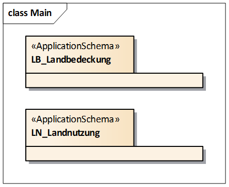
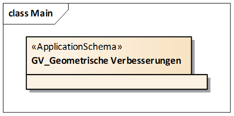
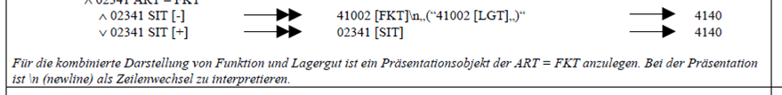
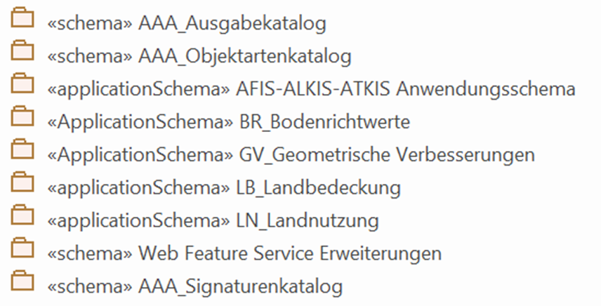

:sectnums!:

[[releasenotes]]
== Wesentliche Änderungen zur Vorgängerversion (Release Notes)

Diese Release Notes richten sich an Primärdatenanbieter und Entwickler, die Daten nach Implementierung einer neuen Referenzversion im alten Verfahren abgeben wollen. Sie enthalten die Beschreibung ausgewählter Änderungen der neuen Version und sollen die Implementierung der neuen Version erleichtern. #Die Release Notes der jeweiligen Vorgängerversionen
ist in Anhang 2 enthalten - *TBD:* Referenz korrigieren.#.

[[releasenotes_quellobjektid]]
=== Neue Attributart "QuellobjektID" bei der Objektart "AA_Objekt"

Der Datenaustausch zwischen dabag und ALKIS (und LEFIS) ist ein fundamentaler Baustein der digitalen Zukunft im AAA-Umfeld, hierzu wird es notwendig, eine performante Verbindung zwischen der Objekt-ID im AAA und den verwendeten IDs in den Quellsystemen (dabag und LEFIS) zu nutzen.

Der bisherige favorisierte Ansatz, den Objektidentifikator eines Quellsystems in einer Fachdatenverbindung zu speichern, zielt prinzipiell auf die Speicherung von identifizierenden Merkmalen zugehöriger Objekte in einem beliebigen Fremdsystem, so dass das oder die zugehörigen Objekte dort gefunden werden können. Aufgrund von Implementierungstests für den Datenaustausch zwischen dem Datenbankgrundbuch (dabag) und ALKIS erwies sich so ein komplexes Element wie die Fachdatenanbindung, die zudem auch für eine Reihe von anderen Refererenzen verwendet wird, als nicht performant genug für den gegenseitigen Datenaustausch. Daher wurde die Objektart "AA_Objekt" um ein Attribut "quellobjektID"erweitert.

[[releasenotes_lbln]]
=== Anwendungsschemata Landbedeckung und Landnutzung

Eine wesentliche Erweiterung der GeoInfoDok sind die Anwendungsschemata zu Landnutzung (LN) und Landbedeckung (LB). Diese sind eigene Anwendungsschemata außerhalb des AAA-Anwendungsschemas, somit lassen sie sich unabhängig davon implementieren.

Dennoch bestehen modellierungstechnische Abhängigkeiten zum AAA-Anwendungsschema (z.B. AAA-Basisschema). Da die Objektarten der Landnutzung aus den flächenförmigen Objektarten der TN sowie flächenförmigen Objekten weiterer Objektartenbereiche (50000, 60000, 70000) durch eine Schematransformation erzeugt werden und die Objektarten der Landbedeckung in erster Linie aus Fernerkundungsdaten erzeugt werden, wurden zwei getrennte Anwendungsschemata angelegt. Zur Schematransformation der Objektarten der Landnutzung wurden notwendige Anpassungen an den bestehenden Objektarten der Tatsächlichen Nutzung vorgenommen.

Beide Anwendungsschemata wurden jedoch extern modelliert, damit das AAA-Anwendungsschema weitgehend unverändert und stabil bleibt, andererseits aber auch dem Grundsatz der Modularisierung Rechnung getragen wird, um eine getrennte und flexible Fortführung der Module zu erlauben.

Für die Elemente der Landbedeckung und Landnutzung wurde eine weitere Standardmodellart "GeoBasis-DE" ergänzt. Zudem wurde ein neuer Tagged Value "AAA:Landnutzung = TRUE" eingeführt, welcher die Wertearten markiert, die für eine konfliktfreie und semantisch eindeutige automatisierte Ableitung der Landnutzung (LN) zwingend zu erheben sind. Damit kommt dem Tagged Value die Funktion des Grunddatenbestandes (G) gleich, zumindest für die Modellartenkennung, aus der die Landnutzung primär abgeleitet wird. Die Information wird in den abgeleiteten Objektkatalogen als Ergänzung "(LN)" bei den Wertearten mit ausgegeben. Welche Attribut- und Wertearten darüber hinaus für die vollständige automatisierte Ableitung der Landnutzung erforderlich sind, wird durch die Mappingregeln der Migrations-Mapping-Tabelle ausgesagt.

Hinweis für die Migration von GeoInfoDok 6 nach dem AAA-Anwendungsschema 7.1.2: +
Die Attributarten 'ErgebnisDerUeberpruefung (EDU)' bzw. 'DatumDerLetztenUeberpruefung (DLU)' dürfen im Rahmen der Migration nicht belegt bzw. geändert werden, da es sich nicht um pauschale Annahmen, sondern zukünftig um Metadaten zur Qualifizierung der Daten handeln soll. Die Belegung von EDU und DLU wird in den Erläuterungen zur Tatsächlichen Nutzung und zur Landnutzung beschrieben.

[[releasenotes_gv]]
=== Anwendungsschema Geometrische Verbesserung

Dieses Anwendungsschema enthält für ein Verfahrensgebiet (Homogenisierungsgebiet) die Verschiebungsvektoren in der Form, dass alle Positionen der Ausgangskoordinaten und die Positionen der Endkoordinaten mit dem Hinweis auf Verwendung als Stützpunkt gespeichert und übergeben werden können.

Dieses Anwendungsschema ist fachlich völlig unabhängig vom AAA-Anwendungsschema, bezieht sich aber auf dieselben Basisklassen des AAA-Basisschemas. Auch dieses Anwendungsschema wurde daher extern modelliert, damit die Führung dieser Informationen optional möglich ist.

Für die Elemente des Anwendungsschemas Geometrische Verbesserung wurde eine weitere Standardmodellart "GVM" eingeführt.

[[releasenotes_histflur_bei_vollhistorie]]
=== Optionale Führung der Objektart "Historisches Flurstück" auch bei Vollhistorie

Bislang wurde im Anwendungsschema nicht zwischen aktuellen und historischen Daten unterschieden, d.h. bei der Vollhistorie werden keine eigenen historischen Objektarten gebildet. Dieser Grundsatz wurde gestrichen, da das "Historische Flurstück" mit seinen abgeleiteten Inhalten für die Daten-führende Stellen, die die Vollhistorie führen, und auch für deren Nutzer einen großen Mehrwert darstellt, da es:

* die Informationsmenge so bündelt, wie es viele Anwender benötigen,
* die Performance bei der Bereitstellung der Informationen erheblich steigert und somit
* die Flexibilität der Nutzung wesentlich erhöht.

In den bekannten realisierten Datenhaltungskomponenten wird das "Historische Flurstück" heute grundsätzlich geführt, so dass keine zusätzlichen Implementierungsaufwände entstehen. Auf die anderen bereits im ALB historisch gewordenen Flurstücke hat die Streichung des Grundsatzes keine Auswirkung, da diese nach deren Migration nicht mehr neu entstehen.

[[releasenotes_zeilenumbrueche]]
=== Codierung von Zeilenumbrüchen

Der AdV-SK spricht an einer Stelle bei der Präsentation von einem \n (newline):

Bisher war unklar wie der Zeilenumbruch in XML, z.B. in der NAS, codiert werden soll, was zu unterschiedlichen und damit nicht interoperablen Umsetzungen geführt hat.

Gelöst wurde dies nun, indem im Schriftinhalt eines Präsentationsobjektes durch ein entsprechendes LF-Zeichen "\n" angegeben werden muss, das ein Steuerzeichen darstellt und nicht in der Ausgabe darzustellen ist. In XML wird ein LF durch ein Zeichen - typischerweise #xA - repräsentiert.

[[releasenotes_testkomponente]]
=== Realisierung einer Testkomponente für Daten der GeoInfoDok

Zur Gewährleistung der fach- und stellenübergreifenden Interoperabilität müssen die von den AdV-Mitgliedsverwaltungen geführten Geobasisdaten anhand der abgestimmten AAA-Datenmodelle in den jeweils gültigen Versionen geprüft werden. Die Interoperabilität ist die Voraussetzung, dass die Geobasisdaten bundesweit einheitlich von den Nutzern in ihren Geoinformationssystemen verwendet werden können. Die AdV-Spezifikationen bilden den Maßstab der Datenqualitätsprüfungen.

Damit die jeweiligen AdV-Mitgliedsverwaltungen ihre Daten prüfen können, wird eine geeignete Testplattform (AdV-Testsuite) aufgebaut. Dabei geht es nicht um eine offizielle Zertifizierung, sondern um den technischen Vorgang zur Überprüfung von Anforderungen aus AdV-Spezifikationen als Teil einer umfassenden Qualitätssicherung der amtlichen Geobasisdaten. Die AdV-Testsuite wird zunächst für Datentests der GeoInfoDok entwickelt, die Konformitätstests für die AdV-Diensteprofile und Metadaten erfolgt in späteren Realisierungsschritten. Neben der Testplattform wird auch eine Registry zur Erfassung und Pflege der Testkriterien entwickelt. Ausführliche Erläuterung dazu sind in xref:qa[] zu finden.

[[releasenotes_impl_funkt]]
=== Implizite Funktionalitäten

Bei der Führung von Primär- und Sekundärnachweisen über die Schnittstelle NAS ist es erforderlich, dass das aufnehmende System neben der Ausführung der expliziten Funktionen _<Insert>, <Delete>_ und _<Replace>_ auch über implizite Funktionen verfügt, die erst die komfortable Arbeitsweise mit dem System erlauben.

Eine aktualisierte Tabelle mit einer Zusammenstellung dieser Funktionen bezogen auf die verschiedenen Fachobjekte wurde in xref:implfunkt[] ergänzt.

[[releasenotes_schema_versionierung]]
=== Versionierung der Anwendungsschemata

Durch die Modularisierung der AdV-Datenmodelle hat sich eine Änderung der Bedeutung der GeoInfoDok ergeben. Bisher wurde die GeoInfoDok gleichgesetzt mit dem AAA-Anwendungsschema und dem Hauptdokument. Künftig bezieht sich die GeoInfoDok - wie ursprünglich auch beabsichtigt - auf sämtliche Modellierungen der Daten des amtlichen Vermessungswesens, also auch Anwendungsschemata außerhalb des AAA_Anwendungsschemas (z.B. LB, LN). Derzeit umfasst die GeoInfoDok folgende Modularten:

* AFIS-ALKIS-ATKIS Anwendungsschema als zentrales Datenmodell der AdV
* externe Datenmodelle mit Bezug zum AAA-Anwendungsschema, z.B. zur Landbedeckung und Landnutzung
* Module mit beschreibendem Charakter (Metamodelle), z.B. AAA_Signaturenkatalog.

Das Hauptdokument in seiner bisherigen Form definiert Modellierungsgrundsätze und technische Grundlagen *für sämtliche Module*, kann sich also nicht nur alleine auf die eine bestimmte Version des AAA-Anwendungsschemas beziehen. Daher wird es künftig auch nicht mehr als "Hauptdokument", sondern als "*Gesamtkonzept*" bezeichnet. Zudem entfällt damit auch die Versionsnummer, da dieses Dokument nun keinen exklusiven Bezug mehr zum AAA-Anwendungsschema hat. Das Dokument "Gesamtkonzept" trägt künftig nur noch eine Datumsangabe. Das Gesamtkonzept kann, wie die externen Datenmodelle, auch unabhängig vom AFIS-ALKIS-ATKIS-Anwendungsschema fortgeführt und veröffentlicht werden. Das Gesamtkonzept ist Teil der GeoInfoDok, die nun auch nicht mehr analog zum AAA-Anwendungsschema versioniert werden muss.

Das Gesamtkonzept beschreibt jedoch nach wie vor auch das Basisschema und die NAS als zentrale und fachneutrale Bausteine für beliebige Anwendungsschemata innerhalb und außerhalb des amtlichen Vermessungswesens, was derzeit Teil des AFIS-ALKIS-ATKIS-Anwendungsschemas ist und auch bleibt. Es ist somit stets im Gesamtkonzept anzugeben, welche Version des Basisschemas jeweils spezifiziert wird. Für dieses Dokument ist es die Version 7.1.2.

Die GeoInfoDok besteht damit aus dem Gesamtkonzept (diesem Dokument) sowie den folgenden darauf aufbauenden Anwendungsschemata, bzw. Modulen:

Zentrales Anwendungsschema ist das AFIS-ALKIS-ATKIS Anwendungsschema, u.a. mit dem AAA_Basisschema und dem AAA_Fachschema, die oft als Grundlage für weitere Anwendunsschemata der AdV oder auch außerhalb der AdV (z.B. LEFIS) verwendet wird.

Durch den modularen Aufbau der GeoInfoDok können Schemata (=Module) auch außerhalb dieses zentralen AAA_Anwendungsschemas beschrieben und getrennt davon fortgeführt werden. Besteht eine logische Abhängigkeit der Module vom AAA-Anwendungsschema, ist in einem entsprechenden Tagged Value (AAA:AAAVersion) die Version des AAA-Anwendungsschemas anzugeben, auf das das jeweilige Modul aufbaut.

Die Module selbst werden unabhängig vom AAA-Anwendungsschema versioniert und beginnen *einheitlich ab der Veröffentlichung dieses Gesamtkonzeptes* *mit der Version 1.0.0*, es sei den, ein Modul folgt schon dieser Logik. In diesem Fall wird dann die schon vorhandene Versionsnummer weiterverwendet. Dies betrifft derzeit nur das SK-Objektmodell.

Die sogenannte *AdV-Referenzversion* bezieht sich nach wie nur auf die entsprechende Version des AAA-Anwendungsschemas.

*[.underline]#Modulare Strukturen und ihre Versionsbezeichnungen#*

Die GeoInfoDok enthält verschiedene Anwendungsschemata, die jeweils eigenständig versioniert werden. Aktuell gilt das Gesamtkonzept für folgende Module:

* AFIS-ALKIS-ATKIS Anwendungsschema in der Version 7.1.2 (*AdV-Referenzversion 7.1)* mit dem AAA Fachschema, AAA Basisschema, AAA Versionierungsschema und NAS-Operationen.
* Landnutzung in der Version 1.0.2 - "LN-Anwendungschema-1.0.2_referenziert_7.1.2", bedeutet, dass das LN-Anwendungsschema 1.0.2 Elemente aus dem AFIS-ALKIS-ATKIS Anwendungsschema in der Version 7.1.2, hier insbesondere AAA Basisschema, AAA Versionierungsschema und NAS-Operationen, verwendet.
* Landbedeckung in der Version 1.0.1 - "LB- Anwendungschema-1.0.1_referenziert_7.1.2"
* Geometrische Verbesserungen in der Version 1.0 - "GV- Anwendungschema-1.0.0_referenziert_7.1.2"
* AFIS-ALKIS-ATKIS_Ausgabekatalog in der Version 2.0.0 - "AAA-AK-2.0.0_referenziert_7.1.2"
* Metamodelle für
** AAA-Objektartenkatalog in der Version 1.0.0 - "AAA-OK-1.0.0"
** AAA-Signaturenkatalog in der Version 2.0.0 - "AAA_Signaturierung-2.0.0"

Diese Übersicht wird nach Einführung neuerer Versionen aktualisiert.

:sectnums: